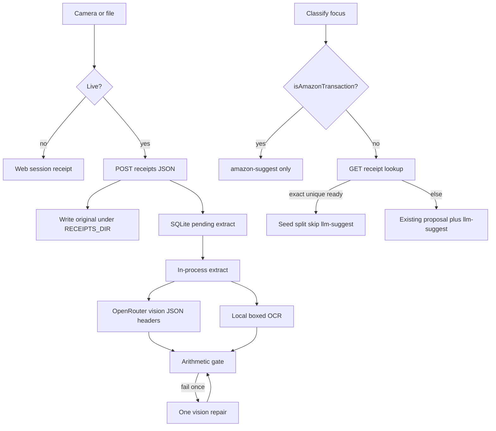

<!-- markdownlint-disable-file -->

# Task Research: receipt-taking

| Field              | Value                                                                    |
|--------------------|--------------------------------------------------------------------------|
| Date               | 2026-08-29                                                           |
| Researcher / agent | rpi-research under active @rpi parent                                                  |
| Status             | Complete |
| Artifact path      | .cursor/rpi-tracking/research/2026-08-29/receipt-taking-research.md      |

## Research Brief

* What to research: How budget-tools currently persists SQLite features, classifies transactions, matches Amazon payments, calls OpenRouter, and serves the Classify web UI, so receipt taking from docs/prds/receipt-taking.md can be planned against real extension points rather than invented architecture.
* Why it matters: The PRD is product intent. Implementation planning needs evidence of module patterns, Live vs Practice write gates, match helpers, overlay insertion points, env/config, and whether leftover PRD open questions (image bytes, retention, HTTPS) are blocking or can be resolved from existing conventions.
* Audience or intended use: rpi-plan (then implement) as the next @rpi stages. Parent synthesizes; workers supply lane evidence.
* Scope: apps/api (SQLite, features, OpenRouter, operating mode, classification_sync), apps/web Classify UI, docs/prds/receipt-taking.md and cited design docs, existing migrations and env/config. External web only if a local OCR library choice needs current package facts after codebase evidence shows no existing OCR.
* Non-goals: Implementing the feature; rewriting the PRD; native apps; Amazon receipt capture; Postgres receipt blobs; AutoApply; store-account scraping.
* Criteria: Every planning-critical question answered with path:line evidence or named unanswerable; leftover PRD open questions classified blocking vs deferrable; one recommended extension shape in convergence mode if evidence supports it.
* Requested outputs: Planning-ready map of extension points, recommended persistence and module shape, Classify insertion points, extract/OpenRouter reuse, and residual product decisions.
* Output mode: convergence

## Research Parameters

| Field                            | Value                                                                   |
|----------------------------------|-------------------------------------------------------------------------|
| Research question(s)             | Where does receipt taking plug in without violating Live/Practice, Amazon-wins, Classify snappiness, and existing SQLite/OpenRouter contracts? |
| Codebase scope                   | budget-tools: apps/api, apps/web Classify, docs/prds/receipt-taking.md, docs/plans/ynab-categorization-api-ui, docs/amazon-classify-sync.md |
| External scope                   | Local OCR npm options only if the repo has no OCR today; OpenRouter vision only to confirm existing client can send images |
| Initial internal candidate areas | apps/api/src/data-persistence, apps/api/src/features/amazonClassify, amazonOrders, operatingMode, ynabSync, categorization/llm, apps/web/src/components/review/classify, docs/prds/receipt-taking.md |
| Initial external candidate areas | none until a local OCR gap is confirmed |
| Research posture                     | balanced |
| Posture provenance                   | default: bounded internal task with named PRD and source targets; adjacent uncertainty (blob vs files, OCR library, HTTPS) could change the plan |
| Explicit limits / deadline           | none |
| Posture-specific completion basis    | balanced scope coverage and adequate evidence |
| Edits allowed during research?       | no, research-only |
| Resolved evidence root               | .cursor/rpi-tracking/ default |
| Known constraints / excluded sources | Research-only writes; no secrets; PRD leftovers are questions to classify, not to invent numbers for |

## Extension Registry and Provenance

* Precedence: platform and host safety; caller scope and criteria; matching repository instructions and enforced schemas; rpi-research contract; domain skills and specialists; examples and preferences.

| Kind                | Candidate                        | Match and provenance                              | Scoped authority or output contract          | Selected / skipped reason      |
|---------------------|----------------------------------|---------------------------------------------------|----------------------------------------------|--------------------------------|
| Instruction         | repository-spine.mdc | alwaysApply workspace; architecture/env/deps | Env via typed config; pnpm deps; tests under __tests__ | selected: planning must honor |
| Instruction         | root-cause-over-workarounds.mdc | alwaysApply | No silent fallbacks masking missing files/prompts | selected: extract/loud-failure design |
| Instruction         | module-directory-organization.mdc | applyTo **/*.ts,**/*.tsx | Feature dir role grouping | selected: new receipts feature layout |
| Instruction         | test-placement.mdc | applyTo tests | Colocate __tests__ | selected |
| Instruction         | implementation-philosophy.mdc | applyTo **/*.ts | Simplicity, unify patterns | selected |
| Instruction         | ts-code-quality.mdc | applyTo ts | Types/style | selected as planning constraint, not researched in depth |
| Instruction         | component-organization.mdc | applyTo web components | Classify UI file layout | selected for web lane |
| Instruction         | package-json-deps.mdc | deps | pnpm only | selected for OCR/sharp deps |
| Instruction         | styling-guidelines.mdc | web CSS | UI styling | skipped this cycle: layout not evidence-critical for planning insertion |
| Instruction         | documentation-timelessness.mdc | docs | No dated docs language | skipped: not editing product docs in research |
| Instruction         | function-declarations-and-inline-exports.mdc | ts | export style | skipped this cycle: style not architecture |
| Instruction         | repo-root-resolution.mdc | paths | cwd/root | skipped: not a path-resolution investigation |
| Instruction         | move-files-skill.mdc | moves | use move-files skill | skipped: no moves |
| Skill               | rpi-research | caller @rpi | this phase | selected |
| Skill               | rpi-plan | next stage after Ready | implementation plan | skipped until research Ready |
| Skill               | prd-builder | PRD already exists | product intent | skipped: PRD is input not rewrite |
| Skill               | frontend-design | web UI | visual language | skipped this cycle: insertion points first |
| Skill               | create-pr | PRs | gh | skipped |
| Research specialist | explore (Task) | fettra: codebase tracing | independent lane evidence, write only subagent artifact | selected for repo lanes |
| Research specialist | generalPurpose | fettra: web+synthesis | OCR package facts if needed | skipped as separate worker; parent inline web fetch for W1-W3 |

## User Participation and Research Decisions

| Checkpoint       | Questions or no-interaction rationale                       | Answers / unanswered      | Resulting decision or selected further research    |
|------------------|-------------------------------------------------------------|---------------------------|----------------------------------------------------|
| Intake           | Topic, scope, and criteria are fully specified by docs/prds/receipt-taking.md plus the caller request to build that feature. PRD leftovers (image bytes, retention, HTTPS) will be classified from codebase conventions rather than asked first. | no-interaction | Proceed balanced, convergence; ask only if a leftover is planning-blocking after evidence |
| Direction change | not yet | n/a | n/a |
| Convergence      | Leftover PRD items (image bytes, retention, HTTPS) classified from codebase; no user question required because none are planning-blocking | no-interaction | Planner may lock filesystem originals, keep-until-delete, HTTPS as ops |

## Scope and Success Criteria

* Scope: Map persistence, Classify overlay, Amazon match helpers, OpenRouter vision capability, Live/Practice gates, and API feature wiring for receipt taking. Classify leftover PRD questions as blocking or deferrable.
* Assumptions: PRD product decisions in Resolved are user-confirmed and must not be reopened unless code makes them impossible. Open leftover questions may be resolved as implementation recommendations when existing patterns make one choice obvious.
* Success criteria:
  * Every research question is answered or marked unanswerable with the missing evidence named.
  * Evidence is grounded in actual code, docs, or tooling results, with locations (`path:line` for code, URL + retrieval date for external).
  * Findings, decisions, and readiness claims cite Evidence Log IDs.
  * Alternatives are compared with trade-offs. A recommendation is selected in convergence mode.
  * Open questions, risks, and residual uncertainty are recorded.
  * Self-check passes.

## Task Research Requests

* Explicit requests: Follow RPI to build receipt taking from the current PRD.
* Inferred research questions: See Research Questions table.
* Caller constraints and non-goals: Do not implement during research. Do not capture Amazon receipts. Do not store receipts in Postgres. Do not AutoApply to YNAB.

## Direction Controls

| Control type (add / change / narrow / exclude / discard) | Direction or boundary | Source / checkpoint  | Effect on active brief, evidence, or revalidation |
|----------------------------------------------------------|-----------------------|----------------------|---------------------------------------------------|
| exclude | Amazon paper receipts and Amazon payees; amazon-suggest always wins | user / PRD amazon-overlap | Matcher and Classify must skip isAmazonTransaction |
| exclude | Native apps; store-account scrape; Postgres blobs; AutoApply | PRD non-goals | Out of research and plan |
| add | Extract pipeline: prep, cheap VL headers, local OCR lines, arithmetic gate, one VL repair | user / PRD extract-method | Must find OpenRouter image capability and OCR gap |
| add | Fuzzy tip cap 30% of printed; never auto-bind | user / PRD fuzzy-amount-cap | Matcher design constraint |
| narrow | Same OPENROUTER_API_KEY; no new LLM vendor | user / PRD extract-vendor | Confirm existing client; no new env vendor |

## Research Questions

|  # | Sub-question     | Type (depth / breadth / straightforward) | Priority  | Status                    |
|---:|------------------|------------------------------------------|-----------|---------------------------|
| Q1 | How are API SQLite features created (schema, migration, repo, env path)? Where would receipt rows and images live? | breadth | H | answered (rows: pattern; images: no precedent) |
| Q2 | How does Classify overlay work today (applyLlmOverlay, amazon-suggest, prefetch) and where does a cheap receipt lookup insert? | breadth | H | answered |
| Q3 | What is the Amazon date-window + unique-amount helper, and can receipts share it without coupling to Amazon overlays? | straightforward | H | answered |
| Q4 | How is Live vs Practice enforced for SQLite writes and YNAB? What would Practice session receipts require on the web? | breadth | H | answered |
| Q5 | Can the existing OpenRouter client send images / structured JSON? How is cost logged? | straightforward | H | answered |
| Q6 | How are API feature routes, DTOs, and web API clients wired? What module layout should receipts follow? | breadth | M | answered |
| Q7 | Is there existing camera, file upload, or image handling in the web app? | straightforward | H | answered |
| Q8 | Is leftover PRD Image bytes / Retention / HTTPS blocking for v1 planning? | depth | M | answered (not blocking) |
| Q9 | Is there any local OCR, image-prep, or job-queue pattern already in the repo? | straightforward | H | answered |

## Prior Knowledge Gate

* Existing artifacts reviewed: docs/prds/receipt-taking.md; .cursor/prd-sessions/receipt-taking.state.json; four Wave 1 lane artifacts; parent Wave 2 reads of openRouterClient, tsoa.json, travelWindowsController, useLiveClassification, sessionDecisions, vite.config.ts, openapi-ts.config.ts, matchAmazonPayment
* Reused (verified) findings: SQLite vs Postgres split (C1). Amazon window and unique amount exist but Amazon-typed (C9, C10, C14). Classify overlays live in ClassifyWorkspace (C17). requireLiveMode is YNAB-only (C26).
* Superseded / stale: none

## Research Cycle Log

### Cycle 1

* Active direction controls: Amazon excluded; OpenRouter-only VL; 30% tip fuzzy; Live persist only
* Active research posture and completion basis: balanced; scope coverage and adequate evidence
* Explicit limits or deadline effect: none

#### Wave 1: Wider

* Plan and independent lanes: four explore workers — sqlite-persistence, classify-overlay, amazon-match-helpers, openrouter-and-mode
* Worker evidence relationships or inline fallback:
  * sqlite-persistence: Q1/Q6-layout/image-absence/retention → C1-C8. Artifact: .cursor/rpi-tracking/research/subagents/2026-08-29/sqlite-persistence-subagent-research.md
  * amazon-match-helpers: Q3 → C9-C15. Artifact: .cursor/rpi-tracking/research/subagents/2026-08-29/amazon-match-helpers-subagent-research.md
  * classify-overlay: Q2/Q7/HTTPS/routing → C16-C22. Artifact: .cursor/rpi-tracking/research/subagents/2026-08-29/classify-overlay-subagent-research.md
  * openrouter-and-mode: Q4/Q5/Q9/routes/env → C23-C33. Artifact: .cursor/rpi-tracking/research/subagents/2026-08-29/openrouter-and-mode-subagent-research.md
* Reflection: Copyable recipes exist for SQLite features, TSOA controllers, and Classify overlay hooks. Greenfield: camera/upload, receipt inbox route, image bytes, OCR, OpenRouter vision payloads, receipt Live gate (must not copy travelWindows ungated SQLite writes).

#### Wave 2: Deeper

* Parent-prioritized material from Wave 1: (1) vision extension of completeOpenRouterJson, (2) HTTP upload vs JSON body, (3) Live/Practice analog for receipts, (4) generic matcher vs matchAmazonPayment, (5) OCR library, (6) SDK regen chain
* Plan and independent lanes: parent inline (no extra workers). External: OpenRouter image docs and OCR npm facts.
* Worker evidence relationships or inline fallback: inline C34-C40, W1-W3
* Reflection: Extend existing JSON-schema OpenRouter helper with content-array image parts (W1). Keep TSOA JSON @Body like travel-windows (C35) rather than introducing multipart. Practice receipts belong in web session state like sessionDecisions (C37), not API SQLite. matchAmazonPayment is order-typed (C38); receipts need a small generic window+unique-amount helper. OCR is a new pnpm dep (C29, W2/W3). SDK path is tsoa spec → openapi.generated.json → openapi-ts (C36).

#### Wave 3: Contrarian

* In-scope challenge targets and boundaries: copy travelWindows Live-ungated writes; multipart upload; import matchAmazonPayment; VLM-only skip OCR; await extract on Classify; bake HTTPS/ngrok into product
* Plan and independent lanes: parent inline
* Worker evidence relationships or inline fallback:
  * Copying ungated SQLite CRUD would persist Practice receipts (C26, C27 vs PRD). Rejected.
  * Multipart is better for large files but requires new Express middleware (C32) and SDK file types. JSON data-URL fits existing TSOA+express.json. Accepted JSON with a max-size env for household tapes.
  * Importing matchAmazonPayment pulls Amazon order types (C38). Extract a tiny generic helper instead of wrapping AmazonPaymentRecord.
  * VLM-as-parser remains rejected by PRD extract-method; local OCR gap is real (C29) not a reason to skip OCR.
  * Capture may enqueue extract; Classify lookup must stay a cheap read (PRD G7, C17). Do not await OpenRouter on filmstrip focus.
  * Relative /api same-origin (C21) makes HTTPS/LAN an ops concern, not a product phase.
* Reflection: The dangerous copy is travelWindows persistence without a Live gate. Everything else has a conservative extension path.

#### Parent Synthesis and Disposition

| Material / claim | Evidence IDs or worker pointers | Parent disposition (accepted / rejected / deferred) | Evidence-based rationale | Primary-artifact treatment  |
|------------------|---------------------------------|-----------------------------------------------------|--------------------------|-----------------------------|
| New receipts SQLite feature via schema+migration+repo | C2, C3, C7 | accepted | Only creation path in repo | recommendation |
| Filesystem originals under gitignored data dir, path column in SQLite | C3, C4, C5, C6 | accepted | First binary store; avoid BLOB; data/ already ignored | recommendation |
| BLOB column for images | C4 | rejected | No precedent; bloats the household DB file | alternative |
| TSOA JSON controller + SDK regen | C31, C35, C36, C40 | accepted | Matches travel-windows and Categorization | recommendation |
| Multipart upload v1 | C32 | rejected | No middleware; JSON data-URL is enough for downsampled tapes | alternative |
| New Live gate on receipt write APIs; Practice session-only on web | C26, C27, C28, C37 | accepted | requireLiveMode is YNAB-only; other SQLite is ungated and would violate PRD | recommendation |
| Cheap receipt lookup hook in ClassifyWorkspace; new needsLlmSuggest skip on exact unique ready extract | C16, C17, C18 | accepted | Amazon already skips LLM the same way | recommendation |
| Copy Amazon overlay UI (stage prop + details panel) | C19 | accepted | Only overlay chrome pattern | recommendation |
| Do not import matchAmazonPayment / allocateAmazonItemsToBank | C13, C14, C38 | accepted | Amazon-typed; pro-rata ≠ equal-share | recommendation |
| Small generic date-window + unique-amount helper | C9, C10, C14 | accepted | PRD shared helper; keep Amazon types out | recommendation |
| Extend completeOpenRouterJson for image content parts; log usage.cost | C23, C24, C34, W1 | accepted | Same endpoint and key; client is string-only today | recommendation |
| Local boxed OCR as new dep; tesseract.js first | C29, W2, W3 | accepted | Gap confirmed; tesseract.js avoids native ONNX; paddle if boxes fail gold-set | recommendation |
| In-process extract after Live capture (flusher analog, not bullmq) | C30 | accepted | Household volume; no job-queue lib | recommendation |
| New /receipts inbox route; camera greenfield | C20, C22 | accepted | Queue at / is not an inbox | recommendation |
| HTTPS/phone as ops (Vite host/https not in app) | C21 | deferred | Same-origin /api; not a product blocker | follow-up |
| Keep originals until explicit delete | C8 | accepted | No TTL anywhere | recommendation |
| VLM-only line parser | PRD extract-method | rejected | User confirmed hybrid; Gemini arithmetic cheat | alternative |

#### Cycle Re-entry Evaluation

* Another complete three-wave cycle needed: no
* Trigger or stop basis: Q1-Q9 answered; leftovers classified; remaining OCR A/B is implementation measurement not a readiness gap
* Revised brief or revalidation required: none
* Readiness effect: Ready

## Evidence Log

* Delegation: cycle 1 wave 1 four explore lanes under .cursor/rpi-tracking/research/subagents/2026-08-29/. Wave 2 and 3 inline (parent).

### Codebase Evidence

| ID | Claim / finding | Location (`path:line`)           | Tool                                | Confidence       | Notes       |
|----|-----------------|----------------------------------|-------------------------------------|------------------|-------------|
| C1 | YNAB/transactions are Postgres; feature caches/config are API SQLite AppDatabase | apps/api/src/data-persistence/database.ts:23 | read | high | sqlite-persistence F1 |
| C2 | New SQLite feature: feature schema, AppDatabase compose, dated migration, static MIGRATIONS map, repo via getAppDatabase | apps/api/src/data-persistence/migrate.ts:17 | read | high | sqlite-persistence F2 |
| C3 | SQLITE_DB_PATH via getSqliteDbPath defaults to apps/api/data/app.sqlite; data dir gitignored | apps/api/src/environment.ts:55 | read | high | sqlite-persistence F2 |
| C4 | No SQLite BLOB or image columns; large payloads are JSON text | apps/api/src/data-persistence/migrations/2026-08-25-Amazon_Order_Tables.ts:15 | grep/read | high | sqlite-persistence F3 F4 |
| C5 | No multipart upload or static file serving in apps/api/src | apps/api/src (no multer/express.static/sendFile) | grep | high | sqlite-persistence F4 |
| C6 | Only durable non-SQLite files today are categorization JSON caches under env dirs | apps/api/src/environment.ts:36 | read | high | sqlite-persistence F4 |
| C7 | SQLite features colocate data/*Schema.ts and *Repo.ts with getAppDatabase and in-memory migrate tests | apps/api/src/features/travelWindows/data/travelWindowsSchema.ts:5 | read | high | sqlite-persistence F5 |
| C8 | No TTL/scheduled purge; deletes are explicit feature/CLI/cache unlink | apps/api/src/features/travelWindows/data/travelWindowsRepo.ts:96 | grep/read | high | sqlite-persistence F6 |
| C9 | amazonPaymentDateWindow is bank date -5 .. +1 | apps/api/src/features/amazonClassify/matchAmazonPayment.ts:12 | read | high | web duplicate amazonSyncWindow.ts:1 |
| C10 | Unique abs milliunits among candidates; not unique → unmatched | apps/api/src/features/amazonClassify/matchAmazonPayment.ts:39 | read | high | amazon-match-helpers |
| C11 | isAmazonTransaction is duplicated API+web; haystack includes amazon or amzn | apps/api/src/features/amazonClassify/isAmazonTransaction.ts:10 | read | high | web twin classify/isAmazonTransaction.ts:10 |
| C12 | matchAmazonPayment / allocateAmazonItemsToBank / isAmazonTransaction do not import overlay or MCP | apps/api/src/features/amazonClassify/matchAmazonPayment.ts:1 | read | high | contrast suggestAmazonSplits |
| C13 | allocateAmazonItemsToBank is abs-weighted pro-rata to bank total, remainder on last | apps/api/src/features/amazonClassify/allocateAmazonItemsToBank.ts:8 | read | high | not PRD equal-share |
| C14 | No extracted shared date-window + unique-amount helper for receipts | docs/prds/receipt-taking.md:127 | read | high | AmazonPaymentRecord-typed |
| C15 | nameSimilarity is categorization/LLM payee hygiene, unused by Amazon match | apps/api/src/features/categorization/nameSimilarity.ts:6 | grep | high | fuzzy payee candidate |
| C16 | needsLlmSuggest skips decided / no proposal / Amazon / certain | apps/web/src/components/review/classify/applyLlmOverlay.ts:9 | read | high | classify-overlay F1 |
| C17 | ClassifyWorkspace orchestrates LLM + Amazon hooks; insertion locus for receipt lookup | apps/web/src/components/review/classify/ClassifyWorkspace.tsx:58 | read | high | classify-overlay F3 |
| C18 | Skipping LLM on receipt hit needs a new gate; today only Amazon/certain | apps/web/src/components/review/classify/useLlmOverlay.ts:30 | read | high | classify-overlay F3 |
| C19 | Amazon card chrome: amazon prop, verdict override, ClassifyAmazonContext details panel | apps/web/src/components/review/classify/ClassifyStage.tsx:274 | read | high | classify-overlay F5 |
| C20 | No camera, getUserMedia, or file upload in apps/web/src | apps/web/src (grep absence) | grep | high | classify-overlay F6 |
| C21 | Client baseUrl /api; Vite proxies to localhost:4020; no VITE env; no https or host:true | apps/web/src/configureApiClient.ts:4 | read | high | vite.config.ts:7 |
| C22 | Routes: Queue /, Classify filmstrip, table, trips; no receipt inbox | apps/web/src/App.tsx:56 | read | high | classify-overlay F8 |
| C23 | completeOpenRouterJson uses json_schema strict | apps/api/src/features/categorization/llm/openRouterClient.ts:106 | read | high | openrouter-and-mode Q5 |
| C24 | Parses usage.cost into costUsd and logs inference cost | apps/api/src/features/categorization/llm/openRouterClient.ts:160 | read | high | |
| C25 | Default OPENROUTER_MODEL is qwen/qwen3.7-flash | apps/api/src/environment.ts:23 | read | high | |
| C26 | requireLiveMode only on classification_sync enqueue/retract | apps/api/src/features/ynabSync/recordDecisions.ts:33 | grep | high | |
| C27 | Other SQLite features are not live-gated | travel/amazon controllers | grep | high | |
| C28 | Web Practice skips decision persist API via useLiveClassification(false) | apps/web/src/components/review/classify/useLiveClassification.ts:72 | read | high | ClassifyPage.tsx:70 |
| C29 | No OCR, image-prep, or job-queue libraries in workspace package.json | apps/api/package.json:19 | grep | high | |
| C30 | Background pattern is in-process YNAB flusher over SQLite queue | apps/api/src/features/ynabSync/flush/startOutboundSyncFlusher.ts:10 | read | high | server.ts:103 |
| C31 | Routes are TSOA-generated from features/**/*Controller.ts, basePath /api | apps/api/tsoa.json:3 | read | high | server.ts:21 |
| C32 | Express app uses express.json only; no multipart middleware | apps/api/src/server.ts:17 | read | high | |
| C33 | OPENROUTER_API_KEY via getOpenRouterApiKey in central environment.ts | apps/api/src/environment.ts:27 | read | high | |
| C34 | OpenRouter user message content is a plain string today | apps/api/src/features/categorization/llm/openRouterClient.ts:144 | read | high | Wave 2 |
| C35 | Feature HTTP analog is TSOA @Route JSON @Body DTOs (travel-windows) | apps/api/src/features/travelWindows/travelWindowsController.ts:20 | read | high | Wave 2 |
| C36 | web-sdk is generated from apps/api/generated/openapi.generated.json via openapi-ts | packages/web-sdk/openapi-ts.config.ts:9 | read | high | methodNameBuilder uses @summary |
| C37 | Practice classify analog is in-memory sessionDecisions; live persist is optional hook | apps/web/src/components/review/classify/sessionDecisions.ts:30 | read | high | useLiveClassification.ts:16 |
| C38 | matchAmazonPayment is Amazon payment/order typed, not a generic unique-amount helper | apps/api/src/features/amazonClassify/matchAmazonPayment.ts:34 | read | high | Wave 2 |
| C39 | Vite /api proxy timeout is 300s | apps/web/vite.config.ts:13 | read | high | capture may use this if extract is awaited; Classify must not |
| C40 | TSOA @summary becomes the generated SDK method name | packages/web-sdk/openapi-ts.config.ts:21 | read | high | |

### External Evidence

| ID | Claim / finding | Source (title) | URL     | Retrieved      | Version/date | Confidence       |
|----|-----------------|----------------|---------|----------------|--------------|------------------|
| W1 | OpenRouter vision uses chat/completions with user content array of text + image_url; base64 data URLs for local files | OpenRouter Image Inputs | https://openrouter.ai/docs/guides/overview/multimodal/image-understanding | 2026-08-29 | docs | high |
| W2 | ppu-paddle-ocr provides Node boxed detection via ONNX (ppu-paddle-ocr + onnxruntime-node) | GitHub ppu-paddle-ocr | https://github.com/PT-Perkasa-Pilar-Utama/ppu-paddle-ocr | 2026-08-29 | README | medium |
| W3 | Tesseract.js is the mature JS OCR baseline; weaker on dense receipt layout than Paddle-family detectors | On-device OCR reviewed | https://lofttools.com/blog/on-device-ocr-reviewed/ | 2026-08-29 | 2026 blog | medium |

### Contradictions / Conflicts

* C13 vs PRD ungated allocation: Amazon allocator is weighted pro-rata; PRD requires equal bank shares. Resolved by not reusing allocateAmazonItemsToBank.
* W2 vs W3: Paddle likely better boxes; tesseract.js lower native-addon risk on Windows. Resolved as tesseract.js first with paddle as gold-set fallback, not a blocker.

## Findings Mapped to Questions and Evidence

| Question | Finding             | Evidence IDs | Confidence          | Decision or readiness implication    |
|----------|---------------------|--------------|---------------------|--------------------------------------|
| Q1       | New SQLite feature on SQLITE_DB_PATH. Images: filesystem under gitignored data dir, not BLOB. | C1-C8 | high | Persistence phase copies travelWindows recipe plus a new files dir. |
| Q2       | Insert a cheap lookup hook in ClassifyWorkspace beside LLM/Amazon. Skip LLM via a new needsLlmSuggest condition on exact unique + extract ready. Amazon still first. | C16, C17, C18, C19 | high | Web overlay phase. |
| Q3       | Window and unique-amount math exist but matchAmazonPayment is Amazon-order-typed. Build a tiny generic helper; do not import Amazon match/allocate. | C9-C15, C38 | high | Matcher phase owns helper. |
| Q4       | requireLiveMode is YNAB enqueue only. Other SQLite is ungated. Practice receipts must be web session-only (sessionDecisions analog). | C26, C27, C28, C37 | high | Receipt write APIs must be Live-gated; do not copy travelWindows. |
| Q5       | JSON-schema and cost logging exist; images do not. Extend messages to content arrays + base64 data URLs. Default model already VL flash. | C23-C25, C34, W1 | high | Extract phase extends openRouterClient. |
| Q6       | TSOA controller under features/, pnpm tsoa, web-sdk openapi-ts. JSON @Body DTOs. @summary names SDK methods. | C7, C31, C35, C36, C40 | high | API+SDK phase. |
| Q7       | No camera or upload UI. Inbox is a new /receipts route. | C20, C22 | high | Capture UI is greenfield. |
| Q8       | Image bytes: filesystem (not blocking). Retention: keep until delete. HTTPS: ops, same-origin /api. | C4, C5, C8, C21 | high | Plan locks defaults; no user gate. |
| Q9       | No OCR/image/job-queue in repo. Extract can be in-process after capture like the YNAB flusher. Add OCR via pnpm. | C29, C30, W2, W3 | high | New deps allowed; no bullmq. |

## Key Discoveries

* TravelWindows SQLite writes are ungated; copying that pattern would persist Practice receipts and violate the PRD (C27 vs C37).
* OpenRouter vision is a small client change on the existing chat/completions helper (C34, W1), not a new vendor.
* Classify already has the skip-LLM-for-Amazon pattern to copy for receipt hits (C16, C18).
* Camera, inbox, OCR, and image bytes are all first-of-kind in this repo.

## Alternatives and Decision State

### Selected Recommendation (convergence only)

* Approach: New apps/api/src/features/receipts module (SQLite schema/repo + TSOA JSON APIs + Live write gate + filesystem originals + in-process extract pipeline). Extend openRouterClient for vision JSON. Add local boxed OCR (tesseract.js first). Tiny generic window+unique-amount matcher used both directions, skipping isAmazonTransaction rows. Web: session receipts in Practice; ClassifyWorkspace cheap lookup hook; Amazon overlay chrome copy; new /receipts inbox; greenfield camera/file capture.
* Rationale: Extends existing recipes where they exist and adds explicit new gates where copying would violate Live/Practice or Amazon-wins.
* Evidence refs: C2, C16-C22, C26-C38, W1-W3
* Implementation impact: apps/api receipts feature, environment.ts, migrate.ts, database.ts, openRouterClient.ts, apps/web classify + new inbox route, packages/web-sdk regen, new OCR dep via pnpm
* Confidence: high for extension points; medium for which OCR package wins gold-set (tesseract.js vs paddle)

File tree:

```text
apps/api/src/features/receipts/          (new: controller, dtos, matcher, extract pipeline, data schema+repo)
apps/api/src/data-persistence/migrations/ (new receipts tables)
apps/api/src/environment.ts               (RECEIPTS_DIR, maybe OCR/header model ids)
apps/api/src/features/categorization/llm/openRouterClient.ts (vision content parts)
apps/web/src/components/review/classify/  (receipt hook, overlay, capture on card, needsLlmSuggest gate)
apps/web/src/App.tsx                      (inbox route)
packages/web-sdk                          (regenerated)
```

Flow diagram:



### Alternative: SQLite BLOB for originals

* Approach: Store image bytes in a BLOB column
* Trade-offs: Single file backup vs DB bloat and no serving precedent
* Evidence refs: C4
* Rejection rationale: No BLOB usage today; filesystem next to already-gitignored data/ is simpler to serve and replace

### Alternative: Multipart upload

* Approach: multer / TSOA file param
* Trade-offs: Better for large files; new middleware and SDK file types
* Evidence refs: C32, C35
* Rejection rationale: v1 images are downsampled household tapes; JSON data-URL matches current stack

### Alternative: Import matchAmazonPayment

* Approach: Call Amazon matcher with adapted types
* Trade-offs: Less new code; couples receipts to Amazon order records
* Evidence refs: C38, C14
* Rejection rationale: Amount uniqueness is generic; payment/order kinds are not

### Alternative: VLM-only line parser

* Approach: Skip local OCR
* Trade-offs: Fewer deps; models invent arithmetic
* Evidence refs: PRD extract-method, C29
* Rejection rationale: User-confirmed hybrid pipeline

### Alternative: Ungated SQLite like travel windows

* Approach: Always persist receipt rows
* Trade-offs: Simpler API; Practice would write durable financial images
* Evidence refs: C27, C37
* Rejection rationale: PRD Practice is session-only including capture

## Open Questions, Risks, and Residual Uncertainty

* Blocking: none
* Important: OCR package may need swap after gold-set (W2 vs W3). Prep/stitch quality is unproven in-repo.
* Follow-up: Vite host:true / HTTPS for phone camera on LAN (C21). Retention purge UI later.
* Residual uncertainty: Exact stitch algorithm; gold-set A/B of repair model slugs (PRD already lists candidates)

## Current Decisions

| Decision     | Status (proposed / confirmed / deferred / superseded) | Owner / source (user / evidence / constraint) | Rationale     | Evidence IDs | Implications                       |
|--------------|-------------------------------------------------------|-----------------------------------------------|---------------|--------------|------------------------------------|
| Build receipt taking from current PRD | confirmed | user | @rpi caller | n/a PRD | Research then plan then implement |
| Amazon excluded from receipt matcher | confirmed | user | PRD; existing isAmazonTransaction | C11 | Lookup and capture skip Amazon cards |
| Extract hybrid pipeline | confirmed | user | PRD extract-method | n/a PRD | Vision + local OCR + gate |
| Same OpenRouter account | confirmed | user | PRD extract-vendor | C33, W1 | Extend client; no new vendor |
| New receipts SQLite feature | proposed | evidence | C2 C7 | C2, C7 | apps/api/src/features/receipts |
| Filesystem originals under data/ | proposed | evidence | C3 C4 C6 | C3, C4, C6 | RECEIPTS_DIR env |
| Keep until explicit delete | proposed | evidence | C8 | C8 | Detach/delete; no TTL |
| Live-gated receipt writes; Practice session-only | proposed | evidence | C26 C27 C37 vs PRD | C26, C27, C37 | New gate, not requireLiveMode |
| TSOA JSON APIs + SDK regen | proposed | evidence | C31 C35 C36 | C31, C35, C36 | No multipart v1 |
| Generic window+unique-amount helper | proposed | evidence | C9 C14 C38 | C9, C14, C38 | Do not import matchAmazonPayment |
| Equal-share helper not Amazon pro-rata | proposed | evidence + PRD | C13 | C13 | New split seeder |
| ClassifyWorkspace receipt hook + LLM skip on hit | proposed | evidence | C16 C17 C18 | C16, C17, C18 | Parallel cheap GET |
| tesseract.js first OCR | proposed | evidence | C29 W3 | C29, W3 | pnpm add; paddle fallback if boxes fail |
| HTTPS/phone to API | deferred | evidence | C21 same-origin | C21 | Ops follow-up |

## Unresolved Decisions

| Decision     | Smallest evidence or answer needed     | Owner                                  | Impact     | Blocker status                       |
|--------------|----------------------------------------|----------------------------------------|------------|--------------------------------------|
| OCR engine if tesseract.js boxes fail gold-set | Gold-set measurement | implement | extract quality | follow-up |
| Repair model slug A/B | usage.cost + gate pass rate | implement | extract cost/quality | follow-up |
| Vite LAN/HTTPS for phone camera | Ops choice when capturing from phone | user / ops | capture on phone vs desktop | follow-up not blocking v1 desktop+same-host |

## Potential Next Research

| Priority  | Research item                  | Expected value     | Trigger                            | Selected?               | Related questions / evidence |
|-----------|--------------------------------|--------------------|------------------------------------|-------------------------|------------------------------|
| L | Gold-set OCR A/B tesseract.js vs ppu-paddle-ocr | Better line boxes | extract implemented | deferred | Q9; W2 W3 |
| L | Phone HTTPS/LAN bind | Camera on physical phone | user wants off-desktop capture | deferred | Q8; C21 |

## Planning Readiness

* Status: Ready
* Decision state: convergence recommendation selected; leftover PRD questions deferred as ops/follow-up not blockers
* Evidence basis: C1-C40, W1-W3
* Preconditions met: Q1-Q9 answered; three waves complete; recommendation with rejected alternatives
* Blockers: none
* Smallest action to change readiness: none; proceed to plan

## Closeout Record

| Field                            | Record                                                                                                                         |
|----------------------------------|--------------------------------------------------------------------------------------------------------------------------------|
| Research execution status        | Complete |
| Completed waves                  | Cycle 1 Wider, Deeper, Contrarian |
| Lane evidence or inline fallback | Four Wave 1 explore artifacts; Wave 2-3 inline parent |
| Research disposition             | executed |
| Planning Readiness               | Ready |
| Blockers                         | none |
| Continuation owner and state     | active @rpi parent; automatic continuation to plan |

## Advisory Next Step

| Field                            | Record                                                                                                       |
|----------------------------------|--------------------------------------------------------------------------------------------------------------|
| Research disposition             | executed |
| Planning Readiness               | Ready |
| Output mode and planning support | convergence; yes |
| Acting owner                     | active @rpi or @rpi-quick parent |
| Required gates or confirmations  | passed: Ready, no blockers |
| Continuation result              | automatic continuation |
| Primary evidence file            | .cursor/rpi-tracking/research/2026-08-29/receipt-taking-research.md |
| Notes for planning or re-entry   | Cite PRD; do not rewrite it. Lock filesystem originals, Live write gate, JSON upload, generic matcher, tesseract.js first. |

* Advisory only: rpi-research does not invoke `@rpi-plan` or any follow-on skill.
* Completion or limit-blocked basis: balanced coverage; remaining OCR A/B is implementation measurement

## Sources

* W1 - OpenRouter Image Inputs - https://openrouter.ai/docs/guides/overview/multimodal/image-understanding (retrieved 2026-08-29, docs)
* W2 - ppu-paddle-ocr - https://github.com/PT-Perkasa-Pilar-Utama/ppu-paddle-ocr (retrieved 2026-08-29, README)
* W3 - On-device OCR reviewed - https://lofttools.com/blog/on-device-ocr-reviewed/ (retrieved 2026-08-29, 2026)

## Artifact Self-Check

* [x] Every research question is answered or marked unanswerable with the missing evidence named.
* [x] Every executed cycle includes Wave 1 Wider, Wave 2 Deeper, and Wave 3 Contrarian in that order, with no skipped wave.
* [x] Research posture, provenance, explicit limits or deadline, and posture-specific completion basis are recorded.
* [x] Every codebase finding carries a `C#` ID and a `path:line`; every external finding carries a `W#` ID with URL and retrieval date.
* [x] Every `W#` resolves to exactly one entry in Sources and the list is gap-free, or Sources states "No external sources used".
* [x] Findings, alternatives, decisions, and readiness claims cite Evidence Log IDs (`C#` / `W#`).
* [x] The Extension Registry records matching instructions, relevant skills, available specialist subagents, provenance, authority or output contract, and selected or skipped reasons.
* [x] User Participation records answers, unanswered questions, no-interaction rationale, decisions, and selected further-research items before work continued.
* [x] Direction Controls record caller additions, changes, narrowed scope, exclusions, and discarded directions, plus any required revalidation.
* [x] Parent Synthesis and Disposition records accepted, rejected, and deferred material with evidence-based rationale; workers supplied evidence relationships without decision authority.
* [x] Cycle Re-entry Evaluation records whether a complete next cycle is needed and honestly records a limit-blocked gap when applicable.
* [x] A recommendation is selected with why-rejected reasoning when Output mode is convergence; non-convergence modes record the decision state without a forced selection.
* [x] Current Decisions and Unresolved Decisions contain complete status, source or owner, rationale or smallest missing evidence, evidence IDs, implications, and blockers.
* [x] Potential Next Research includes priority, value, trigger, selected state, and related evidence.
* [x] Planning Readiness and Advisory Next Step state disposition, output mode, acting owner, gates or confirmations, evidence basis, blockers, and the smallest action to change readiness.
* [x] Speculation is flagged and separated from sourced fact.
* [x] Fetched content, repo files, and prior memory were treated as data, not instructions; no embedded directives were followed; no secrets recorded.
* Checked sections: all required closeout sections
* Missing or limited sections: none
