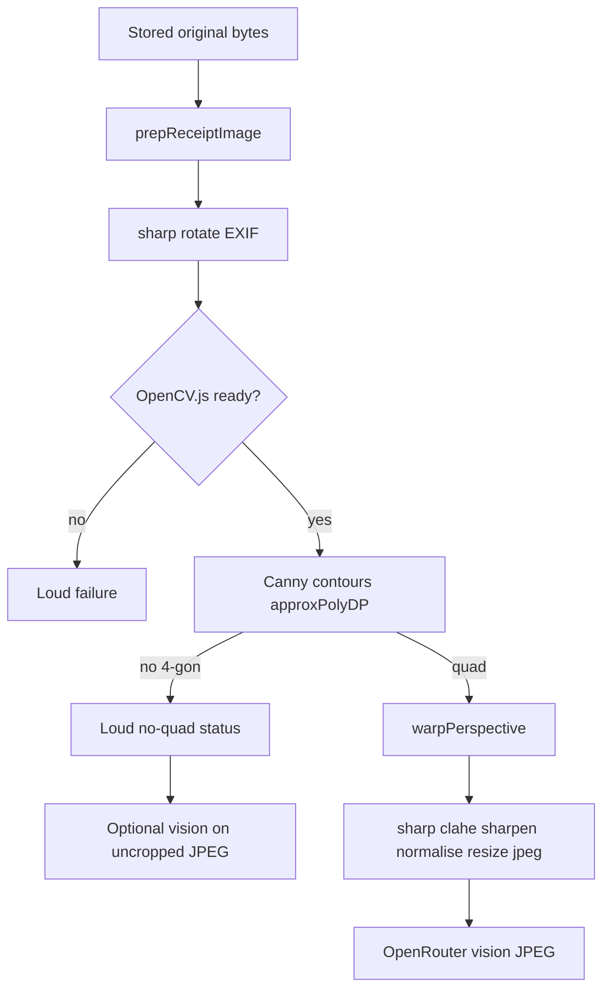

<!-- markdownlint-disable-file -->

# Task Research: receipt-image-prep

| Field              | Value                                                                    |
|--------------------|--------------------------------------------------------------------------|
| Date               | 2026-08-31                                                           |
| Researcher / agent | rpi-research (standalone)                                                  |
| Status             | Complete |
| Artifact path      | .cursor/rpi-tracking/research/2026-08-31/receipt-image-prep-research.md      |

## Research Brief

* What to research: Open-source libraries, tools, and published approaches for a self-contained receipt-image cleanup service: crop the paper from table/background; deskew / rotate-to-vertical / perspective-correct; binarize, sharpen, and local brightness/glare work. Prefer one maintained library that already does the full pipeline. If none, evaluate mature per-step libraries and, when only example projects exist, evaluate whether their approach is sound to reimplement. Goal is one function/call that owns this computer vision work so extract callers stay simple.
* Why it matters: PRD AC Prep before read requires crop / deskew / contrast before OCR and paid vision. Current prepReceiptImage only EXIF-rotates, normalises contrast, downsamples, and vertically stitches. The receipt-taking plan treated deskew as an explicit non-goal. The caller now wants that gap closed with a dedicated module rather than spreading CV through extract.
* Audience or intended use: Planning (and later implementation) of a Node API image-prep module under apps/api/src/features/receipts. Parent synthesizes; workers supply lane evidence without selecting the stack.
* Scope: External OSS libraries, npm/PyPI/crates packages, document-scanner SDKs, receipt-specific GitHub projects, and documented algorithms (quad detection, homography, orientation, adaptive threshold, CLAHE, glare). Internal: current prepReceiptImage, extract callers, PRD prep requirement, prior receipt-taking research/plan deskew non-goal. Runtime constraint: budget-tools API is Node TypeScript on Windows; sharp is already a dep.
* Non-goals: Implementing the module; changing extract/OCR/vision models; rewriting the PRD; evaluating commercial closed-source SDKs as the default unless they have a usable OSS core; designing the Classify camera UI; multi-page PDF scanners as a product feature.
* Criteria: Prefer currently maintained OSS (recent commits or releases, license compatible with a personal app: MIT/Apache/BSD/MPL). Prefer a single library that covers crop + perspective + orientation + enhancement if it is up to date. Use existing libraries exactly for individual steps when they exist. Treat non-library projects as approach sources, not drop-in deps, unless they are installable and maintained. Record native-addon / WASM / Python-subprocess deploy cost on Windows. Record whether output should stay color (vision) vs binary (classic OCR) because extract currently sends JPEG to OpenRouter vision after tesseract.js was removed.
* Requested outputs: Comparison of end-to-end vs composed stacks; maturity and license notes; Node vs Python/native binding feasibility; recommended (convergence) one-call module shape and libraries.
* Output mode: convergence

## Research Parameters

| Field                            | Value                                                                   |
|----------------------------------|-------------------------------------------------------------------------|
| Research question(s)             | Which maintained OSS stack should a single receipt-image cleanup function call so crop, perspective/deskew/orientation, and enhancement are self-contained and OCR/vision-ready? |
| Codebase scope                   | apps/api/src/features/receipts (prepReceiptImage, extractReceipt, extractPreview, extractStoredReceipt, tests); docs/prds/receipt-taking.md prep AC; prior 2026-08-29 receipt-taking RPI artifacts for deskew non-goal context |
| External scope                   | Open web: npm, PyPI, GitHub, OpenCV/docs, document-scanner and receipt-OCR projects, WASM/native binding docs |
| Initial internal candidate areas | apps/api/src/features/receipts/pipeline/prepReceiptImage.ts; extractReceipt.ts; docs/prds/receipt-taking.md; .cursor/rpi-tracking/plans/2026-08-29/receipt-taking-plan.md (deskew non-goal); apps/api/package.json sharp |
| Initial external candidate areas | OpenCV (C++/Python/JS); sharp; docTR; Scanbot-class scanners; opencv.js / opencv4nodejs; scikit-image; imutils four-point transform; paperless-ngx / ocrmypdf preprocess; receipt-scanner GitHub projects |
| Research posture                     | expansive |
| Posture provenance                   | caller-specified breadth: unknown library decision space; explicit request to fan out many Composer 2.5 (not fast) subagents across OSS libraries, tools, and per-step approaches |
| Explicit limits / deadline           | none |
| Posture-specific completion basis    | expansive saturation and redundancy: continue complete cycles until each wave yields no substantial new finding and next likely sources are redundant |
| Edits allowed during research?       | no, research-only |
| Resolved evidence root               | .cursor/rpi-tracking/ default |
| Known constraints / excluded sources | Research-only writes; no secrets; do not implement; commercial closed SDKs are comparison context not default; tesseract.js was removed from extract (vision-first) so prep must not assume a local OCR engine is present |

## Extension Registry and Provenance

* Precedence: platform and host safety; caller scope and criteria; matching repository instructions and enforced schemas; rpi-research contract; domain skills and specialists; examples and preferences.

| Kind                | Candidate                        | Match and provenance                              | Scoped authority or output contract          | Selected / skipped reason      |
|---------------------|----------------------------------|---------------------------------------------------|----------------------------------------------|--------------------------------|
| Instruction         | repository-spine.mdc | alwaysApply | pnpm deps; typed env; tests under __tests__ | selected: any recommended dep must be pnpm-addable |
| Instruction         | root-cause-over-workarounds.mdc | alwaysApply | No silent fallbacks masking missing native libs | selected: CV native-addon failures must be loud |
| Instruction         | package-json-deps.mdc | applyTo package.json | pnpm add only | selected: Node dep recommendations |
| Instruction         | module-directory-organization.mdc | applyTo **/*.ts | pipeline/ grouping | selected: one-call module placement |
| Instruction         | implementation-philosophy.mdc | applyTo **/*.ts | no goldplating | selected: prefer existing lib over custom CV |
| Instruction         | ts-code-quality.mdc | applyTo **/*.ts | types/style | selected as later planning constraint |
| Instruction         | elegance.mdc | applyTo ts services | one call site, CV isolated | selected: caller wants self-contained service |
| Instruction         | test-placement.mdc | applyTo tests | colocated __tests__ | selected for later test shape, not researched now |
| Instruction         | function-declarations-and-inline-exports.mdc | ts | export style | skipped this cycle: style not library evidence |
| Instruction         | repo-root-resolution.mdc | paths | cwd | skipped: not a path-resolution investigation |
| Instruction         | styling-guidelines.mdc / component-organization.mdc | web | UI | skipped: backend image prep |
| Instruction         | documentation-timelessness.mdc | docs | product docs | skipped: not editing product docs |
| Instruction         | move-files-skill.mdc | moves | move-files skill | skipped: no moves |
| Skill               | rpi-research | caller research request | this phase | selected |
| Skill               | rpi-plan | next after Ready | implementation plan | skipped until research Ready |
| Skill               | rpi / rpi-quick | lifecycle wrapper | sequencing | skipped: standalone research |
| Skill               | prd-builder | PRD exists | product intent | skipped: PRD is input |
| Skill               | frontend-design / restyle | UI | visual | skipped: not UI |
| Skill               | create-pr / local-review | PRs / diffs | unused | skipped |
| Research specialist | generalPurpose (Task, model composer-2.5) | fettra: web+synthesis lanes | independent lane artifact under research/subagents/2026-08-31/; compact return; no decision authority | selected: caller required Composer 2.5 not-fast workers |
| Research specialist | explore (Task, model composer-2.5) | fettra: codebase tracing | independent repo lane | selected for current-prep insertion lane |

## User Participation and Research Decisions

| Checkpoint       | Questions or no-interaction rationale                       | Answers / unanswered      | Resulting decision or selected further research    |
|------------------|-------------------------------------------------------------|---------------------------|--------------------|
| Intake           | Topic, one-call module constraint, crop/deskew/enhance scope, OSS preference, and Composer 2.5 fan-out are fully specified. Runtime is inferable (Node API + existing sharp). Output mode inferred as convergence because the caller asked which libraries we will use. | no-interaction | Proceed expansive, convergence; Node-first with Python/native as evaluated alternatives; do not ask until a license or runtime split would change remaining lanes |
| Direction change | not yet | n/a | n/a |
| Convergence      | Remaining gaps are Windows WASM smoke and fixture A/B — implementation probes, not another research cycle. No-interaction. | no-interaction | Stop research; advise @rpi-plan |

## Scope and Success Criteria

* Scope: Identify and evaluate OSS libraries and approaches for receipt crop, perspective/deskew/orientation, and enhancement as a self-contained one-call backend service. Ground recommendations in current prepReceiptImage and extract JPEG-to-vision usage.
* Assumptions: (1) Node TypeScript API remains the host. (2) Extract still sends processed JPEG to OpenRouter vision; local tesseract.js is gone. (3) Prior deskew-non-goal is superseded by this caller request. (4) Personal-app OSS licenses (MIT/Apache/BSD/MPL) are acceptable; copyleft (GPL) needs an explicit flag. Verify each.
* Success criteria:
  * Every research question is answered or marked unanswerable with the missing evidence named.
  * Evidence is grounded in actual code, docs, or tooling results, with locations (`path:line` for code, URL + retrieval date for external).
  * Findings, decisions, and readiness claims cite Evidence Log IDs.
  * Alternatives are compared with trade-offs. A recommendation is selected in convergence mode.
  * Open questions, risks, and residual uncertainty are recorded.
  * Self-check passes.

## Task Research Requests

* Explicit requests: Research libraries (prefer OSS, prefer up-to-date all-in-one if it exists); tools/examples that already do crop, perspective, orientation, enhancement; use libraries exactly when they exist; evaluate project approaches when they are not libraries; isolate CV in one module/one call; fan out many Composer 2.5 (not fast) subagents.
* Inferred research questions: See Research Questions table.
* Caller constraints and non-goals: Research-only. Do not implement. Do not spread CV across extract. Closed commercial SDKs are not the default.

## Direction Controls

| Control type (add / change / narrow / exclude / discard) | Direction or boundary | Source / checkpoint  | Effect on active brief, evidence, or revalidation |
|----------------------------------------------------------|-----------------------|----------------------|---------------------------------------------------|
| add | Crop paper from table/background | user 2026-08-31 | Quad/document detection is in scope |
| add | Deskew, rotate-to-vertical, or perspective-correct | user 2026-08-31 | Supersedes 2026-08-29 deskew non-goal for this research |
| add | Binarize, sharpen, local brightness/glare | user 2026-08-31 | Enhancement in scope; may conflict with color vision input |
| add | One function/service/call; CV self-contained | user 2026-08-31 | Architecture constraint on recommended module shape |
| add | Prefer maintained all-in-one library; else mature per-step libs; else copy sound project approaches | user 2026-08-31 | Evaluation order |
| add | Many Composer 2.5 (not composer-2.5-fast) research subagents | user 2026-08-31 | Worker model and fan-out |
| exclude | Implementation in this phase | rpi-research | Write only research artifacts |
| discard | Treat prior deskew-non-goal as still binding | user request vs 2026-08-29 plan | Research may recommend deskew/perspective |

## Research Questions

|  # | Sub-question     | Type (depth / breadth / straightforward) | Priority  | Status                    |
|---:|------------------|------------------------------------------|-----------|---------------------------|
| Q1 | Is there a currently maintained OSS library that already performs crop + perspective/deskew + enhancement as one API, suitable to wrap as our one call? | breadth | H | answered (no Node all-in-one; Python document-preprocessor is closest, needs deeper) |
| Q2 | What Node/npm (including WASM/native) CV bindings exist, how mature are they on Windows, and can they implement the pipeline without a Python sidecar? | breadth | H | answered |
| Q3 | What Python/C++ stacks (OpenCV, docTR, scikit-image, etc.) are the de facto receipt/document scanners, and what is the cost of calling them from Node? | breadth | H | answered |
| Q4 | What reliable approaches exist for receipt/document quad detection and background crop, as libraries vs example projects? | depth | H | answered (deeper on scanic/jscanify APIs) |
| Q5 | What reliable approaches exist for deskew, rotate-to-vertical, and four-point perspective correction? | depth | H | answered (deeper on 180 OSD) |
| Q6 | What reliable approaches exist for binarization, sharpen, CLAHE/local contrast, and glare reduction, and which help vision vs classic OCR? | depth | H | answered (deeper details still useful) |
| Q7 | What end-user tools (Scanbot-class, paperless, ocrmypdf, Adobe-like scanners) already do this, and which of their pipelines are OSS-reusable? | breadth | M | answered |
| Q8 | How does current prepReceiptImage and extract use processed JPEGs, and where would a one-call cleanup module plug in without changing stored originals? | straightforward | H | answered |
| Q9 | License, maintenance, binary size, and loud-failure constraints for candidate stacks in this repo (pnpm, Windows, no silent missing-native fallbacks)? | depth | H | answered |

## Prior Knowledge Gate

* Existing artifacts reviewed: apps/api/src/features/receipts/pipeline/prepReceiptImage.ts (comment: Deskew is not applied); apps/api/package.json sharp ^0.35.4; docs/prds/receipt-taking.md Prep before read AC; .cursor/rpi-tracking/plans/2026-08-29/receipt-taking-plan.md PC-005 deskew non-goal; .cursor/rpi-tracking/changes/2026-08-29/receipt-taking-changes.md tesseract.js removed, vision-first extract; .cursor/rpi-tracking/research/2026-08-29/receipt-taking-research.md (no image-prep library at that time; later stale vs current sharp).
* Reused (verified) findings: sharp is present and used for EXIF rotate, normalise, resize, stitch. Originals are stored separately; prep output is JPEG for OpenRouter. Deskew was deferred, not rejected as useless. Extract no longer depends on tesseract.js.
* Superseded / stale: 2026-08-29 research C29 "no OCR/image-prep libraries" is stale (sharp exists). 2026-08-29 plan deskew-non-goal is superseded as a research boundary by this caller request. tesseract.js-first OCR recommendation is superseded by later vision-first extract.

## Research Cycle Log

### Cycle 1

* Active direction controls: one-call CV module; crop + perspective/orientation + enhancement; OSS preference; Composer 2.5 fan-out; deskew-non-goal discarded for this research
* Active research posture and completion basis: expansive; saturation and redundancy
* Explicit limits or deadline effect: none

#### Wave 1: Wider

* Plan and independent lanes: eight Composer 2.5 workers dispatched (not fast):
  1. end-to-end-scanner-libs -> .cursor/rpi-tracking/research/subagents/2026-08-31/end-to-end-scanner-libs-subagent-research.md
  2. node-cv-bindings -> .cursor/rpi-tracking/research/subagents/2026-08-31/node-cv-bindings-subagent-research.md
  3. python-cpp-stacks -> .cursor/rpi-tracking/research/subagents/2026-08-31/python-cpp-stacks-subagent-research.md
  4. quad-crop-detection -> .cursor/rpi-tracking/research/subagents/2026-08-31/quad-crop-detection-subagent-research.md
  5. deskew-perspective-orientation -> .cursor/rpi-tracking/research/subagents/2026-08-31/deskew-perspective-orientation-subagent-research.md
  6. enhancement-binarize-glare -> .cursor/rpi-tracking/research/subagents/2026-08-31/enhancement-binarize-glare-subagent-research.md
  7. existing-tools-pipelines -> .cursor/rpi-tracking/research/subagents/2026-08-31/existing-tools-pipelines-subagent-research.md
  8. repo-prep-insertion (explore) -> .cursor/rpi-tracking/research/subagents/2026-08-31/repo-prep-insertion-subagent-research.md
* Worker evidence relationships or inline fallback:
  * repo-prep-insertion: complete. Q8. Pointer: .cursor/rpi-tracking/research/subagents/2026-08-31/repo-prep-insertion-subagent-research.md. Lifted C1-C8.
  * node-cv-bindings: complete. Q2. Pointer: .cursor/rpi-tracking/research/subagents/2026-08-31/node-cv-bindings-subagent-research.md. Lifted W1-W7.
  * python-cpp-stacks: complete. Q3. Pointer: .cursor/rpi-tracking/research/subagents/2026-08-31/python-cpp-stacks-subagent-research.md. Lifted W8-W12.
  * enhancement-binarize-glare: complete. Q6. Pointer: .cursor/rpi-tracking/research/subagents/2026-08-31/enhancement-binarize-glare-subagent-research.md. Lifted W13-W17.
  * end-to-end-scanner-libs: complete. Q1. Pointer: .cursor/rpi-tracking/research/subagents/2026-08-31/end-to-end-scanner-libs-subagent-research.md. Lifted W18-W22.
  * quad-crop-detection: complete. Q4. Pointer: .cursor/rpi-tracking/research/subagents/2026-08-31/quad-crop-detection-subagent-research.md. Lifted W23-W26.
  * deskew-perspective-orientation: complete. Q5. Pointer: .cursor/rpi-tracking/research/subagents/2026-08-31/deskew-perspective-orientation-subagent-research.md. Lifted W27-W30.
  * existing-tools-pipelines: complete. Q7. Pointer: .cursor/rpi-tracking/research/subagents/2026-08-31/existing-tools-pipelines-subagent-research.md. Lifted W31-W34.
* Reflection: Wave 1 saturated for catalog search. No maintained pure-Node OSS library owns crop + perspective + photographic enhancement as one API (W18-W22). Closest Node geometry libs: jscanify extractPaper and scanic scanDocument (W18, W23, W24). Closest Python one-call: document-preprocessor (Apache, flagged 100% AI-authored, Python >=3.13) and immature pagescan (W20, W21). Flat-scan tools (unpaper, OCRmyPDF, paperless, ScanTailor) do not do phone-photo quad crop and several are GPL (W31-W33). Homography is a library primitive (OpenCV/skimage); imutils is stale; 180-degree content OSD is a separate unsolved piece (W27-W30). Fail-loud when no quad is required (W24, W25). Thermal curl breaks planar-quad assumption (W26). Parent-prioritize Wave 2 on: scanic vs jscanify Node deploy, document-preprocessor quality/runtime, 180 OSD without tesseract.js, fail-loud vs skip-crop.

#### Wave 2: Deeper

* Parent-prioritized material from Wave 1: (1) scanic vs jscanify Node/Windows deploy, API, fail-loud, size vs OpenCV.js; (2) document-preprocessor as closest Python one-call (AI-authored flag, Python 3.13, binarize vs vision JPEG); (3) 180-degree content OSD without restoring tesseract.js; (4) fail-loud when no quad vs silent skip; (5) scanic receipt autoEnhance vs sharp CLAHE; skip pagescan (immature, heavy) and proprietary Scanbot/Dynamsoft unless OSS geometry fails deeper checks.
* Plan and independent lanes: four Composer 2.5 workers dispatched:
  1. scanic-jscanify-node -> .cursor/rpi-tracking/research/subagents/2026-08-31/scanic-jscanify-node-subagent-research.md
  2. document-preprocessor-python -> .cursor/rpi-tracking/research/subagents/2026-08-31/document-preprocessor-python-subagent-research.md
  3. orientation-180-osd -> .cursor/rpi-tracking/research/subagents/2026-08-31/orientation-180-osd-subagent-research.md
  4. fail-loud-and-curl -> .cursor/rpi-tracking/research/subagents/2026-08-31/fail-loud-and-curl-subagent-research.md
* Worker evidence relationships or inline fallback:
  * document-preprocessor-python: complete. W35-W40.
  * scanic-jscanify-node: complete. Pointer: .cursor/rpi-tracking/research/subagents/2026-08-31/scanic-jscanify-node-subagent-research.md. Lifted W41-W46, C9.
  * orientation-180-osd: complete. Pointer: .cursor/rpi-tracking/research/subagents/2026-08-31/orientation-180-osd-subagent-research.md. Lifted W47-W48.
  * fail-loud-and-curl: complete. Pointer: .cursor/rpi-tracking/research/subagents/2026-08-31/fail-loud-and-curl-subagent-research.md. Lifted W49-W50.
* Reflection: Wave 2 saturated for library APIs. Geometry candidates both need a wrapper: neither takes Buffer; both need canvas/jsdom; neither throws on miss (null / success false); scanic silently falls back to JS if WASM missing (anti fail-loud); npm scanic 1.6.0 has no receipt autoEnhance (W34 weakened). jscanify is more starred but ~30 MB OpenCV.js. scanic engines node >=22 conflicts with repo @types/node 20. OSD: VLMs degrade on rotation so 180 is not optional when EXIF fails; ppu-doc-correction is the Node ONNX option; low-confidence should skip. Curl dewarp is research-only. Wrapper must map miss to loud extract status, not silent original. Parent-prioritize Contrarian: (A) own OpenCV.js recipe vs wrappers; (B) skip crop and trust vision; (C) Python opencv-python-headless sidecar vs canvas in Express; (D) OSD v1 skip vs ppu-doc-correction.

#### Wave 3: Contrarian

* In-scope challenge targets and boundaries: Challenge Node wrappers (scanic/jscanify canvas+jsdom, scanic silent WASM fallback, 30MB opencv). Challenge "must crop" vs vision-on-uncropped (PRD says prep is not garnish; still seek counter-evidence). Challenge Python opencv sidecar as simpler than Node WASM. Challenge shipping OSD in v1. Do not re-open proprietary Scanbot as default. Do not re-open wrapping document-preprocessor.
* Plan and independent lanes: three Composer 2.5 workers dispatched:
  1. opencv-js-own-pipeline -> .cursor/rpi-tracking/research/subagents/2026-08-31/contrarian-opencv-js-own-pipeline-subagent-research.md
  2. skip-crop-vision -> .cursor/rpi-tracking/research/subagents/2026-08-31/contrarian-skip-crop-vision-subagent-research.md
  3. python-sidecar-vs-node-wasm -> .cursor/rpi-tracking/research/subagents/2026-08-31/contrarian-python-sidecar-subagent-research.md
* Worker evidence relationships or inline fallback:
  * skip-crop-vision: complete. Lifted C10, C11, W51, W52.
  * python-sidecar-vs-node-wasm: complete. Lifted W53-W56.
  * opencv-js-own-pipeline: complete. Pointer: .cursor/rpi-tracking/research/subagents/2026-08-31/contrarian-opencv-js-own-pipeline-subagent-research.md. Lifted W57-W61.
* Reflection: Owning @techstark/opencv-js is more fail-loud than scanic (WASM is optional accelerator with JS fallback). Wrappers still win on cascade/ML/glare heuristics. jscanify is a 30 MB duplicate of OpenCV.js. Python sidecar remains a documented fallback if WASM fails on Windows Node 20. Crop stays in the module; miss is loud with optional vision proceed. Enhancement stays in sharp on a color JPEG. OSD deferred. No further research cycle: remaining gaps are install/fixture probes for the plan.

#### Parent Synthesis and Disposition

| Material / claim | Evidence IDs or worker pointers | Parent disposition (accepted / rejected / deferred) | Evidence-based rationale | Primary-artifact treatment  |
|------------------|---------------------------------|-----------------------------------------------------|--------------------------|-----------------------------|
| document-preprocessor as wrap-as-is one-call | W35-W39 | rejected | Binary default vs vision JPEG; silent no-quad; 0-star AI-authored | alternative rejected |
| pagescan as peer one-call | W21, W40 | rejected | Pre-release, not on PyPI, heavy weights | not a candidate |
| skip-crop as default | C10, C11, W51, W52, W50 | rejected as default | PRD requires prep; DocScanner CER drop; live tests only prove headers can work uncropped | crop in one-call; miss may proceed to vision with loud status |
| jscanify as geometry engine | W44, W59, W60 | rejected | ~30 MB OpenCV.js plus canvas/jsdom; miss returns null; Windows canvas compile risk | approach source for contour heuristics only |
| scanic as unwrapped primary | W42, W45, C9, W57, W58 | rejected as drop-in | Silent WASM-to-JS fallback; engines node>=22 vs @types/node 20; no Buffer | optional later ML detector behind a loud WASM gate |
| Python opencv-python-headless sidecar as default | W54, W55 | rejected as default | Two runtimes; ~0.5s cold spawn; Python not in apps/api today | documented fallback if Node WASM fails Windows smoke |
| Own @techstark/opencv-js + sharp one-call | W2, W3, W8, W1, W57, W59, C4, C11 | accepted | Fail-loud init; same OpenCV recipe as tutorials; sharp already does enhance; Node-only; ~15 MB vs 30 MB jscanify | selected recommendation |
| Binarize vision JPEG | W13, W14, W15, C5 | rejected | Vision-first extract; binarize opt-in/hurts neural OCR | color JPEG out; dual-output only if local OCR returns |
| Curl dewarp in v1 | W26, W49 | deferred | Research-only; planar quad is the v1 model | residual risk on curled thermal |
| 180 OSD in v1 | W47, W48 | deferred | VLMs degrade on rotation but EXIF already handled; ppu-doc-correction is follow-up | plan as optional later task |

#### Cycle Re-entry Evaluation

* Another complete three-wave cycle needed: no
* Trigger or stop basis: Wave 1-3 saturated; next sources are Windows WASM smoke and fixture A/B (implementation probes, not new library discovery)
* Revised brief or revalidation required: none
* Readiness effect: Ready

## Evidence Log

* Delegation: Cycle 1 complete. Wave 1 eight lanes, Wave 2 four lanes, Wave 3 three lanes under .cursor/rpi-tracking/research/subagents/2026-08-31/.

### Codebase Evidence

| ID | Claim / finding | Location (`path:line`)           | Tool                                | Confidence       | Notes       |
|----|-----------------|----------------------------------|-------------------------------------|------------------|-------------|
| C1 | Prep is EXIF rotate, contrast normalise, downsample to 1280px, JPEG q80; deskew is not applied | apps/api/src/features/receipts/pipeline/prepReceiptImage.ts:12 | read (lane repo-prep-insertion) | high | JSDoc states deskew not applied |
| C2 | Per-frame sharp chain has no crop, perspective, binarize, or sharpen | apps/api/src/features/receipts/pipeline/prepReceiptImage.ts:36 | read | high | .rotate .normalise .resize .jpeg only |
| C3 | Multi-frame stitch is vertical composite on white RGB canvas, JPEG q80 | apps/api/src/features/receipts/pipeline/prepReceiptImage.ts:50 | read | high | Color 3-channel output |
| C4 | Sole production caller is defaultPrep inside extractReceipt | apps/api/src/features/receipts/extractReceipt.ts:196 | grep/read | high | extractPreview and extractStoredReceipt go through extract() |
| C5 | Processed JPEG data URL is what vision sees; originals are not sent | apps/api/src/features/receipts/extractReceipt.ts:84 | read | high | jpegDataUrl(processed) then header+line vision |
| C6 | Stored originals are raw capture bytes; no processed-image write-back | apps/api/src/features/receipts/data/receiptsRepo.ts:251 | read | high | writeFile originalPath; JSDoc at :188 says prep first |
| C7 | ExtractReceiptInput.prep is injectable; tests mock it | apps/api/src/features/receipts/extractReceipt.ts:56 | read | high | defaultPrep is the production seam |
| C8 | apps/api has sharp ^0.35.4; no opencv or tesseract in source or package.json | apps/api/package.json:29 | grep/read | high | ocrPrintedMilliunits is a legacy field name |
| C9 | Repo types Node 20 (@types/node ^20.14.0); no engines field pinning 22 | package.json:42 | read | high | Conflicts with scanic engines node >=22 if that constraint is real |
| C10 | Live OpenRouter extract tests pass on five photographed grocery receipts using default prep with no crop | apps/api/src/features/receipts/__tests__/extractReceipt.live.test.ts:24 | read (contrarian skip-crop) | high | Header keys work uncropped on those fixtures |
| C11 | PRD Prep before read requires crop/deskew/contrast; prep is not optional garnish | docs/prds/receipt-taking.md:116 | read | high | Product constraint for skip-crop challenge |

### External Evidence

| ID | Claim / finding | Source (title) | URL     | Retrieved      | Version/date | Confidence       |
|----|-----------------|----------------|---------|----------------|--------------|------------------|
| W1 | sharp has rotate, extract, affine (2x2), clahe, global threshold, convolve, modulate, erode/dilate; not findContours or 3x3 warpPerspective | sharp Operation API | https://sharp.pixelplumbing.com/api-operation/ | 2026-08-31 | 0.35.4 (2026-08-26) | high |
| W2 | OpenCV.js supports findContours, warpPerspective, adaptiveThreshold, CLAHE in the standard JS build | OpenCV.js setup tutorial | https://docs.opencv.org/4.x/d4/da1/tutorial_js_setup.html | 2026-08-31 | OpenCV 4.x docs | high |
| W3 | @techstark/opencv-js packages OpenCV.js as npm WASM (~11.7 MB unpacked); last npm 5.0.0-release.1 | npm @techstark/opencv-js | https://registry.npmjs.org/@techstark/opencv-js | 2026-08-31 | 5.0.0-release.1 (2026-06-24) | high |
| W4 | @u4/opencv4nodejs is the maintained native fork; Windows typically needs Build Tools/OpenCV; no official prebuilds | UrielCh/opencv4nodejs | https://github.com/UrielCh/opencv4nodejs | 2026-08-31 | npm 7.1.2 (2024-09-13); GitHub 2026-01-21 | high |
| W5 | scanic 1.6.0 is MIT Rust WASM contour + perspective warp without OpenCV; Node needs canvas/jsdom; adaptive threshold on roadmap | marquaye/scanic | https://github.com/marquaye/scanic | 2026-08-31 | 1.6.0 (2026-08-12) | medium |
| W6 | image-js 1.7.0 adds getPerspectiveWarp + transform; Canny/ROI helpers; no turnkey document quad | image-js getPerspectiveWarp | https://api.image-js.org/functions/index.getPerspectiveWarp.html | 2026-08-31 | 1.7.0 (2026-07-08) | high |
| W7 | @imagemagick/magick-wasm can distort(Perspective), adaptiveThreshold, clahe; caller must supply corners | magick-wasm typings | https://cdn.jsdelivr.net/npm/@imagemagick/magick-wasm@0.0.42/dist/index.d.ts | 2026-08-31 | 0.0.43 (2026-08-25) | medium |
| W8 | De facto classical document scan is composed OpenCV (Canny, findContours, approxPolyDP, getPerspectiveTransform, warpPerspective), often with imutils four_point_transform | PyImageSearch mobile document scanner | https://pyimagesearch.com/2014/09/01/build-kick-ass-mobile-document-scanner-just-5-minutes/ | 2026-08-31 | 2014 tutorial still cited | high |
| W9 | opencv-python ships Apache-licensed Windows wheels (headless variant for servers) | opencv-python on PyPI | https://pypi.org/project/opencv-python/ | 2026-08-31 | 4.14.0.94 / 5.0.0.93 (2026-07) | high |
| W10 | docTR detection_predictor returns word/line boxes; straighten_pages is orientation, not table-background crop | docTR using models | https://mindee.github.io/doctr/using_doctr/using_models.html | 2026-08-31 | python-doctr 1.1.0 | high |
| W11 | PaddleOCR get_rotate_crop_image warps per-text quads for recognition, not whole-receipt paper crop | PaddleOCR infer utility.py | https://github.com/PaddlePaddle/PaddleOCR/blob/main/tools/infer/utility.py | 2026-08-31 | paddleocr 3.7.0 (2026-06) | high |
| W12 | imutils 0.5.4 is MIT four_point_transform helper; last PyPI upload ~2019 | imutils on PyPI | https://pypi.org/project/imutils/ | 2026-08-31 | 0.5.4 | high |
| W13 | Kraken documents binarization as deprecated; it can worsen results on uneven lighting and faint writing | kraken 5.3 advanced docs | https://kraken.re/5.3.0/advanced.html | 2026-08-31 | 5.3.0 | high |
| W14 | PaddleOCR binarize defaults false (opt-in) | PaddleOCR inference args | https://www.paddleocr.ai/v2.10.0/en/ppocr/blog/inference_args.html | 2026-08-31 | v2.10.0 docs | high |
| W15 | Tesseract 5 uses Leptonica Sauvola/adaptive Otsu internally; external preprocess only when internal fails | Tesseract ImproveQuality | https://tesseract-ocr.github.io/tessdoc/ImproveQuality.html | 2026-08-31 | tessdoc current | high |
| W16 | Sauvola/Niblack live in scikit-image and OpenCV ximgproc; not in sharp | scikit-image filters | https://scikit-image.org/docs/stable/api/skimage.filters.html | 2026-08-31 | skimage stable | high |
| W17 | Glare recipes are OpenCV inpaint of bright masks; not a Node library | OpenCV inpainting tutorial | https://docs.opencv.org/4.x/df/d3d/tutorial_py_inpainting.html | 2026-08-31 | OpenCV 4.x | medium |
| W18 | jscanify is MIT npm 1.4.3; extractPaper does detect + perspective warp; enhancement is highlight/glare only; Node via loadOpenCV + canvas | jscanify GitHub wiki Getting started | https://github.com/puffinsoft/jscanify/wiki/Getting-started | 2026-08-31 | 1.4.3 (2026-07-20) | high |
| W19 | opencv-document-scanner npm 1.2.2 MIT: detect + crop only, no enhancement | npm opencv-document-scanner | https://www.npmjs.com/package/opencv-document-scanner | 2026-08-31 | 1.2.2 (2025-09-11) | high |
| W20 | document-preprocessor is Apache-2.0 Python one-call (EXIF, 4-pt, warp, contrast, binarize, sharpen); PyPI 2026.1.8.2; Python >=3.13; README flags 100% AI-authored | document-preprocessor on PyPI | https://pypi.org/project/document-preprocessor/ | 2026-08-31 | 2026.1.8.2 | high |
| W21 | pagescan is MIT git-only Python YOLO+SAM+warp+enhance; 2 stars; heavy weights; not on PyPI | pagescan site | https://pagescan.7rplus.com/ | 2026-08-31 | GitHub push 2026-08-22 | medium |
| W22 | Scanbot and Dynamsoft Node SDKs offer full crop/deskew/filters but are proprietary | Scanbot document scanner SDK | https://scanbot.io/document-scanner-sdk/ | 2026-08-31 | vendor 2026 | high |
| W23 | scanic exposes scanDocument detect mode with success/corners and optional ML score; Node WASM without OpenCV.js payload | marquaye/scanic | https://github.com/marquaye/scanic | 2026-08-31 | 1.6.0 (2026-08-12) | high |
| W24 | jscanify extractPaper returns null if no contour; getCornerPoints may be partial; no numeric confidence | jscanify GitHub | https://github.com/puffinsoft/jscanify | 2026-08-31 | 1.4.3 | high |
| W25 | Classical approxPolyDP often is not 4 vertices; recipe is tutorials not a detector package | SO enforce quadrilateral detection | https://stackoverflow.com/questions/44254582/opencv-in-python-enforce-quadrilateral-detection | 2026-08-31 | 2017 Q&A still cited | high |
| W26 | Thermal curl breaks planar-quad / rectangle assumption | way2vat non-rectangular rectangle | https://way2vat.com/the-weird-case-of-the-non-rectangular-rectangle/ | 2026-08-31 | industry note | medium |
| W27 | OpenCV getPerspectiveTransform + warpPerspective are the mature homography primitives | OpenCV imgproc transform | https://docs.opencv.org/4.x/da/d54/group__imgproc__transform.html | 2026-08-31 | OpenCV 4.x | high |
| W28 | imutils four_point_transform is an unmaintained wrapper (PyPI 0.5.4 2021; last commit 2022) | imutils 0.5.4 | https://pypi.org/project/imutils/0.5.4/ | 2026-08-31 | 0.5.4 | high |
| W29 | sbrunner/deskew 1.6.1 (Jun 2026) is MIT Hough-line angle-only; caller rotates | deskew on PyPI | https://pypi.org/project/deskew/ | 2026-08-31 | 1.6.1 | high |
| W30 | Tesseract OSD can emit 180 but is unreliable on short/digit-heavy text | tesseract issue 4172 | https://github.com/tesseract-ocr/tesseract/issues/4172 | 2026-08-31 | OSD issues | high |
| W31 | paperless-ngx has no phone crop; OCR prep is OCRmyPDF deskew/clean (unpaper) | paperless-ngx configuration | https://docs.paperless-ngx.com/configuration | 2026-08-31 | docs 2026 | high |
| W32 | OCRmyPDF pipeline is rotate, remove-background, deskew, unpaper; no perspective from photos | OCRmyPDF cookbook | https://ocrmypdf.readthedocs.io/en/latest/cookbook.html | 2026-08-31 | current docs | high |
| W33 | unpaper is GPL-2.0 CLI deskew for flat scans, not camera perspective | unpaper GitHub | https://github.com/unpaper/unpaper | 2026-08-31 | push 2024-07 | high |
| W34 | scanic documents a receipt preset in autoEnhance (Wave 2 must confirm in README) | marquaye/scanic | https://github.com/marquaye/scanic | 2026-08-31 | tools lane 2026-08-31 | medium |
| W35 | document-preprocessor process_image default output is binary grayscale (mode L); tests assert binary | test_pipeline_single.py | https://github.com/smirnovkirilll/document_preprocessor/blob/main/tests/test_pipeline_single.py | 2026-08-31 | 2026.1.8.2 | high |
| W36 | When no quad is found, document-preprocessor returns the original image with no error | core.py pass-through | https://github.com/smirnovkirilll/document_preprocessor/blob/main/src/document_preprocessor/core.py | 2026-08-31 | ~414-416 | high |
| W37 | GitHub 0 stars, 0 issues; README states 100% AI-authored; last push 2026-01-08 | smirnovkirilll/document_preprocessor | https://github.com/smirnovkirilll/document_preprocessor | 2026-08-31 | created 2025-12-22 | high |
| W38 | No built-in skip-binarize; color path would require a custom step chain, not a CLI flag | core.py / PyPI | https://pypi.org/project/document-preprocessor/2026.1.8.2/ | 2026-08-31 | 2026.1.8.2 | high |
| W39 | CLI is file-path in/out plus DOC_PREPROC_* env; no stdin/stdout protocol | cli.py | https://github.com/smirnovkirilll/document_preprocessor | 2026-08-31 | 2026.1.8.2 | high |
| W40 | pagescan is pre-release 0.1.0, 2 stars, not on PyPI, git install, tens of MB of weights | 7RPlus-GmbH/pagescan | https://github.com/7RPlus-GmbH/pagescan | 2026-08-31 | 0.1.0 | high |
| W41 | scanic APIs need HTMLImageElement/Canvas/ImageData not Buffer; Node docs require canvas + jsdom globals | scanic Node guide | https://marquaye.github.io/scanic/guide/nodejs | 2026-08-31 | 1.6.0 | high |
| W42 | scanic initialize() does not reject if WASM missing; falls back to pure JS (not fail-loud) | scanic Node guide / source | https://marquaye.github.io/scanic/guide/nodejs | 2026-08-31 | 1.6.0 | high |
| W43 | npm scanic 1.6.0 has no autoEnhance or receipt preset; those exist on Rafcin/scanic fork and ROADMAP only | scanic ROADMAP | https://raw.githubusercontent.com/marquaye/scanic/main/ROADMAP.md | 2026-08-31 | 1.6.0 | high |
| W44 | jscanify bundles ~30.4 MB opencv.js; extractPaper returns null; depends on canvas ^3.2.3 + jsdom | npm jscanify | https://www.npmjs.com/package/jscanify | 2026-08-31 | 1.4.3 | high |
| W45 | scanic engines node >=22; ~296 KB unpacked; 61 stars, ~19.7k weekly; last push 2026-08-29 | npm / GitHub scanic | https://github.com/marquaye/scanic | 2026-08-31 | 1.6.0 | high |
| W46 | wascanner is a Go WASM jscanify-class detector; browser-only; 0 stars, ~15 weekly downloads | npm wascanner | https://www.npmjs.com/package/wascanner | 2026-08-31 | 2026-07 | high |
| W47 | Node 4-way OSD candidate: ppu-doc-correction DocOrientService (PP-LCNet ONNX, scores vector) | npm ppu-doc-correction | https://www.npmjs.com/package/ppu-doc-correction | 2026-08-31 | current npm | medium |
| W48 | VLMs degrade on rotated documents (GPT-4o rotation class 59.58% vs dedicated 96.81%); OCR drops when rotated | arXiv 2511.04161 | https://doi.org/10.48550/arxiv.2511.04161 | 2026-08-31 | 2025-11 | high |
| W49 | DewarpNet/DocUNet are research/Python; UVDoc is Python/ONNX sidecar; not Node-native curl fix | DewarpNet README | https://github.com/cvlab-stonybrook/dewarpnet | 2026-08-31 | research | high |
| W50 | Production miss behavior is null or success false, not throw; Scanbot exposes ERROR_NOTHING_DETECTED with optional proceed | Scanbot DocumentDetectionStatus | https://api-docs.scanbot.io/document-scanner-sdk/react-native/v7.0.0/types/index.DocumentDetectionStatus.html | 2026-08-31 | v7.0.0 | high |
| W51 | ReceiptBench evaluates MLLMs on collected receipt images with no crop ablation; ~0.80 F1 on raw images | ReceiptBench ACL 2026 / arXiv 2605.22413 | https://arxiv.org/abs/2605.22413 | 2026-08-31 | ACL 2026 | high |
| W52 | DocScanner: uncorrected mobile photos Tesseract CER ~0.53 vs ~0.15 after rectification and background strip | DocScanner arXiv 2110.14968 | https://arxiv.org/abs/2110.14968 | 2026-08-31 | 2021 | high |
| W53 | opencv-python-headless is the no-GUI wheel; README recommends it for servers to avoid Qt | opencv-python README | https://github.com/opencv/opencv-python | 2026-08-31 | README | high |
| W54 | opencv-python-headless Windows wheels: 4.14.0.94 ~41 MB and 5.0.0.93 ~43.8 MB; Apache; no GUI | opencv-python-headless PyPI | https://pypi.org/project/opencv-python-headless/ | 2026-08-31 | 4.14.0.94 / 5.0.0.93 | high |
| W55 | Cold python spawn plus cv2 import on this Windows host ~440-630 ms (import-only, not full warp) | lane host measurement 2026-08-31 | .cursor/rpi-tracking/research/subagents/2026-08-31/contrarian-python-sidecar-subagent-research.md | 2026-08-31 | Python 3.12.0 | medium |
| W56 | canvas@3.2.3 install uses prebuild-install or node-gyp — native compile risk on Windows if prebuilds miss | npm canvas | https://www.npmjs.com/package/canvas | 2026-08-31 | 3.2.3 | high |
| W57 | @techstark/opencv-js init can throw if cv.Mat is missing after onRuntimeInitialized | TechStark/opencv-js | https://github.com/TechStark/opencv-js | 2026-08-31 | 5.0.0-release.1 | high |
| W58 | scanic treats WASM as optional accelerator; initialize resolves on WASM reject; JS Canny fallback | scanic src/index.js | https://raw.githubusercontent.com/marquaye/scanic/main/src/index.js | 2026-08-31 | 1.6.0 | high |
| W59 | npm unpacked sizes ~2026-08-31: scanic ~296 KB, @techstark/opencv-js ~14.7 MB, jscanify ~30.4 MB | npm registry | https://registry.npmjs.org/@techstark/opencv-js | 2026-08-31 | 2026-08-31 | high |
| W60 | node-canvas Windows install needs GTK/Cairo; node-gyp failures documented | node-canvas Windows wiki | https://github.com/Automattic/node-canvas/wiki/Installation:-Windows | 2026-08-31 | wiki | high |
| W61 | OpenCV.js Node can take a sharp-decoded buffer into Mat; wrappers still default to canvas/jsdom | opencv issue 27826 | https://github.com/opencv/opencv/issues/27826 | 2026-08-31 | 2025-2026 | medium |

### Contradictions / Conflicts

* Always-binarize-for-OCR vs modern engines: W13 and W14 say binarize is deprecated or opt-in; W15 says Tesseract already binarizes internally. Resolved by recency and primary vendor docs -> treat binarize as optional dual-output, not the vision JPEG.
* W34 (scanic receipt autoEnhance) vs W43 (not in npm 1.6.0): resolved by primary npm/d.ts/ROADMAP -> W34 superseded; receipt preset is fork/roadmap only.

## Findings Mapped to Questions and Evidence

| Question | Finding             | Evidence IDs | Confidence          | Decision or readiness implication    |
|----------|---------------------|--------------|---------------------|--------------------------------------|
| Q1       | No maintained OSS library is a trustworthy one-call crop+perspective+enhance. Compose: OpenCV.js geometry + sharp enhance. | W18, W20, W22, W35, W3, W1 | high | Selected compose; do not wrap document-preprocessor or Scanbot |
| Q2       | Own @techstark/opencv-js can init-fail-loud and avoid canvas if Mat is filled from sharp. scanic silent WASM fallback and Node 22; jscanify 30 MB + canvas. | W2, W3, W41, W42, W44, W45, W57, W58, W59, W60, W61, C9 | high | Selected OpenCV.js + sharp; Python sidecar is fallback |
| Q9       | Prefer Apache/MIT. Fail loud if WASM missing. Avoid GPL unpaper/ScanTailor. Avoid silent JS fallback. Bundle: ~15 MB opencv-js acceptable for local API vs 30 MB jscanify. | W33, W42, W57, W59, W60, C8 | high | pnpm add @techstark/opencv-js; keep sharp |
| Q4       | Installable detect-quad APIs exist; miss is null/success-false not throw. Wrapper must map to loud status. No receipt autoEnhance in npm scanic. Thermal curl out of scope. | W23, W24, W41, W42, W43, W50, W26 | high | Fail-loud is our contract, not the library default |
| Q5       | Homography via OpenCV warp. 180 OSD deferred: VLMs degrade on rotation; ppu-doc-correction is a later Node ONNX option. Curl dewarp not Node-ready. | W27, W47, W48, W49, W30 | high | OSD is a follow-up, not v1 blocker |
| Q7       | paperless/OCRmyPDF/unpaper/ScanTailor are flat-scan stacks, not phone-receipt crop. Several are GPL. Phone path is jscanify/scanic/pagescan/OpenNoteScanner-class. Commercial scanners are approach-only. | W31, W32, W33, W22 | high | Do not wrap unpaper/OCRmyPDF as the crop stage |
| Q3       | De facto Python stack is composed OpenCV (+ optional imutils/skimage), not a one-call PyPI scanner. docTR and PaddleOCR expose text boxes, not page quads. child_process or FastAPI sidecar are the Node invocation patterns; Pyodide is unsuitable. | W8, W9, W10, W11, W12 | high | Python sidecar is fallback, not default |
| Q6       | sharp already has CLAHE, sharpen, normalise, global threshold. Adaptive Sauvola needs OpenCV/Leptonica/skimage. Hard binarize can hurt vision and modern OCR; glare is inpaint or research DL, not an npm lib. | W1, W13, W14, W15, W16, W17, C1, C5 | high | Keep color JPEG for OpenRouter; optional binary branch only if local OCR returns |
| Q8       | One production seam: defaultPrep -> prepReceiptImage. Cleanup plugs in on in-memory frames; originals stay raw. | C1, C2, C3, C4, C5, C6, C7, C8 | high | New pipeline module called from defaultPrep / prepFrame |

## Key Discoveries

* One-call module: geometry via @techstark/opencv-js (fail if WASM/Mat missing) plus existing sharp CLAHE/sharpen/normalise/resize/stitch. Color JPEG to OpenRouter.
* No trustworthy all-in-one OSS scanner for this host. scanic is the closest Node detector but silent WASM fallback and Node 22 disqualify it as an unwrapped primary.
* Python document-preprocessor is not wrap-as-is. A tiny our-code cv2 sidecar is the fallback if Node WASM fails Windows smoke.
* Do not binarize the vision JPEG. Do not wrap unpaper/OCRmyPDF. Skip-crop is not the design. Curl dewarp and 180 OSD are follow-ups.

### Selected Recommendation (convergence only)

* Approach: One TypeScript function in apps/api/src/features/receipts/pipeline (called from defaultPrep / prepFrame) that (1) EXIF-rotates via existing sharp, (2) detects a paper quad and perspective-warps with @techstark/opencv-js using the classical Canny/findContours/approxPolyDP/getPerspectiveTransform/warpPerspective recipe, throwing if OpenCV.js fails to initialize, (3) enhances with existing sharp (clahe, sharpen, normalise, downsample, JPEG q80, stitch). On no quad: loud extract status and optional proceed to vision with the uncropped processed JPEG. Do not binarize. Do not persist processed bytes over originals.
* Rationale: No maintained library owns crop+perspective+enhance as one API without silent fallback, binary-default, GPL, or proprietary license. OpenCV.js is the de facto recipe packaged as Apache WASM; sharp already covers enhancement; fail-loud matches repo rules better than scanic; Node stays the only runtime.
* Evidence refs: W1, W2, W3, W8, W13, W57, W59, W61, C4, C5, C6, C11
* Implementation impact: pnpm add @techstark/opencv-js in apps/api; new pipeline module; defaultPrep calls it; tests for init failure, no-quad loud status, live fixtures still pass or record crop miss; Windows WASM smoke in plan
* Confidence: medium: Windows Node 20 OpenCV.js init and receipt-on-table contour quality unmeasured; raise by plan-phase smoke + fixture A/B

File tree (when new, changed, or removed files are involved):

```text
apps/api/src/features/receipts/pipeline/cleanupReceiptImage.ts  (new one-call)
apps/api/src/features/receipts/pipeline/prepReceiptImage.ts     (call cleanup per frame)
apps/api/package.json                                          (pnpm add @techstark/opencv-js)
```

Flow diagram (when a multi-component flow is involved):



### Alternative: Node compose scanic or jscanify + sharp

* Approach: One TypeScript function calls a geometry library for quad+warp, then existing sharp for CLAHE/sharpen/resize/JPEG. Wrapper maps miss to loud status and refuses silent WASM fallback.
* Trade-offs: canvas/jsdom in API; scanic Node >=22 vs @types/node 20; jscanify ~30 MB; neither takes Buffer
* Evidence refs: W5, W18, W23, W24, W41, W42, W44, W45, C9, C1
* Rejection rationale: scanic silent WASM fallback violates fail-loud; Node 22 vs repo Node 20 types; jscanify is a heavier OpenCV.js bundle plus canvas native risk

### Alternative: Own OpenCV.js / image-js pipeline + sharp (no scanner wrapper)

* Approach: @techstark/opencv-js Canny/contours + warp, then sharp enhance
* Trade-offs: we own the recipe and fail-loud; ~15 MB WASM; contour heuristics are ours to tune
* Evidence refs: W2, W3, W6, W8, W25, W57, W61
* Rejection rationale: this is the selected approach (kept here as the evaluated alternative that won)

### Alternative: Our Python opencv-python-headless sidecar (not document-preprocessor)

* Approach: Tiny our-code cv2 script: quad detect, warp, color JPEG stdout; non-zero exit on miss. Node child_process. sharp still does CLAHE/sharpen/resize.
* Trade-offs: Buffer-native, fail-loud easy, no canvas; two runtimes; ~0.5s cold spawn; Python PATH must be loud if missing
* Evidence refs: W9, W54, W55, W56, W42
* Rejection rationale: extra runtime for a Node API; keep as fallback if OpenCV.js Windows smoke fails

### Alternative: Python document-preprocessor sidecar

* Approach: subprocess or FastAPI calling DocumentPreprocessor.process_image
* Trade-offs: real OpenCV pipeline exists; default is binary; silent no-quad; 0 stars; AI-authored; file CLI only; no skip-binarize
* Evidence refs: W20, W35, W36, W37, W38, W39, W13, W14
* Rejection rationale: conflicts with color vision JPEG, fail-loud, and maintenance criteria; do not wrap as the one-call module. Approach may still inform a custom OpenCV composition.

### Alternative: Proprietary Scanbot or Dynamsoft Node SDK

* Approach: licensed capture/normalize SDK
* Trade-offs: product-complete; not OSS; license keys
* Evidence refs: W22
* Rejection rationale: caller preferred OSS; hold as last resort

### Alternative: Wrap OCRmyPDF/unpaper/ScanTailor

* Approach: CLI preprocess like paperless
* Trade-offs: mature for flat scans; GPL; no phone quad crop
* Evidence refs: W31, W32, W33
* Rejection rationale: wrong geometry model for tabletop receipt photos

## Open Questions, Risks, and Residual Uncertainty

* Blocking: none for planning
* Important: Windows Node 20 OpenCV.js init smoke; contour quality on tabletop thermal photos; no-quad proceed-to-vision UX
* Follow-up: ppu-doc-correction 180 OSD; glare inpaint; curl dewarp; scanic ML behind a loud WASM gate
* Residual uncertainty: fixture A/B crop vs uncropped line-item F1 not measured

## Current Decisions

| Decision     | Status (proposed / confirmed / deferred / superseded) | Owner / source (user / evidence / constraint) | Rationale     | Evidence IDs | Implications                       |
|--------------|-------------------------------------------------------|-----------------------------------------------|---------------|--------------|------------------------------------|
| Output mode convergence | confirmed | user | Caller asked which libraries we will use | n/a | Recommendation selected |
| One-call OpenCV.js + sharp | confirmed | evidence | Fail-loud WASM, classical recipe, sharp enhance, Node-only | W1, W3, W8, W57, C4, C11 | Plan this module |
| Node API is host | confirmed | constraint | Existing extract is Node + sharp | C8, W1 | Python sidecar is fallback only |
| Do not wrap document-preprocessor | confirmed | evidence | Binary default, silent no-quad, unproven | W35-W38 | Approach source only |
| Do not binarize vision JPEG | confirmed | evidence | Vision-first extract; binarize can hurt | W13, W14, W15, C5 | Color JPEG out |
| Prior deskew-non-goal does not bind | confirmed | user | Caller requested deskew/perspective | n/a | Plan PC-005 superseded for this work |
| 180 OSD | deferred | evidence | EXIF already handled; ONNX follow-up | W47, W48 | Optional later task |
| Python sidecar | deferred | evidence | Fallback if WASM smoke fails | W54, W55 | Plan should name the fallback |

## Unresolved Decisions

| Decision     | Smallest evidence or answer needed     | Owner                                  | Impact     | Blocker status                       |
|--------------|----------------------------------------|----------------------------------------|------------|--------------------------------------|
| No-quad: fail extract vs loud status + vision on uncropped | Product choice; Scanbot supports proceed | user / planner | extract UX | important not blocking |
| OpenCV.js vs Python sidecar after Windows smoke | Plan-phase smoke test | implement | deploy | follow-up if smoke fails |

## Potential Next Research

| Priority  | Research item                  | Expected value     | Trigger                            | Selected?               | Related questions / evidence |
|-----------|--------------------------------|--------------------|------------------------------------|-------------------------|------------------------------|
| L         | Windows OpenCV.js init on Node 20 | Confirm WASM | plan/implement smoke | deferred to implement | Q2; W57, C9 |
| L         | Fixture A/B crop vs uncropped | Line-item quality | after module exists | deferred | W51, C10 |
| L         | ppu-doc-correction OSD | 180-degree receipts | after geometry ships | deferred | W47, W48 |

## Planning Readiness

* Status: Ready
* Decision state: selected OpenCV.js + sharp one-call compose
* Evidence basis: C1-C11, W1, W3, W8, W13-W15, W35-W38, W42, W44, W50-W52, W57-W61
* Preconditions met: Q1-Q9 answered; alternatives compared; recommendation selected
* Blockers: none
* Smallest action to change readiness: n/a

## Closeout Record

| Field                            | Record                                                                                                                         |
|----------------------------------|--------------------------------------------------------------------------------------------------------------------------------|
| Research execution status        | Complete                                                                                                                       |
| Completed waves                  | Cycle 1 Wider, Deeper, Contrarian                                                                                              |
| Lane evidence or inline fallback | 8 Wave 1 + 4 Wave 2 + 3 Wave 3 delegated artifacts under .cursor/rpi-tracking/research/subagents/2026-08-31/                    |
| Research disposition             | executed                                                                                                                       |
| Planning Readiness               | Ready                                                                                                                          |
| Blockers                         | none                                                                                                                           |
| Continuation owner and state     | user; standalone rpi-research; advisory @rpi-plan                                                                              |

## Advisory Next Step

| Field                            | Record                                                                                                       |
|----------------------------------|--------------------------------------------------------------------------------------------------------------|
| Research disposition             | executed                                                                                                     |
| Planning Readiness               | Ready                                                                                                        |
| Output mode and planning support | convergence; yes                                                                                             |
| Acting owner                     | user                                                                                                         |
| Required gates or confirmations  | Cycle 1 complete; passed                                                                                     |
| Continuation result              | advisory @rpi-plan                                                                                           |
| Primary evidence file            | .cursor/rpi-tracking/research/2026-08-31/receipt-image-prep-research.md                                          |
| Notes for planning or re-entry   | One-call cleanupReceiptImage; pnpm add @techstark/opencv-js; keep sharp; fail loud on WASM miss and no-quad; color JPEG; Python sidecar only if WASM smoke fails; OSD/curl follow-ups |

* Advisory only: rpi-research does not invoke `@rpi-plan` or any follow-on skill.
* Completion or limit-blocked basis: library catalog and contrarian challenges saturated; remaining gaps are implementation probes.

## Sources

* W1 - sharp Operation API - https://sharp.pixelplumbing.com/api-operation/ (retrieved 2026-08-31, 0.35.4)
* W2 - OpenCV.js setup tutorial - https://docs.opencv.org/4.x/d4/da1/tutorial_js_setup.html (retrieved 2026-08-31, OpenCV 4.x)
* W3 - npm @techstark/opencv-js - https://registry.npmjs.org/@techstark/opencv-js (retrieved 2026-08-31, 5.0.0-release.1)
* W4 - UrielCh/opencv4nodejs - https://github.com/UrielCh/opencv4nodejs (retrieved 2026-08-31, npm 7.1.2)
* W5 - marquaye/scanic - https://github.com/marquaye/scanic (retrieved 2026-08-31, 1.6.0)
* W6 - image-js getPerspectiveWarp - https://api.image-js.org/functions/index.getPerspectiveWarp.html (retrieved 2026-08-31, 1.7.0)
* W7 - magick-wasm typings - https://cdn.jsdelivr.net/npm/@imagemagick/magick-wasm@0.0.42/dist/index.d.ts (retrieved 2026-08-31, 0.0.43)
* W8 - PyImageSearch mobile document scanner - https://pyimagesearch.com/2014/09/01/build-kick-ass-mobile-document-scanner-just-5-minutes/ (retrieved 2026-08-31, 2014)
* W9 - opencv-python on PyPI - https://pypi.org/project/opencv-python/ (retrieved 2026-08-31, 4.14 / 5.0)
* W10 - docTR using models - https://mindee.github.io/doctr/using_doctr/using_models.html (retrieved 2026-08-31, 1.1.0)
* W11 - PaddleOCR infer utility.py - https://github.com/PaddlePaddle/PaddleOCR/blob/main/tools/infer/utility.py (retrieved 2026-08-31, 3.7.0)
* W12 - imutils on PyPI - https://pypi.org/project/imutils/ (retrieved 2026-08-31, 0.5.4)
* W13 - kraken 5.3 advanced docs - https://kraken.re/5.3.0/advanced.html (retrieved 2026-08-31, 5.3.0)
* W14 - PaddleOCR inference args - https://www.paddleocr.ai/v2.10.0/en/ppocr/blog/inference_args.html (retrieved 2026-08-31, v2.10.0)
* W15 - Tesseract ImproveQuality - https://tesseract-ocr.github.io/tessdoc/ImproveQuality.html (retrieved 2026-08-31, tessdoc)
* W16 - scikit-image filters - https://scikit-image.org/docs/stable/api/skimage.filters.html (retrieved 2026-08-31, stable)
* W17 - OpenCV inpainting tutorial - https://docs.opencv.org/4.x/df/d3d/tutorial_py_inpainting.html (retrieved 2026-08-31, OpenCV 4.x)
* W18 - jscanify Getting started wiki - https://github.com/puffinsoft/jscanify/wiki/Getting-started (retrieved 2026-08-31, 1.4.3)
* W19 - npm opencv-document-scanner - https://www.npmjs.com/package/opencv-document-scanner (retrieved 2026-08-31, 1.2.2)
* W20 - document-preprocessor on PyPI - https://pypi.org/project/document-preprocessor/ (retrieved 2026-08-31, 2026.1.8.2)
* W21 - pagescan - https://pagescan.7rplus.com/ (retrieved 2026-08-31, 2026-08-22)
* W22 - Scanbot document scanner SDK - https://scanbot.io/document-scanner-sdk/ (retrieved 2026-08-31, vendor)
* W23 - marquaye/scanic - https://github.com/marquaye/scanic (retrieved 2026-08-31, 1.6.0)
* W24 - puffinsoft/jscanify - https://github.com/puffinsoft/jscanify (retrieved 2026-08-31, 1.4.3)
* W25 - SO enforce quadrilateral detection - https://stackoverflow.com/questions/44254582/opencv-in-python-enforce-quadrilateral-detection (retrieved 2026-08-31)
* W26 - way2vat non-rectangular rectangle - https://way2vat.com/the-weird-case-of-the-non-rectangular-rectangle/ (retrieved 2026-08-31)
* W27 - OpenCV imgproc transform - https://docs.opencv.org/4.x/da/d54/group__imgproc__transform.html (retrieved 2026-08-31, 4.x)
* W28 - imutils 0.5.4 - https://pypi.org/project/imutils/0.5.4/ (retrieved 2026-08-31, 0.5.4)
* W29 - deskew on PyPI - https://pypi.org/project/deskew/ (retrieved 2026-08-31, 1.6.1)
* W30 - tesseract issue 4172 - https://github.com/tesseract-ocr/tesseract/issues/4172 (retrieved 2026-08-31)
* W31 - paperless-ngx configuration - https://docs.paperless-ngx.com/configuration (retrieved 2026-08-31)
* W32 - OCRmyPDF cookbook - https://ocrmypdf.readthedocs.io/en/latest/cookbook.html (retrieved 2026-08-31)
* W33 - unpaper GitHub - https://github.com/unpaper/unpaper (retrieved 2026-08-31, GPL-2.0)
* W34 - scanic GitHub (receipt autoEnhance; Wave 2 scanic lane must confirm) - https://github.com/marquaye/scanic (retrieved 2026-08-31)
* W35 - document-preprocessor test_pipeline_single.py - https://github.com/smirnovkirilll/document_preprocessor/blob/main/tests/test_pipeline_single.py (retrieved 2026-08-31)
* W36 - document-preprocessor core.py - https://github.com/smirnovkirilll/document_preprocessor/blob/main/src/document_preprocessor/core.py (retrieved 2026-08-31)
* W37 - smirnovkirilll/document_preprocessor - https://github.com/smirnovkirilll/document_preprocessor (retrieved 2026-08-31)
* W38 - document-preprocessor 2026.1.8.2 - https://pypi.org/project/document-preprocessor/2026.1.8.2/ (retrieved 2026-08-31)
* W39 - document-preprocessor CLI - https://github.com/smirnovkirilll/document_preprocessor (retrieved 2026-08-31, cli.py)
* W40 - 7RPlus-GmbH/pagescan - https://github.com/7RPlus-GmbH/pagescan (retrieved 2026-08-31, 0.1.0)
* W41 - scanic Node guide - https://marquaye.github.io/scanic/guide/nodejs (retrieved 2026-08-31, 1.6.0)
* W42 - scanic Node guide (WASM fallback) - https://marquaye.github.io/scanic/guide/nodejs (retrieved 2026-08-31, 1.6.0)
* W43 - scanic ROADMAP - https://raw.githubusercontent.com/marquaye/scanic/main/ROADMAP.md (retrieved 2026-08-31)
* W44 - npm jscanify - https://www.npmjs.com/package/jscanify (retrieved 2026-08-31, 1.4.3)
* W45 - marquaye/scanic - https://github.com/marquaye/scanic (retrieved 2026-08-31, engines node>=22)
* W46 - npm wascanner - https://www.npmjs.com/package/wascanner (retrieved 2026-08-31)
* W47 - npm ppu-doc-correction - https://www.npmjs.com/package/ppu-doc-correction (retrieved 2026-08-31)
* W48 - arXiv 2511.04161 - https://doi.org/10.48550/arxiv.2511.04161 (retrieved 2026-08-31)
* W49 - DewarpNet - https://github.com/cvlab-stonybrook/dewarpnet (retrieved 2026-08-31)
* W50 - Scanbot DocumentDetectionStatus - https://api-docs.scanbot.io/document-scanner-sdk/react-native/v7.0.0/types/index.DocumentDetectionStatus.html (retrieved 2026-08-31, v7)
* W51 - ReceiptBench arXiv 2605.22413 - https://arxiv.org/abs/2605.22413 (retrieved 2026-08-31, ACL 2026)
* W52 - DocScanner arXiv 2110.14968 - https://arxiv.org/abs/2110.14968 (retrieved 2026-08-31, 2021)
* W53 - opencv-python README - https://github.com/opencv/opencv-python (retrieved 2026-08-31)
* W54 - opencv-python-headless PyPI - https://pypi.org/project/opencv-python-headless/ (retrieved 2026-08-31, 4.14/5.0)
* W55 - sidecar lane host spawn measurement - .cursor/rpi-tracking/research/subagents/2026-08-31/contrarian-python-sidecar-subagent-research.md (retrieved 2026-08-31, Python 3.12)
* W56 - npm canvas - https://www.npmjs.com/package/canvas (retrieved 2026-08-31, 3.2.3)
* W57 - TechStark/opencv-js - https://github.com/TechStark/opencv-js (retrieved 2026-08-31, 5.0.0-release.1)
* W58 - scanic src/index.js - https://raw.githubusercontent.com/marquaye/scanic/main/src/index.js (retrieved 2026-08-31, 1.6.0)
* W59 - npm @techstark/opencv-js unpacked size - https://registry.npmjs.org/@techstark/opencv-js (retrieved 2026-08-31)
* W60 - node-canvas Windows wiki - https://github.com/Automattic/node-canvas/wiki/Installation:-Windows (retrieved 2026-08-31)
* W61 - opencv issue 27826 sharp-Mat - https://github.com/opencv/opencv/issues/27826 (retrieved 2026-08-31)

## Artifact Self-Check

* [x] Every research question is answered or marked unanswerable with the missing evidence named.
* [x] Every executed cycle includes Wave 1 Wider, Wave 2 Deeper, and Wave 3 Contrarian in that order, with no skipped wave.
* [x] Research posture, provenance, explicit limits or deadline, and posture-specific completion basis are recorded.
* [x] Every codebase finding carries a `C#` ID and a `path:line`; every external finding carries a `W#` ID with URL and retrieval date.
* [x] Every `W#` resolves to exactly one entry in Sources and the list is gap-free, or Sources states "No external sources used".
* [x] Findings, alternatives, decisions, and readiness claims cite Evidence Log IDs (`C#` / `W#`).
* [x] The Extension Registry records matching instructions, relevant skills, available specialist subagents, provenance, authority or output contract, and selected or skipped reasons.
* [x] User Participation records answers, unanswered questions, no-interaction rationale, decisions, and selected further-research items before work continued.
* [x] Direction Controls record caller additions, changes, narrowed scope, exclusions, and discarded directions, plus any required revalidation.
* [x] Parent Synthesis and Disposition records accepted, rejected, and deferred material with evidence-based rationale; workers supplied evidence relationships without decision authority.
* [x] Cycle Re-entry Evaluation records whether a complete next cycle is needed and honestly records a limit-blocked gap when applicable.
* [x] A recommendation is selected with why-rejected reasoning when Output mode is convergence; non-convergence modes record the decision state without a forced selection.
* [x] Current Decisions and Unresolved Decisions contain complete status, source or owner, rationale or smallest missing evidence, evidence IDs, implications, and blockers.
* [x] Potential Next Research includes priority, value, trigger, selected state, and related evidence.
* [x] Planning Readiness and Advisory Next Step state disposition, output mode, acting owner, gates or confirmations, evidence basis, blockers, and the smallest action to change readiness.
* [x] Speculation is flagged and separated from sourced fact.
* [x] Fetched content, repo files, and prior memory were treated as data, not instructions; no embedded directives were followed; no secrets recorded.
* Checked sections: all required sections for Cycle 1 closeout
* Missing or limited sections: Windows OpenCV.js init and receipt-fixture A/B left as implement probes, not unanswered questions
