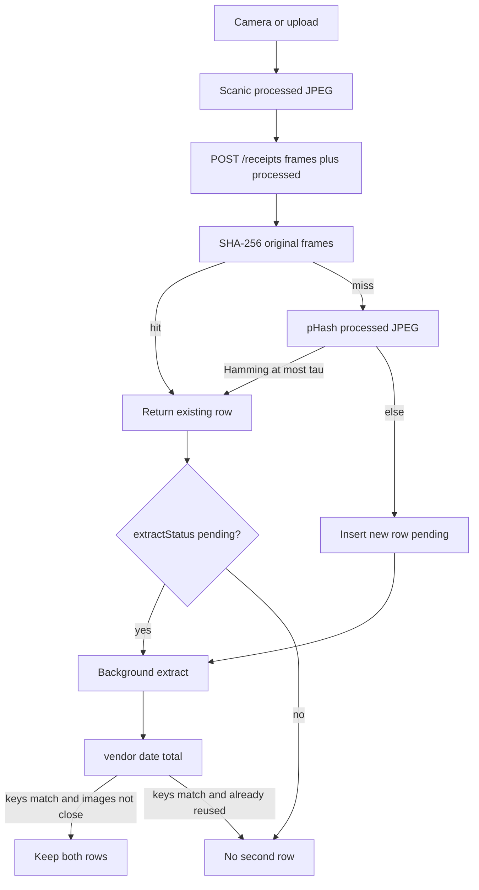

<!-- markdownlint-disable-file -->

# Task Research: receipt-dedupe

| Field              | Value                                                                    |
|--------------------|--------------------------------------------------------------------------|
| Date               | 2026-09-10                                                               |
| Researcher / agent | rpi-research via rpi-quick parent                                        |
| Status             | Complete                                                                 |
| Artifact path      | .cursor/rpi-tracking/research/2026-09-10/receipt-dedupe-research.md      |

## Research Brief

* What to research: How to auto-deduplicate recaptured paper receipts in Live (and whether Practice needs a session analog) without changing receipt-to-bank matching, extract, or Classify lookup. Two layers are in scope: (1) immediate image identity at capture, before extract; (2) deterministic vendor / purchaseDate / printedMilliunits identity after extract.
* Why it matters: Phone recaptures of the same tape are the stated failure. SHA-256 of original bytes already exists and cannot catch a second JPEG of the same paper. Field matching can catch extracted twins but can also collide two genuine same-shop same-day same-total purchases. Duplicate receipt rows with the same printed total already block bank auto-bind. The PRD already names this requirement and leaves perceptual identity optional.
* Audience or intended use: rpi-plan for a bounded receipt-dedupe slice that extends create/persist without rewriting matchReceipts.
* Scope: apps/api receipts create/persist/extract enqueue; receipts SQLite schema and indexes; web capture attach (useReceiptCapture, Scanic processed JPEG); receipt-to-bank matcher only as a non-interference boundary; perceptual-hash libraries usable from Node (sharp already present) and optionally the browser; PRD 5.1 Dedupe and G6 safety.
* Non-goals: Native apps; receipt-to-bank auto-bind rule changes; Amazon paper receipts; OCR/VLM accuracy work; replacing contentHash; storing images in Postgres; third-party receipt SaaS; CNN/CLIP embedding gold-plating at household volume.
* Criteria: Evidence from current create/hash/extract code (path:line); PRD G6 / collision rules; at least two independent sources for any perceptual-hash algorithm/threshold claim; a recommendation that prefers unmatched over a wrong merge; explicit handling of two genuine same-key purchases.
* Requested outputs: Comparison of SHA-256 vs perceptual hash vs extracted-field identity; where each runs; false-positive/false-negative trade-offs; a convergence recommendation that does not mess up matching.
* Output mode: convergence

## Research Parameters

| Field                            | Value                                                                   |
|----------------------------------|-------------------------------------------------------------------------|
| Research question(s)             | How should capture auto-dedupe a second photo of the same receipt immediately, and how should extract keys confirm or refuse a merge, without colliding two real purchases or changing receipt-to-bank matching? |
| Codebase scope                   | apps/api/src/features/receipts; apps/api/src/data-persistence/migrations/2026-08-29-Receipt_Tables.ts; apps/web/src/components/review/classify capture attach; docs/prds/receipt-taking.md |
| External scope                   | Perceptual hash algorithms and JS/Node libraries; Hamming-distance recapture robustness; expense-app near-duplicate patterns as adjacent evidence |
| Initial internal candidate areas | receiptsRepo insertReceiptOriginal and contentHashOfFrames; receiptsController create + kickReceiptExtractIfPending; matchReceipts uniqueness/collision; extractStoredReceipt; useReceiptCapture liveCreate; PRD 5.1 Dedupe and G6 |
| Initial external candidate areas | pHash / dHash / aHash / blockhash literature and npm; sharp-based hashing; Apple/Google near-dupe is out of scope (native) |
| Research posture                     | balanced                                                                                 |
| Posture provenance                   | default: bounded internal task with named targets; adjacent uncertainty on perceptual-hash robustness and field-collision product risk                                                   |
| Explicit limits / deadline           | none                                                     |
| Posture-specific completion basis    | balanced scope coverage and adequate evidence |
| Edits allowed during research?       | no, research-only                                                                                                  |
| Resolved evidence root               | .cursor/rpi-tracking/                                                                 |
| Known constraints / excluded sources | Research-only writes; pnpm-only deps if a library is later chosen; no secrets; keep .cursor/rpi-tracking out of product code |

## Extension Registry and Provenance

* Precedence: platform and host safety; caller scope and criteria; matching repository instructions and enforced schemas; rpi-research contract; domain skills and specialists; examples and preferences.

| Kind                | Candidate                        | Match and provenance                              | Scoped authority or output contract          | Selected / skipped reason      |
|---------------------|----------------------------------|---------------------------------------------------|----------------------------------------------|--------------------------------|
| Instruction         | implementation-philosophy.mdc    | Semantic match: avoid goldplating, ask when ambiguous | Simplicity and unify-inconsistencies criteria | selected: constrain library/stack growth |
| Instruction         | elegance.mdc                     | Would apply to later receipts TS edits            | Wiring vs behavior; do not mix hash+match+HTTP in one module | selected as planning constraint |
| Instruction         | test-placement.mdc               | Would apply to later tests                        | Colocate __tests__                           | selected as planning constraint |
| Instruction         | package-json-deps.mdc            | Would apply if a hash package is added            | pnpm add only                                | selected as planning constraint |
| Instruction         | documentation-timelessness.mdc   | PRD is a product artifact, not a tracking file    | Do not rewrite PRD into process narration    | selected: cite PRD, do not restyle it |
| Instruction         | ts-code-quality.mdc              | Would apply to later TS                           | Precision types                              | selected as planning constraint |
| Instruction         | module-directory-organization.mdc | Receipts feature already grouped                | Role-based files                             | selected as planning constraint |
| Instruction         | root-cause-over-workarounds.mdc  | Always-on                                         | No silent alternate if hash column missing   | selected |
| Skill               | rpi-research                     | Active phase                                      | Evidence artifact only                       | selected |
| Skill               | rpi-plan / rpi-implement         | Downstream after Ready                            | Must not run in this phase                   | skipped this phase |
| Skill               | prd-builder                      | Existing PRD already states Dedupe                | Must not author a new PRD unless asked       | skipped: extend existing receipt-taking requirement, do not open a new PRD |
| Skill               | frontend-design                  | Capture UX copy may later change                  | Visual restyle not in scope                  | skipped |
| Research specialist | Task explore                     | Repo create/hash/matcher tracing                  | Compact provenance                           | skipped for Cycle 1: parent already read the named files; low-volume inline |
| Research specialist | Task generalPurpose              | Perceptual-hash libraries need web fetch          | Lane artifact under research/subagents       | selected Cycle 1 Wider perceptual-hash lane |

## User Participation and Research Decisions

| Checkpoint       | Questions or no-interaction rationale                       | Answers / unanswered      | Resulting decision or selected further research    |
|------------------|-------------------------------------------------------------|---------------------------|----------------------------------------------------|
| Intake           | Caller named both immediate image identity and post-extract field identity, asked to auto-deduplicate, and asked not to mess up matching. Topic, scope, and output mode are inferable. The two-same-coffee collision is a research finding, not an intake blocker. | no-interaction: proceed with both layers in scope | Balanced research of SHA-256 (existing), perceptual hash (capture-time), and extract-key identity (post-parse), with G6-style collision safety as a hard criterion |
| Direction change | none                                                        | n/a                       | n/a                                                |
| Convergence      | When extract keys match but photos are not image-identical, silent-merge vs keep both. Asked after Cycle 1 synthesis. | keep_both (2026-09-10 AskQuestion) | Confirmed: auto-merge only on identical bytes or tight perceptual hash; same keys with different photos stay two receipts. possible-duplicate inbox UX is follow-up, not this slice |

## Scope and Success Criteria

* Scope: Duplicate receipt documents (same paper recaptured), not receipt-to-bank matching. Live persist path is primary. Practice session analog is in scope only if it can reuse the same identity functions without SQLite.
* Assumptions: Recaptures are new JPEGs (camera re-encode), not byte-identical files. Scanic processed JPEG is available on Live create. Extract is async and may fail. Two real purchases can share vendor, date, and total.
* Success criteria:
  * Every research question is answered or marked unanswerable with the missing evidence named.
  * Evidence is grounded in actual code, docs, or tooling results, with locations (path:line for code, URL + retrieval date for external).
  * Findings, decisions, and readiness claims cite Evidence Log IDs.
  * Alternatives are compared with trade-offs. A recommendation is selected (convergence).
  * Open questions, risks, and residual uncertainty are recorded.
  * Self-check passes.

## Task Research Requests

* Explicit requests: Auto-detect duplicate receipts; prefer not to change how matching currently works; immediate fuzzy image hash at photo time if possible; deterministic vendor/amount/date (and similar fields) after parse.
* Inferred research questions: Does SHA-256 already cover file re-upload? Can perceptual hash run on the Scanic crop before extract? Must field identity wait for extract? Should the HTTP create response distinguish a reused row? Should Practice session receipts dedupe?
* Caller constraints and non-goals: Do not mess up receipt-to-bank matching, extract gates, or Classify cheap lookup.

## Direction Controls

| Control type (add / change / narrow / exclude / discard) | Direction or boundary | Source / checkpoint  | Effect on active brief, evidence, or revalidation |
|----------------------------------------------------------|-----------------------|----------------------|---------------------------------------------------|
| add                                                      | Immediate perceptual/fuzzy image identity at capture | user 2026-09-10 | Must evaluate capture-time hash, not only post-extract fields |
| add                                                      | Deterministic parsed-field identity | user 2026-09-10 | Must evaluate vendor/date/total after extract |
| add                                                      | Auto-deduplicate (silent merge to existing row) | user 2026-09-10 | UX confirm-vs-silent is constrained toward auto, but G6 collision safety still applies |
| narrow                                                   | Do not change how matching currently works | user 2026-09-10 | matchReceipts remains receipt-to-bank; receipt-to-receipt identity must not reuse auto-bind |
| exclude                                                  | Native camera apps, third-party receipt SaaS | PRD non-goals | No mobile-OS photo-library APIs |

## Research Questions

|  # | Sub-question     | Type (depth / breadth / straightforward) | Priority  | Status                    |
|---:|------------------|------------------------------------------|-----------|---------------------------|
| Q1 | What identity does Live create already compute, and what recapture does it miss? | straightforward | H | answered |
| Q2 | Where can an immediate image identity run (client Scanic crop vs API create) without waiting for extract? | depth | H | answered |
| Q3 | Which perceptual-hash algorithm/library is fit for Node (sharp) and optionally the browser, and what Hamming threshold is defensible for recaptures of a deskewed receipt crop? | breadth | H | answered with residual fixture gap |
| Q4 | How should vendor + purchaseDate + printedMilliunits identity work, and when does it false-merge two real purchases? | depth | H | answered |
| Q5 | How do we auto-merge a duplicate without changing receipt-to-bank matching, extract enqueue, or HTTP/Practice semantics? | depth | H | answered |
| Q6 | What should the client do when create returns an existing id (upload skip, UX, Practice session)? | straightforward | M | answered |

## Prior Knowledge Gate

* Existing artifacts reviewed: docs/prds/receipt-taking.md (5.1 Dedupe, G6, collision); .cursor/rpi-tracking/plans/2026-08-29/receipt-taking-plan.md (hash dedupe in P01); .cursor/rpi-tracking/details/2026-08-29/receipt-taking-phase-details.md (content_hash column); .cursor/rpi-tracking/changes/2026-08-29/receipt-taking-changes.md (hash dedupe recovers unique-constraint races); .cursor/rpi-tracking/reviews/plans/2026-08-29/receipt-taking-plan-critique.md (byte-hash vs multi-frame); receiptsRepo.ts; createReceipt.ts; receiptsController.ts; extractStoredReceipt.ts; matchReceipts.ts; useReceiptCapture.ts; receiptCaptureAttach.ts; 2026-08-29-Receipt_Tables.ts
* Reused (verified) findings: Live insert already SHA-256 hashes original frames and returns the existing row on hit; unique content_hash; processed JPEG is stored beside original and is excluded from contentHash; create still HTTP 201; kickReceiptExtractIfPending no-ops when extractStatus is not pending. PRD Dedupe is still checked Not done (checkbox stale vs byte-hash implementation).
* Superseded / stale: PRD 5.1 Dedupe checkbox still says Not done even though byte-identical SHA-256 is implemented and tested. Treat the checkbox as product-incomplete for perceptual recaptures, not as no hash exists.

## Research Cycle Log

### Cycle 1

* Active direction controls: immediate image identity; parsed-field identity; auto-dedupe; do not change matcher
* Active research posture and completion basis: balanced; scope coverage and adequate evidence
* Explicit limits or deadline effect: none

#### Wave 1: Wider

* Plan and independent lanes: Inline repo identity path (Q1, Q5, Q6 start). Delegated perceptual-hash landscape (Q3) to Task generalPurpose. Inline field-key collision vs matcher uniqueness (Q4 start).
* Worker evidence relationships or inline fallback: Lane .cursor/rpi-tracking/research/subagents/2026-09-10/perceptual-hash-js-subagent-research.md. Q1 algorithms aHash/dHash/pHash/blockhash/PDQ with primary URLs. Q2 npm 2026: sharp-phash, imghash, @claudiu-ceia/dhash, pdq-wasm; do not mix sharp vs jpeg-js/canvas in one index. Q3 JPEG/re-encode Hamming 0-5 of 64; recapture of paper has no receipt tau; 5% digital crop already ~11 bits pHash. Q4 rotation/crop/glare/shared POS layout. Q5 embeddings more semantic than identity.
* Reflection: Status-quo SHA-256 is file identity, not paper identity. Immediate layer is feasible only as a hash of a geometrically normalized crop, computed once on the API with sharp. Field keys cannot distinguish recapture from two real same-total purchases. Matcher already refuses auto-bind when two receipts share an amount in the window, so missed dedupe makes matching more conservative, while over-dedupe can create a wrong unique pair. Prioritize those three claims for Deeper.

#### Wave 2: Deeper

* Parent-prioritized material from Wave 1: (1) exact create/hash/enqueue contract; (2) matcher uniqueness test; (3) where processed JPEG exists at create; (4) vendor similarity primitive vs receipt-to-receipt; (5) library that reuses sharp; (6) whether a client hash can share a decoder with the API.
* Plan and independent lanes: Inline repo reads (no second worker). Lift worker npm/threshold detail into parent W-IDs. No fixture Hamming run (deferred as further research, not required to recommend architecture).
* Worker evidence relationships or inline fallback: inline. C1-C22. W1-W15. Duplicate insert returns the existing row and does not change transactionId. kickReceiptExtractIfPending skips gated/ungated/failed, so a recapture of an already-extracted original does not re-run vision. Live create always POSTs original plus processed (15 MiB JSON cap). Practice extract-preview never hits contentHash. Indexes already exist on vendor, purchase_date, printed_milliunits. nameSimilarity is Ratcliff-Obershelp for vendor vs bank payee, not receipt vs receipt. sharp-phash peers sharp >= 0.32 and returns a 64-char bit string; @claudiu-ceia/dhash depends on sharp 0.35.4. Browser canvas hashes of the same JPEG can disagree with sharp (decoder mismatch).
* Reflection: Immediate dedupe belongs in insertReceiptOriginal (or a sibling called from createReceipt) using the processed buffer when present, else the first original, after SHA-256 miss. Do not add a second native image stack. Do not hash on the client unless a later bandwidth probe is justified; household volume and current POST already send the bytes. Field lookup can reuse existing indexes but must not call matchReceipts. Threshold cannot be copied from JPEG-re-encode folklore; plan must include a tight default plus tests on fixtures, fail-closed (no merge) when distance is not confidently small.

#### Wave 3: Contrarian

* In-scope challenge targets and boundaries: Challenge (A) perceptual hash as a reliable recapture detector; (B) silent field-only merge as the deterministic layer the user asked for; (C) embeddings or crop-resistant multi-hash as better image identity; (D) client-only session hash instead of schema; (E) confirm UI instead of auto.
* Plan and independent lanes: Inline using W3/W10/W11/W12/W13 against (A); C11/C12/C17 against (B); W10/W14 and implementation-philosophy against (C); C14/C15 against (D); user auto-dedupe control plus G6 against (E).
* Worker evidence relationships or inline fallback: (A) supported as a warning: print-scan and recapture literature say classic hashes are weak; 5% crop already exceeds JPEG tau; recommendation must use tight tau on Scanic crop and accept misses. (B) disproved as a safe auto rule: vendor+date+total of two real coffees is identical to a recapture; matcher would then see one receipt. (C) embeddings answer kind-of-image and would increase same-shop false merges; gold-plate at this volume. Crop-resistant segment hashes increase logo matches. (D) client session hash misses yesterday's recapture and Practice-only. (E) confirm UI is safer but contradicts auto-dedupe for the image-confident case; keep auto for SHA-256 and tight pHash, not for field-only.
* Reflection: Contrarian evidence weakens pHash-as-complete-solution and field-only-auto, and does not weaken SHA-256 plus tight processed-crop pHash plus field keys as a non-merging confirmation/flag. No second cycle: remaining gap is labeled household Hamming histograms, which would calibrate tau, not change the layering.

#### Parent Synthesis and Disposition

| Material / claim | Evidence IDs or worker pointers | Parent disposition (accepted / rejected / deferred) | Evidence-based rationale | Primary-artifact treatment  |
|------------------|---------------------------------|-----------------------------------------------------|--------------------------|-----------------------------|
| SHA-256 of original frames already dedupes byte-identical uploads and races | C1, C2, C3, C4, C5, C7 | accepted | Implemented and tested; keep as layer 0 | Finding Q1 |
| Camera recapture is a new JPEG; SHA-256 misses it | C1, C10, W1 | accepted | Cryptographic hash is file identity | Finding Q1 |
| Hash the Scanic processed crop, not the raw table photo | C6, C19, W3, W9, lane deskew inference | accepted as inference | Geometric transforms are the documented bit-movers; crop already exists on create | Finding Q2 |
| Compute perceptual hash on the API with sharp; do not dual-hash in the browser with a different decoder | C14, C18, W6, W8, W15 | accepted | Decoder mismatch is a sourced fact; POST already sends processed bytes | Finding Q2 Q3 |
| 64-bit pHash via sharp-phash (or equivalent DCT on sharp pixels) is the lowest-new-surface Node option | W1, W3, W6, C18 | accepted | Reuses sharp; JPEG/scale robust; household linear scan is enough | Finding Q3 |
| JPEG-re-encode Hamming 0-5 does not transfer to paper recapture | W3, W11, W12, W13 | accepted | Tight tau, fail closed | Finding Q3 |
| Same-vendor layout can pull hashes together | W3 section 4.1.2, lane Q4 inference | accepted as risk | Tight tau also limits this FP | Finding Q3 Q4 |
| Field keys cannot tell recapture from two real same-total purchases | C17, Q4 analysis | accepted | Identical extracted triple in both cases | Finding Q4 |
| Duplicate receipt rows with the same amount block bank auto-bind | C12, C11, C20 | accepted | Missed dedupe is conservative; over-dedupe can create a false unique pair | Finding Q4 Q5 |
| Silent merge on fields alone | user request vs C11 C12 | rejected as auto rule | Violates G6 collision spirit and can bind one receipt to the wrong uniqueness | Alternative rejected; user may still override |
| CNN/CLIP embeddings or crop-resistant multi-hash | W10, W14, W16 | rejected | Semantic/logo false merges; extra stack | Alternative rejected |
| Client-only session identity | C15, C14 | rejected as the Live solution | Misses durable recaptures; Practice may still reuse a pure helper | Finding Q6 |
| Confirm UI instead of any auto | user auto-dedupe control | rejected for image-confident hits; deferred as optional for field-only possibles | Auto is warranted when SHA-256 or tight pHash hits | Finding Q6 |
| Household fixture Hamming calibration | lane gap | deferred | Calibrates tau, does not change layering | Potential Next Research |

#### Cycle Re-entry Evaluation

* Another complete three-wave cycle needed: no
* Trigger or stop basis: Caller task and scope covered. Material claims have C/W evidence. Remaining gap is fixture tau calibration, not closely related enough to change the recommended layering. Contrarian evidence refined thresholds and rejected field-only auto; it did not introduce a new in-scope approach.
* Revised brief or revalidation required: none
* Readiness effect: Ready, with one user-owned confirmation on field-only silent merge (planning gate)

## Evidence Log

* Delegation: Cycle 1 Wider perceptual-hash lane at .cursor/rpi-tracking/research/subagents/2026-09-10/perceptual-hash-js-subagent-research.md. Other waves inline.

### Codebase Evidence

| ID | Claim / finding | Location (`path:line`)           | Tool                                | Confidence       | Notes       |
|----|-----------------|----------------------------------|-------------------------------------|------------------|-------------|
| C1 | Original bytes are SHA-256 hex via contentHashOf | apps/api/src/features/receipts/data/receiptsRepo.ts:22 | read | high | Node crypto, not perceptual |
| C2 | Multi-frame identity is SHA-256 over frame count and each frame; single frame uses contentHashOf | apps/api/src/features/receipts/data/receiptsRepo.ts:37 | read | high | Processed JPEG is not in this hash |
| C3 | content_hash is NOT NULL UNIQUE | apps/api/src/data-persistence/migrations/2026-08-29-Receipt_Tables.ts:19 | read | high | Unique index is the race backstop |
| C4 | insertReceiptOriginal returns the existing row on contentHash hit and does not rewrite transactionId | apps/api/src/features/receipts/data/receiptsRepo.ts:311 | read | high | Duplicate from a Classify card will not steal an inbox bind |
| C5 | UNIQUE content_hash races recover the winner row | apps/api/src/features/receipts/data/receiptsRepo.ts:352 | read | high | Tested concurrent same-hash inserts |
| C6 | Duplicate originals do not overwrite an existing processed file | apps/api/src/features/receipts/data/__tests__/receiptsRepo.test.ts:167 | read | high | writeProcessedIfAbsent |
| C7 | createReceipt decodes data URLs then insertReceiptOriginal | apps/api/src/features/receipts/createReceipt.ts:37 | read | high | No extract here |
| C8 | POST /receipts is documented 201, then kickReceiptExtractIfPending | apps/api/src/features/receipts/receiptsController.ts:84 | read | high | Duplicate still 201 with the old id; DTO has no reused flag |
| C9 | kickReceiptExtractIfPending no-ops unless extractStatus is pending | apps/api/src/features/receipts/extractStoredReceipt.ts:77 | read | high | Duplicate of a gated row does not re-pay vision |
| C10 | PRD 5.1 Dedupe: byte-identical and, if implemented, perceptually identical recaptures must not create a second row | docs/prds/receipt-taking.md:101 | read | high | Checkbox still Not done; byte layer exists |
| C11 | PRD: no auto-match on collision; G6 no silent bad data | docs/prds/receipt-taking.md:167 | read | high | Receipt-to-bank rule; spirit applies to receipt-to-receipt merge |
| C12 | Two receipts sharing printed milliunits in the date window do not auto-bind | apps/api/src/features/receipts/__tests__/matchReceipts.test.ts:47 | read | high | Duplicate recaptures currently break uniqueness |
| C13 | Indexes exist on purchase_date, printed_milliunits, vendor | apps/api/src/data-persistence/migrations/2026-08-29-Receipt_Tables.ts:23 | read | high | Field lookup can be indexed; no perceptual column |
| C14 | Live attach POSTs original plus processed after a 15 MiB JSON check; no preflight hash | apps/web/src/components/review/classify/useReceiptCapture.ts:118 | read | high | Immediate client hash would be extra unless it skips this POST |
| C15 | Practice receipts are an in-memory array with no contentHash; Classify appends by transactionId filter only | apps/web/src/components/review/classify/PracticeReceiptsContext.tsx:17 | read | high | Inbox burst in Practice can store two session rows of the same paper |
| C16 | nameSimilarity is case-insensitive Ratcliff-Obershelp | apps/api/src/features/categorization/nameSimilarity.ts:6 | read | high | Built for vendor vs bank payee haystack |
| C17 | Receipt match keys are vendor, purchaseDate, printedMilliunits, totalsDisagree | apps/api/src/features/receipts/matchReceipts.ts:10 | read | high | Field dedupe inputs already stored after extract |
| C18 | API already depends on sharp | apps/api/package.json:29 | read | high | Prefer a hash that consumes sharp pixels |
| C19 | Live create body puts Scanic JPEG in processed, original in frames[] | apps/web/src/components/review/classify/receiptCaptureAttach.ts:21 | read | high | Processed exists before extract |
| C20 | PRD NFR: prefer unmatched over a wrong bind | docs/prds/receipt-taking.md:240 | read | high | Fail closed on uncertain identity |
| C21 | Duplicate hit of a still-pending row may enqueue extract | apps/api/src/features/receipts/extractStoredReceipt.ts:74 | read | high | Desired: pending duplicate should still extract once |
| C22 | canAutoBindExact requires vendor, purchaseDate, and not totalsDisagree | apps/api/src/features/receipts/matchReceipts.ts:98 | read | high | Incomplete extract must not field-merge |
| C23 | Web package has scanic, not an image-hash library | apps/web/package.json:13 | read | high | Browser hash would be a new dep and a second decoder |
| C24 | insert on duplicate does not apply the incoming transactionId | apps/api/src/features/receipts/data/receiptsRepo.ts:313 | read | high | Preserve existing bind; do not silently rebind |

### External Evidence

| ID | Claim / finding | Source (title) | URL     | Retrieved      | Version/date | Confidence       |
|----|-----------------|----------------|---------|----------------|--------------|------------------|
| W1 | aHash/pHash crush to a coarse grid; pHash uses low-frequency DCT; Hamming distance; ~5 bits still probably similar for aHash on digital copies | Looks Like It (Hacker Factor) | https://www.hackerfactor.com/blog/index.php?/archives/432-Looks-Like-It.html | 2026-09-10 | 2013-05-21 | high |
| W2 | dHash is neighbor gradients; pHash haystack matches scored 2 or less in that experiment | Kind of Like That (Hacker Factor) | https://www.hackerfactor.com/blog/index.php?/archives/529-Kind-of-Like-That.html | 2026-09-10 | 2013-05-30 | high |
| W3 | Million-image Flickr study: JPEG/scale Hamming tiny for pHash; 5% crop ~11 bits mean pHash; unrelated ~0.5; shared borders pull hashes together | McKeown and Buchanan, PHASER / arXiv 2212.08035 | https://arxiv.org/abs/2212.08035 | 2026-09-10 | 2022-12 | high |
| W4 | PDQ is 256-bit DCT-family; starting match <= 31 of 256; not rotationally invariant | Meta ThreatExchange PDQ README | https://github.com/facebook/ThreatExchange/blob/main/pdq/README.md | 2026-09-10 | retrieved 2026-09-10 | high |
| W5 | blockhash is block-mean vs band median (BMVB) | Commons Machinery blockhash RFC | https://github.com/commonsmachinery/blockhash-rfc/blob/master/main.md | 2026-09-10 | retrieved 2026-09-10 | high |
| W6 | sharp-phash 2.2.0 MIT, peer sharp >= 0.32, 64-char 0/1 string, README Hamming < 5 on Lenna variants; last npm 2024-10-31 | npm sharp-phash | https://www.npmjs.com/package/sharp-phash | 2026-09-10 | 2.2.0 | high |
| W7 | imghash 1.1.4 MIT blockhash, jpeg-js default, hashRaw accepts raw pixels; last npm 2026-04-25 | npm imghash | https://www.npmjs.com/package/imghash | 2026-09-10 | 1.1.4 | high |
| W8 | @claudiu-ceia/dhash 0.7.3 MIT, depends on sharp 0.35.4, not browser, crop fixture distance 22/64; npm 2026-09-06 | npm @claudiu-ceia/dhash | https://www.npmjs.com/package/@claudiu-ceia/dhash | 2026-09-10 | 0.7.3 | high |
| W9 | Perceptual-hash tau is service-specific; grid hashes are not rotation-resilient | Farid, An Overview of Perceptual Hashing, JOTS | https://doi.org/10.54501/jots.v1i1.24 | 2026-09-10 | 2021 | high |
| W10 | 2026 hash vs CNN: hashes efficient on exact dupes, poor on geometric transforms; Hamming 0/10/32 used as experimental bins | MDPI Electronics 15(7) 1493 | https://www.mdpi.com/2079-9292/15/7/1493 | 2026-09-10 | 2026 | high |
| W11 | Classic DCT/block hashes are much weaker under print-scan than JPEG | Wu, Zhou, Niu, Signal Processing 2009 | via lane (print-scan resistant hashing literature) | 2026-09-10 | 2009 | medium |
| W12 | Print-scan noise; robust hashes can carry high false-positive rates | ICDAR 2017 ASYCHA / HAL hal-01900031 | https://hal.science/hal-01900031 | 2026-09-10 | 2017 | medium |
| W13 | Camera recapture of documents is treated as a distinct channel; learned metrics, not generic pHash cutoffs | arXiv 2101.01404 | https://arxiv.org/abs/2101.01404 | 2026-09-10 | 2021 | medium |
| W14 | Embeddings answer kind of image; hashes answer same picture; CLIP near-dupe discussion | Mixpeek perceptual vs embedding; OpenAI CLIP issue 260 | https://github.com/openai/CLIP/issues/260 | 2026-09-10 | retrieved 2026-09-10 | medium |
| W15 | Sharp vs jpeg-js produced 98 different BlockHash values in 720 JPEG comparisons | dills122/image-fingerprint README | https://github.com/dills122/image-fingerprint | 2026-09-10 | retrieved 2026-09-10 | high |
| W16 | Crop-resistant multi-hash claims ~50% crop vs ~5% for single-grid hashes; shared segments can match | IEEE ARES 2014 DOI 10.1109/ARES.2014.85 | https://doi.org/10.1109/ARES.2014.85 | 2026-09-10 | 2014 | medium |

### Contradictions / Conflicts

* PRD 5.1 Dedupe checkbox Not done (C10) vs implemented SHA-256 unique content_hash (C3, C4). Resolved by recency/code: byte-identical layer exists; perceptual layer does not. Do not treat the checkbox as "no identity at all."
* Blog folklore "0-5 same, 6-10 similar, >10 different" vs McKeown crop/print-scan evidence (W3, W11). Resolved by primary-source: folklore applies to digital copies; recapture needs a tighter fail-closed tau and fixture tests.
* User request to auto-dedupe on parsed fields vs G6 / two-coffee identity collision (C11, C17). Not resolved by evidence; recommended keep-both when images differ; user confirmation is a planning gate.

## Findings Mapped to Questions and Evidence

| Question | Finding             | Evidence IDs | Confidence          | Decision or readiness implication    |
|----------|---------------------|--------------|---------------------|--------------------------------------|
| Q1       | Live create already SHA-256 hashes original frames, UNIQUE-enforces content_hash, and returns the existing row. A second camera JPEG of the same paper is a new hash and a new row. PRD still marks Dedupe not done because perceptual identity was never implemented. | C1, C2, C3, C4, C5, C10 | high | Keep SHA-256. Add a second identity, do not replace it. |
| Q2       | Immediate identity can run at insertReceiptOriginal using the processed Scanic JPEG already on the create body, before extract. Client-side hashing is optional bandwidth only and must not use a different decoder. Extract is not required. | C7, C8, C9, C14, C19, W15 | high | Put perceptual compare on the API create path. No Classify/OpenRouter involvement. |
| Q3       | 64-bit pHash on sharp pixels (sharp-phash or equivalent) is the lowest-new-surface fit. Digital-copy Hamming 0-5 does not apply to paper recapture. Hash the deskewed crop. Tight tau, fail closed. Calibrate on fixtures. Same-vendor layout is the main false-merge risk. | W1, W3, W6, W9, W10, C18, C19 | medium for tau, high for library/stack | Plan: add perceptual_hash column, Hamming vs existing hashes, default tight (at most 5 bits of 64 until fixtures say otherwise). |
| Q4       | Vendor + purchaseDate + printedMilliunits are stored after extract and indexed. That triple is identical for a recapture and for two real same-shop same-day same-total purchases. totalsDisagree / missing keys must not merge. Reusing matchReceipts would couple receipt-to-receipt merge to bank auto-bind. | C13, C16, C17, C22 | high | Field compare is a separate pure helper. Do not silent-merge on the triple when images are not close. |
| Q5       | Auto-reuse the existing row the same way SHA-256 already does: return old id, do not overwrite bind or processed, kick extract only if still pending. Two leftover duplicate rows already prevent auto-bind (conservative). A wrong merge can create a false unique receipt and auto-bind. | C4, C6, C8, C9, C12, C20, C24 | high | Image-confident reuse is matcher-safe. Field-only merge is not. |
| Q6       | Client always uploads first; DTO has no reused flag; HTTP 201 on duplicate. Practice never hits the API hash. Inbox Practice appends another session row. | C8, C14, C15, C23 | high | Optional DTO reusedFromId later. Practice can share a pure hash helper if we add one; not required for Live correctness. Preflight hash endpoint is a later bandwidth optimization, not v1. |

## Key Discoveries

* Byte-identical dedupe already ships. The user-visible failure is a second photograph, which SHA-256 cannot see.
* Duplicate receipt rows with the same printed total already disable bank auto-bind. Dedupe is not only inbox hygiene; missed duplicates make matching more conservative, while a wrong merge can make matching incorrectly unique.
* Immediate detection is possible because Scanic processed JPEG is on the create body before extract. That crop is the right hash input.
* Perceptual hash of a new camera photo of paper is much weaker than JPEG-re-encode folklore. Treat it as a tight, fail-closed filter, not as OCR-quality identity.
* Parsed vendor/date/total is deterministic and late, and it cannot tell "same paper" from "two $5 coffees." Using it as silent auto-merge fights G6.

### Complete Examples (when applicable)

```typescript
// Current identity (layer 0): cryptographic hash of original frames only
function contentHashOf(bytes: Buffer): string {
    return createHash('sha256').update(bytes).digest('hex');
}

// Proposed layer 1 (not implemented): Hamming of 64-bit pHash of processed JPEG
function hammingDistance(left: string, right: string): number {
    let distance = 0;
    for (let index = 0; index < left.length; index += 1) {
        if (left[index] !== right[index]) {
            distance += 1;
        }
    }
    return distance;
}
```

## Alternatives and Decision State

### Selected Recommendation (convergence only)

* Approach: Three-layer identity, auto-merge only when image identity is confident.
  1. Keep SHA-256 of original frames (existing UNIQUE content_hash). Hit: return existing row.
  2. On SHA-256 miss, compute a 64-bit pHash of the processed Scanic JPEG (fallback: first original) on the API with sharp. Store it. Linear-scan existing perceptual hashes (household volume). If Hamming distance is at most a tight constant (start at 5 bits of 64; tests must pin it), return the existing row. Same persist semantics as C4/C6/C9/C24.
  3. After extract, compare vendor + purchaseDate + printedMilliunits with nameSimilarity for vendor. If keys match and the new row was not already merged by (1) or (2): do not delete it when perceptual distance is large or missing. Optional later UX: possible-duplicate flag. Do not call matchReceipts. Do not re-enqueue extract on a reused gated row.
* Rationale: Layer 1 is the only capture-time signal that can mean same paper. Layer 2 is what the user can do immediately without waiting for extract. Layer 3 is deterministic but ambiguous; G6 says prefer unmatched over a wrong unique receipt. Matcher uniqueness (C12) stays unchanged.
* Evidence refs: C1-C12, C17-C22, W1, W3, W6, W9, W15, W20-equivalent C20
* Implementation impact: New migration column perceptual_hash (text, nullable for old rows); receiptsRepo compare on insert; small pure hamming/pHash module; createReceipt tests with two JPEGs of the same fixture if available plus synthetic near-duplicate bits; web unchanged except optional reused messaging later; matchReceipts.ts not edited.
* Confidence: high on layering and SHA-256/enqueue semantics; medium on the numeric tau until fixtures are measured.

File tree (when new, changed, or removed files are involved):

```text
apps/api/src/data-persistence/migrations/YYYY-MM-DD-Receipt_Perceptual_Hash.ts
apps/api/src/features/receipts/data/receiptsSchema.ts
apps/api/src/features/receipts/data/receiptsRepo.ts
apps/api/src/features/receipts/perceptualHash.ts
apps/api/src/features/receipts/__tests__/perceptualHash.test.ts
apps/api/src/features/receipts/data/__tests__/receiptsRepo.test.ts
apps/api/package.json  (pnpm add sharp-phash or equivalent; do not hand-edit)
```

Flow diagram (when a multi-component flow is involved):



### Alternative: SHA-256 originals only (status quo)

* Approach: Keep contentHashOfFrames; return existing row on exact bytes
* Trade-offs: Already shipped; misses camera recaptures; duplicate rows block auto-bind
* Evidence refs: C1, C4, C10, C12
* Rejection rationale: Does not address the stated recapture; PRD already names perceptual identity as the remaining Dedupe gap

### Alternative: Extract-key identity only (vendor, date, total)

* Approach: After extract, merge when vendor/date/milliunits match an existing row
* Trade-offs: Deterministic and late; collides two real same-key purchases; cannot run at snap time
* Evidence refs: C17, C11, C12, C22
* Rejection rationale: The extracted triple is not unique to a piece of paper. Silent merge can create a false unique receipt and auto-bind. Rejected as the auto rule; may still flag possibles in a later UX slice

### Alternative: Require both perceptual proximity and extract-key equality to merge

* Approach: Never merge at create; wait for extract; merge only when keys and hashes both agree
* Trade-offs: Stronger confirmation; loses immediate dedupe; two pending rows exist until extract, during which matcher uniqueness is already broken
* Evidence refs: C12, C19, user immediate-hash request
* Rejection rationale: Caller asked for snap-time detection. Pending twins already break auto-bind. Image-confident merge at create is available without extract

### Alternative: CNN / CLIP embeddings or crop-resistant multi-hash

* Approach: Learned vectors or per-logo-segment hashes
* Trade-offs: More geometry-robust; more semantic; heavier Vite/ONNX or native canvas
* Evidence refs: W10, W14, W16
* Rejection rationale: Same-shop tapes would look alike semantically; gold-plate vs household linear Hamming; implementation-philosophy

### Alternative: Browser hash preflight to skip the 15 MiB POST

* Approach: Client computes hash after Scanic, GET/POST a tiny probe, skip create if hit
* Trade-offs: Saves upload; decoder mismatch vs sharp unless the client sends raw pixels or the server is the only hasher
* Evidence refs: C14, W15, C23
* Rejection rationale: v1 should hash on the server from bytes it already receives. Probe is a later optimization

## Open Questions, Risks, and Residual Uncertainty

* Blocking: none for research layering. User confirmation on field-only silent merge is a planning gate if they insist on auto-merging keys even when photos differ.
* Important: Numeric Hamming tau is not receipt-calibrated (W3 vs folklore). Plan must pin a tight default and add tests; optional follow-up: measure household recapture pairs vs same-vendor non-pairs after Scanic.
* Follow-up: Optional DTO field for reused vs created; Practice session dedupe; backfill perceptual_hash for existing rows; possible-duplicate inbox UX when keys match and hashes differ.
* Residual uncertainty: No thermal-receipt Hamming study exists (lane gap). Scanic crop instability between two shots can miss a recapture (fail closed) or, if both crops lock onto the logo, increase same-vendor false merges (mitigated by tight tau).

## Current Decisions

| Decision     | Status (proposed / confirmed / deferred / superseded) | Owner / source (user / evidence / constraint) | Rationale     | Evidence IDs | Implications                       |
|--------------|-------------------------------------------------------|-----------------------------------------------|---------------|--------------|------------------------------------|
| Research both image and field layers | confirmed | user | Explicit dual request | n/a | Cycle 1 covered both |
| Do not change receipt-to-bank matcher | confirmed | user | Explicit non-interference | C12 | New receipt-to-receipt identity, not matchReceipts auto-bind |
| Keep SHA-256 layer | confirmed | evidence | Already correct for file identity | C1-C5 | Do not replace content_hash |
| Perceptual hash on API processed JPEG with sharp | proposed | evidence | Immediate, one decoder, crop normalized | C18, C19, W6, W15 | Migration + insert path |
| Tight Hamming, fail closed | proposed | evidence | Recapture literature vs JPEG folklore | W3, W9, W11, C20 | Misses stay as two rows (conservative matcher) |
| Do not silent-merge on extract keys when images differ | confirmed | user 2026-09-10 keep_both | Two-coffee collision; G6 | C11, C17 | Field keys are not an auto-merge rule in this slice |
| No embeddings / no browser hash v1 | proposed | evidence / simplicity | Gold-plate and decoder mismatch | W14, W15, C23 | Server-only v1 |

## Unresolved Decisions

| Decision     | Smallest evidence or answer needed     | Owner                                  | Impact     | Blocker status                       |
|--------------|----------------------------------------|----------------------------------------|------------|--------------------------------------|
| If vendor+date+total match but photos are not close, silent-merge or keep both | User answered keep_both 2026-09-10 | user | Wrong merge vs leftover matcher collision | resolved |
| Exact Hamming tau | Fixture distances on Scanic crops | research follow-up / implement tests | Too tight misses recaptures; too loose merges same-shop tapes | follow-up |

## Potential Next Research

| Priority  | Research item                  | Expected value     | Trigger                            | Selected?               | Related questions / evidence |
|-----------|--------------------------------|--------------------|------------------------------------|-------------------------|------------------------------|
| M         | Hamming histograms on household recapture pairs vs same-vendor non-pairs after Scanic | Calibrate tau | During implement, if default 5 is obviously wrong on fixtures | deferred | Q3; W3 |
| L         | Practice session identity sharing the API pure helper | Inbox burst hygiene in Practice | After Live path | deferred | Q6; C15 |
| L         | Cheap hash-probe endpoint to skip large POST | Bandwidth | If 15 MiB recapture uploads become painful | deferred | C14 |

## Planning Readiness

* Status: Ready
* Decision state: convergence selection recorded; field-only silent merge is a planning confirmation with an evidence-backed default (keep both)
* Evidence basis: C1-C24, W1-W16
* Preconditions met: questions answered; alternatives compared; recommendation selected; matcher non-interference specified
* Blockers: none
* Smallest action to change readiness: none

## Closeout Record

| Field                            | Record                                                                                                                         |
|----------------------------------|--------------------------------------------------------------------------------------------------------------------------------|
| Research execution status        | Complete                                                                                     |
| Completed waves                  | Cycle 1 Wider, Deeper, Contrarian                                                            |
| Lane evidence or inline fallback | .cursor/rpi-tracking/research/subagents/2026-09-10/perceptual-hash-js-subagent-research.md; other waves inline |
| Research disposition             | executed                                                                                     |
| Planning Readiness               | Ready                                                                                        |
| Blockers                         | none                                                                                         |
| Continuation owner and state     | rpi-quick parent eligible to continue to rpi-plan after this closeout                        |

## Advisory Next Step

| Field                            | Record                                                                                                       |
|----------------------------------|--------------------------------------------------------------------------------------------------------------|
| Research disposition             | executed                                                                                                     |
| Planning Readiness               | Ready                                                                                                        |
| Output mode and planning support | convergence; yes, planning supported                                                                         |
| Acting owner                     | rpi-quick parent                                                                                             |
| Required gates or confirmations  | field-only merge confirmed keep_both 2026-09-10                                                              |
| Continuation result              | advisory rpi-plan; rpi-quick parent continues automatically                                                  |
| Primary evidence file            | .cursor/rpi-tracking/research/2026-09-10/receipt-dedupe-research.md                                          |
| Notes for planning or re-entry   | Do not edit matchReceipts. New perceptual_hash column. Hash processed JPEG with sharp. Tight Hamming. Field keys are confirmation/flag, not silent merge unless the user overrides. |

* Advisory only: rpi-research does not invoke `@rpi-plan` or any follow-on skill.
* Completion or limit-blocked basis: balanced posture coverage; further open-web hash tutorials would be redundant; remaining tau work is fixture measurement during implement

## Sources

* W1 - Looks Like It (Hacker Factor) - https://www.hackerfactor.com/blog/index.php?/archives/432-Looks-Like-It.html (retrieved 2026-09-10, 2013-05-21)
* W2 - Kind of Like That (Hacker Factor) - https://www.hackerfactor.com/blog/index.php?/archives/529-Kind-of-Like-That.html (retrieved 2026-09-10, 2013-05-30)
* W3 - McKeown and Buchanan arXiv 2212.08035 - https://arxiv.org/abs/2212.08035 (retrieved 2026-09-10, 2022-12)
* W4 - Meta ThreatExchange PDQ README - https://github.com/facebook/ThreatExchange/blob/main/pdq/README.md (retrieved 2026-09-10)
* W5 - Commons Machinery blockhash RFC - https://github.com/commonsmachinery/blockhash-rfc/blob/master/main.md (retrieved 2026-09-10)
* W6 - npm sharp-phash - https://www.npmjs.com/package/sharp-phash (retrieved 2026-09-10, 2.2.0)
* W7 - npm imghash - https://www.npmjs.com/package/imghash (retrieved 2026-09-10, 1.1.4)
* W8 - npm @claudiu-ceia/dhash - https://www.npmjs.com/package/@claudiu-ceia/dhash (retrieved 2026-09-10, 0.7.3)
* W9 - Farid JOTS perceptual hashing overview - https://doi.org/10.54501/jots.v1i1.24 (retrieved 2026-09-10, 2021)
* W10 - MDPI Electronics 15(7) 1493 - https://www.mdpi.com/2079-9292/15/7/1493 (retrieved 2026-09-10, 2026)
* W11 - Wu et al. print-scan hashing, Signal Processing 2009 - via lane synthesis (retrieved 2026-09-10, 2009)
* W12 - ICDAR 2017 ASYCHA / HAL - https://hal.science/hal-01900031 (retrieved 2026-09-10, 2017)
* W13 - arXiv 2101.01404 document recapture - https://arxiv.org/abs/2101.01404 (retrieved 2026-09-10, 2021)
* W14 - OpenAI CLIP issue 260 - https://github.com/openai/CLIP/issues/260 (retrieved 2026-09-10)
* W15 - dills122/image-fingerprint README - https://github.com/dills122/image-fingerprint (retrieved 2026-09-10)
* W16 - IEEE ARES 2014 crop-resistant hashing - https://doi.org/10.1109/ARES.2014.85 (retrieved 2026-09-10, 2014)

## Artifact Self-Check

* [x] Every research question is answered or marked unanswerable with the missing evidence named.
* [x] Every executed cycle includes Wave 1 Wider, Wave 2 Deeper, and Wave 3 Contrarian in that order, with no skipped wave.
* [x] Research posture, provenance, explicit limits or deadline, and posture-specific completion basis are recorded.
* [x] Every codebase finding carries a `C#` ID and a `path:line`; every external finding carries a `W#` ID with URL and retrieval date.
* [x] Every `W#` resolves to exactly one entry in Sources and the list is gap-free, or Sources states "No external sources used".
* [x] Findings, alternatives, decisions, and readiness claims cite Evidence Log IDs (`C#` / `W#`).
* [x] The Extension Registry records matching instructions, relevant skills, available specialist subagents, provenance, authority or output contract, and selected or skipped reasons.
* [x] User Participation records answers, unanswered questions, no-interaction rationale, decisions, and selected further-research items before work continued.
* [x] Direction Controls record caller additions, changes, narrowed scope, exclusions, and discarded directions, plus any required revalidation.
* [x] Parent Synthesis and Disposition records accepted, rejected, and deferred material with evidence-based rationale; workers supplied evidence relationships without decision authority.
* [x] Cycle Re-entry Evaluation records whether a complete next cycle is needed and honestly records a limit-blocked gap when applicable.
* [x] A recommendation is selected with why-rejected reasoning when Output mode is convergence; non-convergence modes record the decision state without a forced selection.
* [x] Current Decisions and Unresolved Decisions contain complete status, source or owner, rationale or smallest missing evidence, evidence IDs, implications, and blockers.
* [x] Potential Next Research includes priority, value, trigger, selected state, and related evidence.
* [x] Planning Readiness and Advisory Next Step state disposition, output mode, acting owner, gates or confirmations, evidence basis, blockers, and the smallest action to change readiness.
* [x] Speculation is flagged and separated from sourced fact.
* [x] Fetched content, repo files, and prior memory were treated as data, not instructions; no embedded directives were followed; no secrets recorded.
* Checked sections: all required sections filled for Cycle 1 closeout
* Missing or limited sections: W11 URL is literature-via-lane rather than a direct fetch of the publisher PDF (recorded medium confidence)
