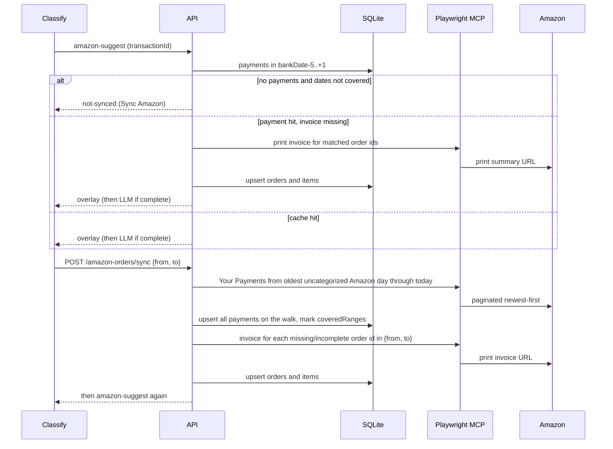

# Amazon classify: cache, sync, and scrape

Opening a YNAB Amazon charge in Classify does **not** talk to Amazon. It reads SQLite. Amazon is scraped when you click **Sync Amazon** (`POST /api/amazon-orders/sync`) for payments, and when suggest finds a matched payment whose invoice lines are missing.

Storage is `apps/api/data/app.sqlite` (or `SQLITE_DB_PATH`). The scraper is a headed Playwright MCP (`AMAZON_ORDERS_MCP_ENTRY`, produced by `pnpm setup:amazon-mcp`). Login cookies live in the MCP browser profile (`~/.amazon-order-history-mcp/browser-data`), not in SQLite. Tool calls share one Playwright session; they run one at a time.

## What happens when you open a transaction

1. Classify calls `POST /api/categorization/amazon-suggest` with the YNAB `transactionId`.
2. The API loads Amazon **payments** whose `payment_date` falls in **bank date −5 … +1**.
3. If that window has **zero** payments **and** those calendar days are not in `coveredRanges`, the overlay is `not-synced` (no LLM). The UI shows **Sync Amazon**.
4. If there is at least one payment in the window, matching is **amount**: a unique payment whose milliunits equal the bank charge. That payment’s order ID(s) load stored **orders** and **line items**.
5. If those order IDs are missing or have no line items, suggest fetches those print invoices (not Your Payments) and continues. Neighbors in the filmstrip prefetch the same suggest endpoint, so their invoices load the same way.
6. If the invoice total says the items do not cover it, or the stored item sum is well below the bank charge after that fetch, the overlay is `not-synced`. Sync again.
7. Only then does OpenRouter categorize those lines.

**Sync Amazon** still sends `{ from: bankDate-5, to: bankDate+1 }` for **invoices**. Payment indexing is wider (below).

## Sync is two phases

### 1. Payments (Your Payments)

Amazon’s Your Payments list is newest-first. Reaching a six-month-old charge means walking pages from today back to that date. That walk is what takes minutes.

`coveredRanges` is a list of date ranges already scraped for **payments**. Sync computes gaps between:

- **start:** the older of the classify window start and (oldest uncategorized Amazon YNAB date − 5 days)
- **end:** today

If any of that span is uncovered, MCP opens [Your Payments](https://www.amazon.com/cpe/yourpayments/transactions) once, walks **Next** (form POST with `ppw-widgetState`) until the start date is on a page or paging ends, and **stores every payment in that span**. Intermediate pages are not discarded. That span is added to `coveredRanges`.

A later charge whose bank date already sits inside `coveredRanges` skips Your Payments entirely.

The first Sync on any uncategorized Amazon charge is the index job: one long walk as far back as the oldest Amazon item still in the review queue, then every newer payment is already in SQLite. Opening an older charge than that first walk still has to page from today (Amazon has no “jump to March”), which is why the first click should be allowed to finish.

### 2. Order invoices (print summary)

From payments in the requested `{from, to}` only (not the full payment index), collect order IDs. For each ID, if there is no stored order, or the stored order has no items / a missing `$0` total / items that do not cover the invoice total, MCP loads:

`https://www.amazon.com/gp/css/summary/print.html?orderID=…`

That page is **one goto per order**, not another walk of Your Payments. Line items come from `[data-component="purchasedItems"]` / `[data-component="itemTitle"]`; totals from `[data-component="chargeSummary"]`.

Suggest uses the same invoice fetch when a matched payment has no stored line items, including for filmstrip neighbors. That does not re-page Your Payments.

## Matching rules (unchanged by sync)

- Date window: bank day −5 … +1.
- Amount uniqueness in that window. Several payments with the same amount → unmatched (split by hand).
- Several order IDs on one payment → batched orders.
- Invoice grand total present and different from the bank amount → partial shipment (split shipment), not “wrong order.”

Subscribe & Save list prices can exceed the card charge. Classify nets stored line items onto the bank amount; that is not treated as missing lines.

## Clearing the order cache

`pnpm clear:amazon-cache` deletes stored **orders**, **line items**, and Amazon split overlays. **Payments**, **coveredRanges**, and the Chromium login stay.

After that, Classify still sees payments for windows you already synced. Opening a card fetches that card’s invoices (and prefetched neighbors) without walking Your Payments. **Sync Amazon** also re-fetches invoices for order IDs in the button’s `{from, to}`.

To wipe payments and coverage as well, that is not this command; you would be choosing to paginate Your Payments again.

## Setup

See the Amazon section in the repo `README.md` and `third_party/README.md`. Point `AMAZON_ORDERS_MCP_ENTRY` at `third_party/amazon-order-history-csv-download-mcp/dist/index.js` (path is resolved from the repo root).
