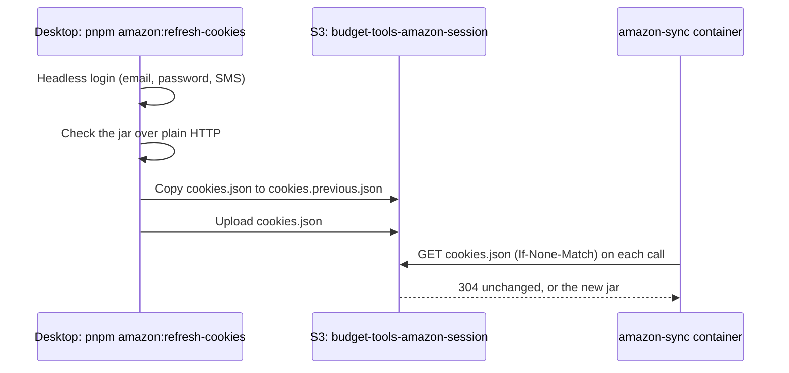

# Refreshing the Amazon session

```powershell
pnpm amazon:refresh-cookies
```

Run it in a terminal on the desktop when Amazon sync reports `COOKIES_EXPIRED` or
`COOKIES_MISSING` (the classify panel says "Run `pnpm amazon:refresh-cookies`"). It asks
for your Amazon email, password and the SMS code, then:

1. logs in with a headless browser (no window opens; the challenge can take ~30 s),
2. checks the jar holds the session cookies and works over plain HTTP, the way the server
   uses it,
3. uploads it to S3, keeping the old one as `cookies.previous.json`.

The amazon-sync service uses the new jar on its next call. Nothing needs restarting.

If any step fails it says so and uploads nothing, so the jar the server has is untouched.
The output lists cookie names (never values) and how old the previous jar was. That age
is the best measurement we have of how long a session lasts.

The first run takes a few minutes: it creates `apps/amazon-sync/.venv-browser` and
downloads a headless Chromium. Later runs start straight away.

## Already have a jar?

```powershell
pnpm amazon:refresh-cookies --jar path\to\cookies.json
```

Skips the login and just checks and uploads the file.

## One-time setup

The jar lives in its own bucket, `budget-tools-amazon-session`, with its own service
account, so receipt credentials can't read an Amazon session and vice versa.

```powershell
pnpm provision:amazon-session-s3
```

It reads the rust-fs admin key (`RUSTFS_ADMIN_*`) from `.env.local`, creates the bucket and
service account, and writes the `AMAZON_COOKIES_S3_*` settings back into `.env.local`, so
`pnpm amazon:refresh-cookies` works straight after. Running it again does nothing once those
settings exist (`--force` makes a new service account). It downloads the MinIO Client
(`mc`) into `.tools/` on first run if it isn't already there or on PATH.

The amazon-sync service's production environment needs the same `AMAZON_COOKIES_S3_*`
values, copied from `.env.local`.

## How it fits together



The server only reads the jar. If S3 is unreachable it keeps using the last copy it
fetched, and reports `COOKIE_STORE_UNAVAILABLE` (not an expired session) if it never had one.

Local development: when `AMAZON_COOKIES_S3_BUCKET` is set in `.env.local`, `pnpm dev`'s
amazon-sync reads the same S3 jar as production. Without it, it reads
`AMAZON_COOKIE_JAR_PATH`.
