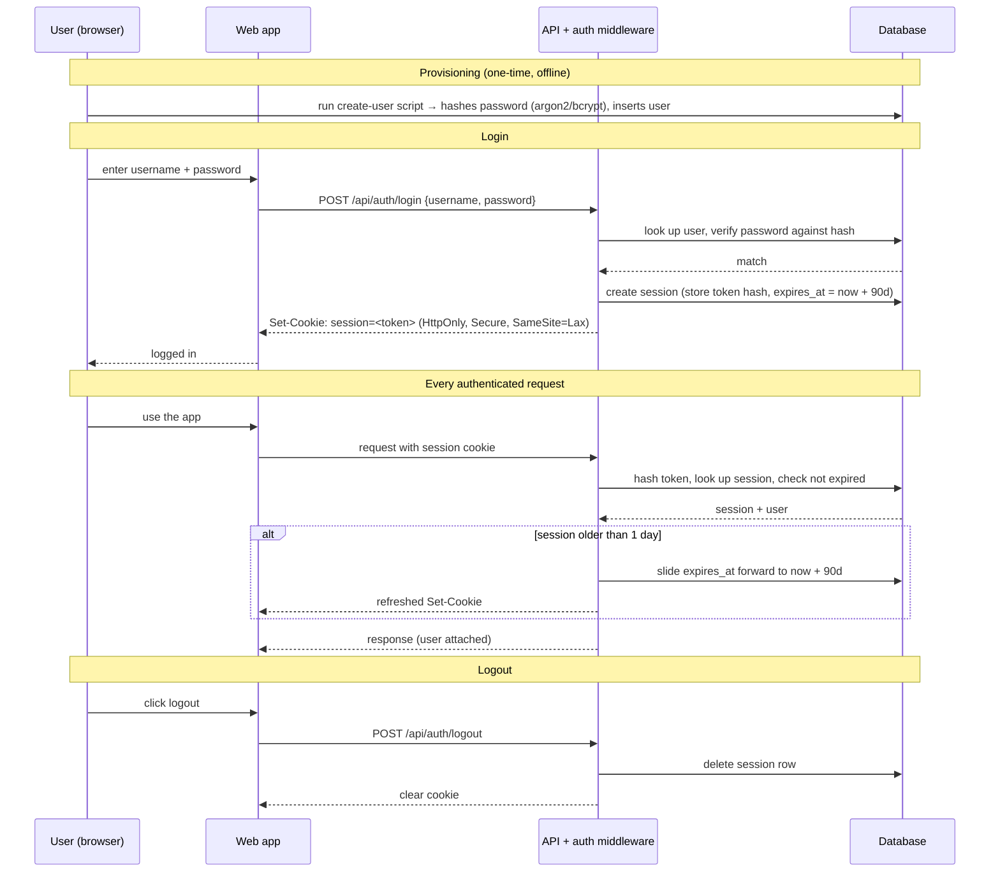

# Authentication flow

```mermaid
sequenceDiagram
    participant U as User (browser)
    participant W as Web app
    participant A as API + auth middleware
    participant D as Database

    Note over U,D: Provisioning (one-time, offline)
    U->>D: run create-user script → hashes password (argon2/bcrypt), inserts user

    Note over U,D: Login
    U->>W: enter username + password
    W->>A: POST /api/auth/login {username, password}
    A->>D: look up user, verify password against hash
    D-->>A: match
    A->>D: create session (store token hash, expires_at = now + 90d)
    A-->>W: Set-Cookie: session=<token> (HttpOnly, Secure, SameSite=Lax)
    W-->>U: logged in

    Note over U,D: Every authenticated request
    U->>W: use the app
    W->>A: request with session cookie
    A->>D: hash token, look up session, check not expired
    D-->>A: session + user
    alt session older than 1 day
        A->>D: slide expires_at forward to now + 90d
        A-->>W: refreshed Set-Cookie
    end
    A-->>W: response (user attached)

    Note over U,D: Logout
    U->>W: click logout
    W->>A: POST /api/auth/logout
    A->>D: delete session row
    A-->>W: clear cookie
```
