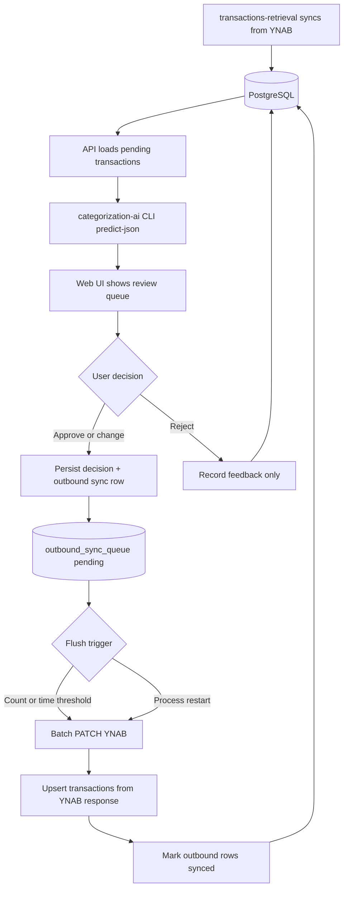

# PRD: YNAB Transaction Categorization API & UI

## 1. Summary

Build a web application and HTTP API that let a household reviewer approve, reject, or correct AI-generated category suggestions for YNAB transactions. The system wraps the existing `categorization-ai` engine (already designed for this workflow), persists audit feedback, and writes approved categories back to YNAB.

The deliverable is three new monorepo packages:

| Package | Role |
|---------|------|
| `apps/api` | Express + TSOA backend exposing categorization and YNAB write-back endpoints |
| `apps/web` | React + Mantine review UI consuming a typed SDK |
| `packages/web-sdk` | Auto-generated TypeScript client from the API OpenAPI spec |

Scaffolding (tooling, codegen pipeline, dev proxy, lint hooks) is intentionally separated from product functionality. This document defines **what** we are building; implementation plans for scaffolding and each product area follow in separate documents.

---

## 2. Problem

Today the budget-tools repo can:

1. **Pull** YNAB transactions and categories into PostgreSQL (`transactions-retrieval`)
2. **Predict** categories for pending transactions via a .NET CLI (`categorization-ai predict-json`)

What is missing:

- No HTTP API to serve proposals to a client
- No UI for human review
- No YNAB **write** path (category assignment never leaves the local system)
- Feedback recording exists in schema and C# code but is not wired to any interface

A reviewer must currently run CLI commands, read JSON on stdout, and manually categorize in YNAB. The categorization engine is production-ready for an approval UI; the integration layer is not.

---

## 3. Goals

### Primary goals

1. **Review queue** — Show pending transactions with AI proposals, tier, confidence, flags, and alternatives.
2. **Approve / reject / change** — One-click approve for strong suggestions; deny or pick a different category when needed.
3. **YNAB persistence** — Enqueue approved/changed transactions; flush to YNAB in durable batches (§9.1)
4. **Transaction editing** — Edit category, payee, and memo before confirming; not category-only
5. **Feedback audit** — Record every decision via `categorization_feedback` with full proposal snapshot
6. **Typed client** — Frontend uses an auto-generated SDK from the API OpenAPI spec (same pattern as ai-knowledge-helper)
7. **Re-sync loop** — After YNAB flush, mirror `transactions` from PATCH response; retrieval delta sync handles drift

### Non-goals (v1)

- Replacing or reimplementing the ML pipeline in TypeScript
- Auto-applying `AutoApply` tier transactions without human confirmation (configurable later)
- Split-transaction categorization (pipeline excludes splits today)
- Transfer transaction categorization
- Multi-user auth / RBAC (single-household tool; auth is a future concern)
- Mobile-native app
- Replacing `transaction-cleaner` bank CSV matching workflow
- Scheduled retraining orchestration (manual `dotnet run train` remains acceptable for v1)

---

## 4. Users & workflows

### Primary user

Household budget manager who periodically reviews uncategorized or AI-flagged transactions after bank sync.

### Core workflow



Decisions that change YNAB state are **not** sent immediately. They are persisted to an outbound sync queue and flushed in batches (see §9.1). Rejections skip the queue.

### Review interactions by tier

| Tier | UI behavior | Default action |
|------|-------------|----------------|
| `AutoApply` | Prominent suggestion, high confidence badge, optional "approve all" batch | Single-click approve |
| `Suggested` | Primary suggestion + "approve" button; show agreeing methods | Single-click approve |
| `Review` | Editable fields + category picker from `alternatives`; show flags | User confirms with edits |
| `Blocked` | Explain exclusion; editable fields; manual category required | User confirms with edits |

---

## 5. System context

### Existing components (unchanged responsibilities)

| Component | Technology | Responsibility |
|-----------|------------|----------------|
| `transactions-retrieval` | TypeScript, Kysely, `ynab` npm SDK | Delta sync YNAB → Postgres; categories, transactions, metrics |
| `categorization-ai` | .NET 8, ML.NET, EF Core | **CLI only** — `predict-json` for proposals; no HTTP, no feedback writes |
| PostgreSQL | Docker (dev) | Shared data store |

### Pending transaction definition

A transaction appears in the review queue when it is cleared or reconciled, not deleted, not a transfer, not a split, and any of:

- `approved = false`
- `category_id` is null
- Category name is excluded (e.g. `Uncategorized`, `Inflow:*`)

(Source: `TransactionQueries.GetPendingTransactions`)

### Proposal shape

The API and UI consume `CategorizationProposal` (already JSON-serializable):

| Field | UI use |
|-------|--------|
| `transactionId` | Join to transaction details |
| `tier` | Queue grouping, action defaults |
| `suggestedCategory` / `suggestedCategoryId` / `suggestedCategoryGroup` | Primary suggestion display |
| `confidence`, `method`, `gapReason` | Explainability |
| `signals`, `agreeingSignals` | Method breakdown (expandable detail) |
| `alternatives` | Category picker options (up to 8 ranked) |
| `flags` | Warning badges |
| `featureText`, `resolvedPayee`, `notes` | Context panel |

`predict-json` output envelope:

```json
{
  "summary": { "total", "autoApply", "suggested", "review", "blocked" },
  "proposals": [ /* CategorizationProposal[] */ ]
}
```

### Feedback model

`CategorizationFeedbackService` supports three actions:

| Action | When | Required fields |
|--------|------|-----------------|
| `Approved` | User accepts AI suggestion | Proposal with `suggestedCategory` |
| `Changed` | User picks different category | `chosenCategory` (+ id/group) |
| `Rejected` | User denies without applying | Proposal snapshot only |

Training data comes from synced categorized transactions, not directly from feedback rows. Feedback is audit and metrics.

### YNAB write gap

`YnabService` today only reads (`getTransactions`, `getCategories`). The API must add transaction update via the official `ynab` SDK (`transactions.updateTransaction`).

---

## 6. Product requirements

### 6.1 API — Categorization endpoints

#### `GET /api/categorization/queue`

Return the pending review queue.

**Response:**

- `summary`: `CategorizationProposalQueueSummary` (counts by tier)
- `proposals`: `CategorizationProposal[]`
- `transactions`: map or array of transaction detail DTOs keyed by `transactionId` (date, amount, payee, account, memo, import_id, current category)

**Behavior:**

- Invoke categorization-ai prediction (see §7.1 integration options)
- Support query params:
  - `tier` — filter by one or more tiers
  - `accountId` — filter by account
  - `llm` — boolean, enable LLM fallback for this request (default: server config)
- Proposals are computed on demand (not persisted in v1)
- Return empty queue with zeroed summary when no pending transactions

#### `GET /api/categorization/transactions/{transactionId}`

Return a single transaction with its current proposal and feedback history.

**Response:**

- Transaction detail DTO
- Latest `CategorizationProposal` (recomputed or from same batch)
- `feedbackHistory`: prior `CategorizationFeedback` entries

#### `POST /api/categorization/decisions`

Record a user decision. Approve/change actions enqueue outbound YNAB changes; they do **not** call YNAB synchronously.

**Request body:**

```typescript
type TransactionEdits = {
    categoryId?: string;
    payeeName?: string;
    payeeId?: string;
    memo?: string;
    /** When true, include approved: true in the YNAB PATCH payload. See §9.3. */
    markApprovedInYnab?: boolean;
};

type CategorizationDecisionRequest = {
    transactionId: string;
    action: 'approved' | 'rejected' | 'changed';
    proposal: CategorizationProposal; // snapshot at decision time
    edits?: TransactionEdits; // required for 'changed'; optional overrides for 'approved'
    notes?: string;
};
```

For `approved`, default `edits` from the proposal suggestion (category id/name). For `changed`, user-supplied `edits` are required (at minimum `categoryId`). Payee and memo edits are optional on both.

**Behavior:**

1. Validate request
2. Insert feedback row into `categorization_feedback` (audit — always)
3. If `action` is `rejected`: return immediately (no outbound row)
4. If `action` is `approved` or `changed`:
   - Upsert row in `outbound_sync_queue` with status `pending` and the `edits` payload
   - If a pending row already exists for this `transaction_id`, replace it (latest decision wins)
5. Return decision record + outbound queue status (pending until flushed)
6. Background flusher evaluates flush triggers (§9.1)

**Errors:**

- `404` — transaction not found
- `422` — validation failure (e.g. approve without category, change without edits)

#### `GET /api/categorization/outbound-sync`

Return outbound sync queue status for the UI.

**Response:**

- `pendingCount`, `syncingCount`, `failedCount`
- `oldestPendingAt`, `nextScheduledFlushAt` (if time-based)
- `recentBatches`: last N flush attempts with counts and errors

#### `POST /api/categorization/outbound-sync/flush`

Manually trigger a flush now (still respects YNAB rate limits). Returns batch result.

#### `GET /api/categorization/stats`

Return feedback accuracy summary and queue counts.

**Response:**

- `FeedbackAccuracySummary` (total, approved, changed, rejected, acceptanceRate, suggestionFollowRate)
- Optional `since` query param for date filtering

### 6.2 API — Reference data

#### `GET /api/categories`

Return category groups and categories from Postgres (synced by `transactions-retrieval`).

**Response:**

- Category groups with nested categories
- Include `id`, `name`, `hidden`, `deleted` flags
- Used by UI category picker beyond proposal `alternatives`

#### `GET /api/payees` (or include in categories response)

Return payees from Postgres for payee dropdown. Source: synced YNAB payees table (add to schema if not present; otherwise fetch from YNAB on a schedule). Exact source TBD in `api-read-path` plan.

#### `GET /api/health`

Standard health check for dev and deployment.

### 6.3 API — YNAB integration requirements

| Requirement | Detail |
|-------------|--------|
| Auth | `YNAB_API_KEY` from typed env module (never committed) |
| Budget selection | `YNAB_BUDGET_NAME` (existing convention) |
| Write path | **Batched** `PATCH /budgets/{id}/transactions` via outbound sync flusher (§9.1) |
| Editable YNAB fields | `category_id`, `payee_name` / `payee_id`, `memo`, optionally `approved` (see §9.3) |
| Error handling | Surface YNAB rate limits (429) and per-transaction failures; mark outbound rows `failed` with retry |
| Post-flush local state | Upsert `transactions` **only** from YNAB PATCH response fields — never guess |
| Recovery | Outbound queue persisted in Postgres; flusher resumes `pending`/`failed` rows on API restart |
| Idempotency | Re-flushing the same pending row should be safe; use transaction `id` + version awareness |

### 6.4 UI — Review application

#### Layout

- App shell with sidebar navigation (queue, stats; future: settings)
- Default route: review queue
- Dark mode default (match ai-knowledge-helper aesthetic baseline)

#### Queue view

- Summary bar: counts by tier (`autoApply`, `suggested`, `review`, `blocked`)
- Filter controls: tier, account
- Transaction list/cards sorted by tier priority (AutoApply first, then Suggested, Review, Blocked)
- Each item shows:
  - Date, amount (formatted from milliunits), payee, account, memo
  - Suggested category with confidence and tier badge
  - Flag chips (`Ambiguous`, `Novel import`, `Excluded`, etc.)
  - Expandable signals panel (methods and confidences)

#### Transaction editor (per queue item)

Each transaction card exposes editable fields before confirm:

| Field | Control | Notes |
|-------|---------|-------|
| Category | Searchable dropdown | Pre-filled from suggestion; full list from `GET /api/categories`; alternatives highlighted |
| Payee | Searchable dropdown or combobox | Pre-filled from transaction; allow rename / pick existing payee |
| Memo | Text input | Optional edit |
| Mark approved in YNAB | Checkbox (default on for Approve action) | Maps to `markApprovedInYnab` in outbound payload (§9.3) |

"Approve" submits the suggestion (with any user edits). "Change" requires the user to have modified at least category or payee from the suggestion. "Deny" records rejection with no outbound row.

#### Decision actions

| Action | UI control | API call |
|--------|------------|----------|
| Approve | Primary button; uses current editor values | `POST /decisions` with `action: approved` + `edits` |
| Deny | Secondary/danger button | `POST /decisions` with `action: rejected` |
| Save changes | Confirm button when user edited fields | `POST /decisions` with `action: changed` + `edits` |

- After decision: item shows **sync state** — `Pending YNAB sync`, `Synced`, or `Sync failed` (with retry)
- Global outbound sync indicator in shell: pending count, next flush ETA, "Flush now" button
- Disable duplicate decisions while a `pending` or `syncing` outbound row exists for the same transaction
- Show error alert on flush failures with per-transaction detail

#### Category picker

- Pre-populate from `proposal.alternatives`
- Allow search/select from full `GET /api/categories` list
- Show category group in labels (`Group: Category`)

#### Stats view (minimal v1)

- Acceptance rate, suggestion follow rate
- Counts by action type
- Link back to queue

#### Empty states

- No pending transactions: "All caught up" message
- API unreachable: error notice component (pattern from ai-knowledge-helper `BackendErrorNotice`)

### 6.5 Data requirements

| Data | Source | Mutated by |
|------|--------|------------|
| Transactions | Postgres via retrieval sync | **Only** YNAB PATCH response upsert or retrieval delta sync |
| Categories | Postgres via retrieval sync | YNAB (external) |
| Payees | Postgres or YNAB sync | YNAB (external); TBD in read-path plan |
| Proposals | categorization-ai CLI at request time | — |
| Feedback | `categorization_feedback` | API on every decision (immediate) |
| Outbound sync queue | `outbound_sync_queue` (new) | API on approve/change; flusher on batch PATCH |
| ML models | `categorization-ai/models/*.zip` | `dotnet run train` (out of band) |

Proposal persistence is deferred. Outbound sync queue persistence is **required** for crash recovery.

---

## 7. Technical architecture

### 7.1 Categorization-ai integration

**Resolved (D1, D8):** The .NET app is a **CLI only**. The API spawns `dotnet run predict-json` for proposals. All feedback, outbound queue, and transaction mirror writes happen in the TypeScript API via Kysely.

| Concern | Owner |
|---------|-------|
| Predict proposals | categorization-ai CLI |
| Record feedback | TypeScript API → `categorization_feedback` |
| Queue YNAB changes | TypeScript API → `outbound_sync_queue` |
| Flush to YNAB | TypeScript API background flusher |
| Update `transactions` mirror | TypeScript API from YNAB PATCH response only |

ASP.NET HTTP host deferred until CLI latency is a problem.

### 7.2 API stack

| Layer | Choice | Reference |
|-------|--------|-----------|
| HTTP framework | Express 5 | ai-knowledge-helper `apps/api` |
| OpenAPI / routing | TSOA 7 | ai-knowledge-helper `apps/api` |
| Validation | TSOA + `ValidateError` → 422 | ai-knowledge-helper `apps/api` |
| DB access | Kysely (existing pattern) | `transactions-retrieval` |
| YNAB client | `ynab` npm SDK | extend `YnabService` |
| Env | Typed `environment.ts` + dotenvx | repo spine rule |

### 7.3 Frontend stack

| Layer | Choice | Reference |
|-------|--------|-----------|
| Framework | React 19 | ai-knowledge-helper `apps/web` |
| UI | Mantine 9 | ai-knowledge-helper `apps/web` |
| Routing | React Router 7 | ai-knowledge-helper `apps/web` |
| Data fetching | TanStack React Query 5 | via generated SDK hooks |
| Build | Vite 8 | ai-knowledge-helper `apps/web` |
| API client | `@budget-tools/web-sdk` | ai-knowledge-helper `packages/web-sdk` |

### 7.4 SDK generation pipeline

```
TSOA controllers → openapi.generated.json → @hey-api/openapi-ts → packages/web-sdk/src/gen
```

- API `predev` / `prebuild` / `pretypecheck` run `tsoa spec-and-routes`
- API `postbuild` triggers web-sdk `build`
- Web app calls `setupClient({ baseUrl: '/api' })` at startup
- Vite dev proxy: `/api` → API port

### 7.5 Monorepo layout (new packages)

```
apps/
  api/          # Express + TSOA
  web/          # React + Mantine
packages/
  web-sdk/      # Generated client + setupClient
  shared/       # (optional) env helpers, findRepoRoot for codegen
  shared-node/  # (optional) repo root for openapi-ts.config.ts
```

Existing packages (`config-typescript`, `logging`) remain; ESLint config may coexist during Biome migration.

---

## 8. Scaffolding scope (separate implementation plan)

The following is **infrastructure only** — no product behavior. Detailed steps: [`scaffolding.md`](./scaffolding.md).

### 8.1 API scaffolding

- `apps/api` package with ESM, TSOA, Express bootstrap
- `tsoa.json`, generated routes, health controller
- `src/server.ts` pattern (reflect-metadata, error handler, request context)
- dotenvx script wrappers
- vitest config with placeholder env vars

### 8.2 Web scaffolding

- `apps/web` with Vite, React, Mantine theme baseline
- `App.tsx` shell, router, `configureApiClient.ts`
- Dev proxy to API

### 8.3 SDK scaffolding

- `packages/web-sdk` with `@hey-api/openapi-ts`
- `assert-openapi.mjs` guard script
- `setupClient.ts` with fail-loud interceptor
- Barrel exports for types, query options, mutations

### 8.4 Tooling scaffolding

- Root `biome.jsonc` (ported from ai-knowledge-helper; exclude `categorization-ai` C# and generated dirs)
- Root `lefthook.yml` (Biome pre-commit; block raw `openapi.json` commits)
- Root scripts: `lint`, `format`, `check`, `dev:api`, `dev:web`, `prepare`
- VS Code formatter switch to Biome

### 8.5 Root orchestration

- `concurrently` or similar for `dev` (API + web)
- Workspace `package.json` entries for new packages

---

## 9. Resolved decisions

| # | Decision | Resolution | Notes |
|---|----------|------------|-------|
| D1 | Categorization-ai integration | **CLI spawn** (`predict-json`) | .NET does not write feedback or call YNAB |
| D2 | AutoApply without confirmation | **Always confirm** | No auto-apply in v1 |
| D3 | LLM default | Server config + query override | |
| D4 | YNAB write strategy | **Persisted outbound queue + batched PATCH** | Time- and count-triggered flush; crash recovery (§9.1) |
| D5 | Biome migration | **Replace ESLint at scaffolding time** | |
| D6 | API port | 4020 | |
| D7 | YNAB `approved` field | **Mirror only; optional PATCH payload flag** | See §9.3 — distinct from decision action "approved" |
| D8 | Feedback writes | **TypeScript API → Postgres via Kysely** | categorization-ai not involved |

### 9.1 Outbound sync queue and batching (D4)

User decisions that change YNAB state are written to a **durable outbound queue** first. A background flusher batches pending rows into a single YNAB `PATCH` call. This conserves the 200 requests/hour budget and survives process restarts.

**New table: `outbound_sync_queue`**

| Column | Type | Purpose |
|--------|------|---------|
| `id` | serial PK | |
| `transaction_id` | text, unique among pending | YNAB transaction id |
| `decision_action` | text | `approved` or `changed` |
| `edits` | jsonb | `{ categoryId, payeeName, payeeId, memo, markApprovedInYnab }` |
| `proposal_snapshot` | jsonb | Full `CategorizationProposal` at decision time |
| `status` | text | `pending` → `syncing` → `synced` \| `failed` |
| `batch_id` | uuid, nullable | Groups rows flushed together |
| `attempt_count` | int | Retry tracking |
| `last_error` | text, nullable | YNAB error detail |
| `created_at` | timestamptz | |
| `updated_at` | timestamptz | |
| `synced_at` | timestamptz, nullable | |

Add migration to `scaffold.sql` and Kysely schema.

**Flush triggers** (configurable via env):

| Trigger | Default | Behavior |
|---------|---------|----------|
| Count threshold | 25 pending rows | Flush immediately when reached |
| Time threshold | 5 minutes | Flush oldest pending batch if any exist |
| Manual | UI "Flush now" | `POST /outbound-sync/flush` |
| Startup | Always | Resume `pending` and stale `syncing` rows |

**Flusher algorithm**

```
1. SELECT pending rows ORDER BY created_at LIMIT max_batch_size
2. Mark rows syncing (same batch_id)
3. Build PATCH payload from edits[]
4. PATCH YNAB (1 API call)
5. On success:
   - Upsert each returned transaction into `transactions` (authoritative fields from YNAB)
   - Mark rows synced
6. On partial failure:
   - Mark succeeded rows synced; failed rows → failed with last_error
7. On 429:
   - Revert syncing → pending; schedule retry after backoff
```

**What the UI sees after a decision**

- Decision is **accepted immediately** (feedback recorded, outbound row `pending`)
- Transaction leaves the "needs review" queue or shows **"Pending YNAB sync"** badge
- After flush: badge becomes **"Synced"** once `transactions` mirror matches YNAB response
- `transactions.approved` updates **only** when YNAB response includes `approved: true` (§9.3)

**Rate budget**

| Operation | YNAB calls |
|-----------|------------|
| Review session (N decisions) | 0 until flush |
| One flush (≤25 items) | 1 PATCH |
| 50 decisions, 2 flushes | 2 PATCH |
| Background delta sync (retrieval) | 1 GET per scheduled pull |

### 9.2 Data persistence — Kysely write paths (D8)

All persistence is **PostgreSQL** via **Kysely** in `apps/api` (shared schema with `transactions-retrieval`).

| Event | Table | When |
|-------|-------|------|
| User decides | `categorization_feedback` | Immediately on `POST /decisions` |
| Approve/change enqueued | `outbound_sync_queue` | Immediately after feedback insert |
| YNAB flush succeeds | `transactions` | Upsert from PATCH response only |
| Flush completes | `outbound_sync_queue` | Status → `synced` |

The categorization-ai .NET `CategorizationFeedbackService` is **not used** at runtime. Its schema and validation rules are the reference for the TypeScript implementation.

Extract or share the Kysely schema module (e.g. `packages/db`) during `api-write-path` so types are not duplicated.

### 9.3 YNAB `approved` vs decision action "approved" (D7)

These are **different concepts** and must not be conflated.

**YNAB `approved` (field on `transactions.approved`)**

- Native YNAB transaction property: the user has reviewed/checked off the transaction in YNAB
- Mirrored in our database when `transactions-retrieval` syncs from YNAB, or when we upsert from a YNAB PATCH **response**
- Used in metrics (`unapproved` / `approved` counts) and in the pending-queue query (`approved = false` keeps items in queue)
- **Rule: never set `transactions.approved` locally except from YNAB data** (PATCH response or delta sync)

**Decision action `approved` (our workflow)**

- Value in `categorization_feedback.action` meaning "user accepted the AI category suggestion"
- Does **not** automatically mean YNAB `approved` is true until we flush and YNAB confirms

**`markApprovedInYnab` (outbound payload flag)**

- When true, the outbound PATCH includes `approved: true` in the YNAB request
- Sensible default: **on** when user clicks Approve, **off** when user only changes category/payee without explicitly approving
- UI exposes this as a checkbox; user can uncheck if they want to categorize without marking reviewed in YNAB
- After flush, read `approved` back from the YNAB response into `transactions.approved`

**Pending queue behavior**

Until flush completes, the transaction may still appear in the categorization queue (still `approved = false` in mirror). UI should filter or badge these as "decision recorded, awaiting sync" so the user does not double-review.

---

## 10. Success metrics

| Metric | Target (initial) |
|--------|------------------|
| Queue load time | < 5s for ≤ 200 pending transactions (CLI integration) |
| Decision API latency | < 500ms (persist only; no YNAB call) |
| Flush round-trip | < 5s per batch (≤25 items) |
| Crash recovery | 100% of `pending` outbound rows flushed after restart |
| Suggestion follow rate | Track via `GET /stats`; baseline TBD after launch |
| Zero silent failures | Failed outbound rows surfaced in UI with retry |

---

## 11. Phasing

### Phase 0 — Scaffolding (no product features)

Implement §8 only. Deliverable: empty API with health endpoint, empty web shell, working SDK codegen pipeline, Biome + Lefthook.

### Phase 1 — Read path

- `GET /categorization/queue` with proposals + transaction details
- `GET /categories`
- Queue UI (read-only display of proposals)

### Phase 2 — Write path

- `outbound_sync_queue` table + migration
- Outbound sync flusher (count + time triggers, startup recovery)
- `POST /categorization/decisions` with transaction edits
- `GET /outbound-sync`, `POST /outbound-sync/flush`
- YNAB batch PATCH + mirror upsert from response
- Transaction editor UI (category, payee, memo) + sync status badges

### Phase 3 — Polish

- Stats view
- Error/retry UX
- Batch approve (if needed)
- Performance: evaluate ASP.NET host if CLI is too slow

---

## 12. Implementation plans (next documents)

Implementation plans live alongside this PRD in `docs/plans/ynab-categorization-api-ui/`. Each major section gets its own plan before coding:

| Plan document | Scope |
|---------------|-------|
| `scaffolding.md` | §8 — API, web, web-sdk, Biome, Lefthook, root scripts |
| `api-read-path.md` | Queue, categories, categorization-ai integration, DTOs |
| `api-write-path.md` | Outbound queue, flusher, YNAB batch PATCH, mirror upsert, payee endpoint |
| `ui-review-queue.md` | Queue view, transaction editor, proposal display, filters |
| `ui-decisions.md` | Approve/reject/change flows, sync status, flush controls |

---

## Appendix A — Research sources

| Area | Reference project path |
|------|------------------------|
| API (Express + TSOA) | `ai-knowledge-helper/apps/api` |
| Web (React + Mantine) | `ai-knowledge-helper/apps/web` |
| SDK generation | `ai-knowledge-helper/packages/web-sdk` |
| Biome | `ai-knowledge-helper/biome.jsonc` |
| Lefthook | `ai-knowledge-helper/lefthook.yml` |
| Categorization domain | `budget-tools/apps/categorization-ai` |
| YNAB read sync | `budget-tools/apps/transactions-retrieval` |
| Feedback schema | `budget-tools/apps/transactions-retrieval/src/data/scaffold.sql` |

## Appendix B — Key domain files

| File | Purpose |
|------|---------|
| `apps/categorization-ai/ML/CategorizationProposal.cs` | Proposal DTO |
| `apps/categorization-ai/Data/CategorizationFeedbackService.cs` | Feedback recording |
| `apps/categorization-ai/Data/TransactionQueries.cs` | Pending/training queries |
| `apps/categorization-ai/ML/CategorizationPipeline.cs` | Prediction orchestration |
| `apps/transactions-retrieval/src/ynab/ynabService.ts` | YNAB read client (to extend) |
