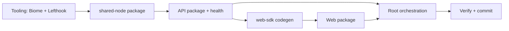

# Implementation plan: Scaffolding (Phase 0)

Maps to [PRD §8](./PRD.md#8-scaffolding-scope-separate-implementation-plan) and [PRD §11 Phase 0](./PRD.md#phase-0--scaffolding-no-product-features).

## Goal

Stand up the monorepo packages, codegen pipeline, dev workflow, and lint hooks **without product behavior**. When complete:

- `pnpm dev` runs API + web together
- `GET http://localhost:4020/api/health` returns `{ "ok": true }`
- Web shell loads at `http://localhost:5173`, proxies `/api` to the API
- `pnpm tsoa` → `openapi.generated.json` → `web-sdk build` → typed client usable from web
- `pnpm check` runs Biome + recursive typecheck
- Pre-commit runs Biome on staged files

No categorization endpoints, no YNAB writes, no database wiring in the API (deferred to read/write path plans).

## Reference implementation

Port patterns from `ai-knowledge-helper` (paths on local machine):

| Concern | Reference |
|---------|-----------|
| API bootstrap | `apps/api` |
| Web shell | `apps/web` |
| SDK codegen | `packages/web-sdk` |
| Repo root helper | `packages/shared-node` |
| Biome | `biome.jsonc` |
| Lefthook | `lefthook.yml` |

## Prerequisites

- Node.js 20+ (22+ recommended; match team standard before pinning `engines`)
- pnpm 9.12.0 (already in root `packageManager`)
- Dependencies added **only** via `pnpm add` / `pnpm add -D` (never hand-edit versions in `package.json`)

## Execution order

Work in this sequence — later steps depend on earlier ones:



1. Root tooling (Biome, Lefthook, root scripts)
2. `packages/shared-node` (repo root discovery for codegen scripts)
3. `apps/api` (TSOA + Express + health)
4. `packages/web-sdk` (openapi-ts + setupClient)
5. `apps/web` (Vite + Mantine shell + SDK wiring)
6. Root orchestration (`dev`, `check`, VS Code settings)
7. Verification checklist

---

## 1. Root tooling (Biome + Lefthook)

### 1.1 Add dev dependencies at repo root

```bash
pnpm add -D @biomejs/biome lefthook concurrently @dotenvx/dotenvx
```

Add `lefthook` to `pnpm.onlyBuiltDependencies` in root `package.json` (same as reference).

### 1.2 Create `biome.jsonc`

Copy structure from `ai-knowledge-helper/biome.jsonc`. Budget-tools-specific `files.includes` exclusions:

```
!**/apps/categorization-ai/**
!**/apps/categorization-ai/bin/**
!**/gen
!**/*.gen.ts
!**/apps/api/generated/**
!**/apps/api/src/generated/**
```

Keep formatter aligned with existing `.editorconfig` / `.prettierrc`: 4-space indent, 120 line width, single quotes.

### 1.3 Create `lefthook.yml`

Minimum hooks (no `sync-claude-rules` unless we add that script):

```yaml
pre-commit:
    commands:
        check-biome:
            skip: [merge]
            run: pnpm biome check --no-errors-on-unmatched --files-ignore-unknown=true --diagnostic-level=error {staged_files}

        exclude-openapi:
            glob: ['*/openapi.json']
            skip: [merge]
            run: |
                echo "Error: do not commit openapi.json — use openapi.generated.json"
                exit 1
```

### 1.4 Root `package.json` scripts

Add:

| Script | Command |
|--------|---------|
| `biome` | `biome` |
| `format` | `biome format --write .` |
| `lint` | `biome check .` |
| `lint:fix` | `biome check --write .` |
| `typecheck` | `pnpm -r --if-present typecheck` |
| `test` | `pnpm -r --if-present test` |
| `check` | `pnpm lint && pnpm typecheck` |
| `prepare` | `lefthook install` |
| `dev` | `concurrently "pnpm dev:api" "pnpm dev:web"` |
| `dev:api` | `pnpm --filter @budget-tools/api dev` |
| `dev:web` | `pnpm --filter @budget-tools/web dev` |

### 1.5 ESLint → Biome migration (scaffolding scope)

- **Do not** remove existing ESLint config packages yet — other apps still use them
- **Do** run Biome at root for the whole repo; `ignoreUnknown: true` skips C# under `categorization-ai`
- Remove per-package `lint:check` / `lint:fix` from new packages (`api`, `web`, `web-sdk`) — lint is root-only
- Update `.vscode/settings.json`: default formatter → `biomejs.biome`; add extension recommendation

### 1.6 Extend `packages/config-typescript` (if needed)

Add `api.json` for TSOA apps:

```json
{
  "extends": "./node.json",
  "compilerOptions": {
    "emitDecoratorMetadata": true,
    "experimentalDecorators": true
  }
}
```

Web apps continue using `base.json` + jsx/dom overrides in their own `tsconfig.json`.

---

## 2. `packages/shared-node`

Minimal tooling package for build scripts only (per `.cursor/rules/repo-root-resolution.mdc` — not for runtime request handling).

### Package layout

```
packages/shared-node/
  package.json          # name: @budget-tools/shared-node
  tsconfig.json
  src/
    repoRoot.ts         # findRepoRoot — copy from ai-knowledge-helper
    index.ts            # re-export
```

### `package.json` essentials

- `"type": "module"`
- `"exports": { ".": "./src/index.ts" }`
- `typecheck` script: `tsc --noEmit`
- devDependency: `@budget-tools/config-typescript`

---

## 3. `apps/api`

### Package layout

```
apps/api/
  package.json
  tsconfig.json          # extends @budget-tools/config-typescript/api.json
  tsoa.json
  vitest.config.ts
  generated/             # openapi.generated.json (committed after first tsoa run)
  src/
    server.ts
    environment.ts
    generated/
      routes.ts          # TSOA output (committed)
    features/
      health/
        healthController.ts
        healthDtos.ts
    services/
      requestContext.ts  # optional but matches reference; x-request-id
```

### `package.json` essentials

- `"name": "@budget-tools/api"`
- `"type": "module"`
- Scripts (mirror reference, adjust paths):

```json
{
  "predev": "pnpm tsoa",
  "dev": "dotenvx run -f ../../.env.local -f .env.local --ignore=MISSING_ENV_FILE -- pnpm --dir ../.. exec tsx watch apps/api/src/server.ts",
  "prebuild": "pnpm tsoa",
  "build": "tsc -p tsconfig.json --noEmit",
  "postbuild": "pnpm --filter @budget-tools/web-sdk build",
  "pretypecheck": "pnpm tsoa",
  "typecheck": "tsc -p tsconfig.json --noEmit",
  "test": "dotenvx run -f ../../.env.local -f .env.local --ignore=MISSING_ENV_FILE -- vitest run --passWithNoTests",
  "tsoa": "dotenvx run -f ../../.env.local -f .env.local --ignore=MISSING_ENV_FILE -- tsoa spec-and-routes"
}
```

### Dependencies (via pnpm)

| Kind | Packages |
|------|----------|
| runtime | `express`, `tsoa`, `@tsoa/runtime`, `reflect-metadata`, `env-var` |
| dev | `@budget-tools/config-typescript`, `@dotenvx/dotenvx`, `tsx`, `@types/express` |

Use the same TSOA major as reference: `tsoa@7.0.0-alpha.0` + matching `@tsoa/runtime` (Express 5 support).

### `tsoa.json`

```json
{
  "entryFile": "src/server.ts",
  "noImplicitAdditionalProperties": "throw-on-extras",
  "controllerPathGlobs": [
    "src/controllers/*Controller.ts",
    "src/features/**/*Controller.ts"
  ],
  "spec": {
    "outputDirectory": "generated",
    "specVersion": 3,
    "specFileBaseName": "openapi.generated"
  },
  "routes": {
    "routesDir": "src/generated",
    "basePath": "/api"
  }
}
```

### `src/environment.ts`

Scaffolding minimum:

```typescript
import env from 'env-var';

export const API_PORT = env.get('API_PORT').default('4020').asPortNumber();
```

No DB or YNAB env vars in scaffolding.

### `src/server.ts`

- First import: `reflect-metadata`
- Export `app` for future tests
- `express.json()` middleware
- `RegisterRoutes(app)` from `./generated/routes.js`
- `ValidateError` → 422 handler
- Generic 500 handler with structured log
- `app.listen(API_PORT)` — no DB init in scaffolding

### Health controller

```typescript
// healthDtos.ts
export type HealthDto = { ok: true };

// healthController.ts — @Route('health') @Get() returns { ok: true }
```

### First codegen

```bash
pnpm --filter @budget-tools/api tsoa
```

Commit `generated/openapi.generated.json` and `src/generated/routes.ts`.

### `vitest.config.ts`

Empty config or placeholder env — `passWithNoTests` is fine for scaffolding.

---

## 4. `packages/web-sdk`

### Package layout

```
packages/web-sdk/
  package.json
  tsconfig.json
  openapi-ts.config.ts
  scripts/
    assert-openapi.mjs
  src/
    index.ts
    setupClient.ts
    gen/                 # generated — commit after first build
```

### `package.json` essentials

- `"name": "@budget-tools/web-sdk"`
- `"exports": { ".": "./src/index.ts" }` — source export, no `dist` emit
- Scripts: `prebuild` → assert script, `build` → `openapi-ts`, `typecheck`

### Dependencies (via pnpm)

| Kind | Packages |
|------|----------|
| runtime | `@hey-api/client-fetch`, `@tanstack/react-query` |
| dev | `@hey-api/openapi-ts`, `@budget-tools/shared-node`, `@budget-tools/config-typescript` |

### `openapi-ts.config.ts`

- Input: `{repoRoot}/apps/api/generated/openapi.generated.json`
- Output: `src/gen`
- Plugins: `@hey-api/client-fetch`, `@hey-api/sdk` (asClass), `@tanstack/react-query`
- Copy from ai-knowledge-helper; use `@budget-tools/shared-node` for `findRepoRoot`

### `scripts/assert-openapi.mjs`

Fail with actionable message if OpenAPI artifact missing; point to `pnpm --filter @budget-tools/api tsoa`.

### `src/setupClient.ts`

Copy fail-loud interceptor pattern from reference (`setupClient` must be called before SDK use).

### `src/index.ts`

```typescript
export * from './gen/@tanstack/react-query.gen';
export { client } from './gen/client.gen';
export * from './gen/sdk.gen';
export * from './gen/types.gen';
export type { SetupClientOptions } from './setupClient';
export { setupClient } from './setupClient';
```

### First codegen

```bash
pnpm --filter @budget-tools/web-sdk build
```

Commit `src/gen/**`.

---

## 5. `apps/web`

### Package layout

```
apps/web/
  package.json
  tsconfig.json
  vite.config.ts
  index.html
  src/
    main.tsx
    App.tsx
    configureApiClient.ts
    theme.ts                  # minimal createTheme baseline
    cssVariablesResolver.ts   # optional; can stub minimal tokens
    pages/
      HomePage.tsx            # placeholder — "Budget Tools" + health status
    components/
      BackendErrorNotice.tsx  # copy pattern from reference (optional stub)
    vite-env.d.ts
```

### `package.json` essentials

- `"name": "@budget-tools/web"`
- Dependency: `"@budget-tools/web-sdk": "workspace:*"`
- React 19, Mantine 9, React Router 7, TanStack Query 5, Tabler icons, Fontsource fonts
- Dev: `vite`, `@vitejs/plugin-react`

### `vite.config.ts`

```typescript
server: {
  port: 5173,
  proxy: {
    '/api': { target: 'http://localhost:4020', changeOrigin: true },
  },
},
```

### `configureApiClient.ts`

```typescript
setupClient({ baseUrl: '/api', auth: async () => undefined });
```

Called in `main.tsx` before render.

### `App.tsx` (scaffolding shell)

- `MantineProvider` with `theme` + `defaultColorScheme="dark"`
- `BrowserRouter` + `Routes`
- Single route `/` → `HomePage`
- `AppShell` with placeholder nav ("Review" disabled or links to `/`)

### `HomePage.tsx` (proves SDK wiring)

Use generated health query options:

```typescript
import { healthOptions } from '@budget-tools/web-sdk';
const healthQuery = useQuery(healthOptions());
```

Display `ok` or error — this validates the full codegen → proxy → API chain.

### Build script

`"build": "tsc -p tsconfig.json --noEmit && vite build"`

---

## 6. Root orchestration

### `tsconfig.json` (root)

Extend base; exclude `packages/web-sdk/openapi-ts.config.ts` if Biome/TS complains about default export config pattern.

### `.gitignore` additions (if missing)

Ensure generated artifacts we **do** commit are not gitignored:

- `apps/api/generated/openapi.generated.json` — **tracked**
- `apps/api/src/generated/routes.ts` — **tracked**
- `packages/web-sdk/src/gen/**` — **tracked**

### Env files (document, do not commit)

| File | Purpose |
|------|---------|
| `.env.local` (repo root) | Shared local overrides |
| `apps/api/.env.local` | `API_PORT=4020` |

Example `.env.local.example` at root with `API_PORT=4020` only for scaffolding.

---

## 7. Verification checklist

Run from repo root after scaffolding:

| # | Command / action | Expected |
|---|------------------|----------|
| 1 | `pnpm install` | Lefthook installs via `prepare` |
| 2 | `pnpm --filter @budget-tools/api tsoa` | Generates OpenAPI + routes |
| 3 | `pnpm --filter @budget-tools/web-sdk build` | Generates `src/gen/**` |
| 4 | `pnpm check` | Biome clean + all packages typecheck |
| 5 | `pnpm dev` | API on `:4020`, web on `:5173` |
| 6 | `curl http://localhost:4020/api/health` | `{"ok":true}` |
| 7 | Open `http://localhost:5173` | Home page shows health status from SDK |
| 8 | Edit a TS file, stage, commit | Biome pre-commit passes |
| 9 | Stage a file named `openapi.json` | Lefthook blocks commit |

---

## 8. Deliverable file tree

```
budget-tools/
  biome.jsonc
  lefthook.yml
  package.json                    # updated scripts + devDeps
  .vscode/settings.json           # Biome formatter
  apps/
    api/                          # NEW
    web/                          # NEW
  packages/
    shared-node/                  # NEW
    web-sdk/                      # NEW
    config-typescript/
      api.json                    # NEW (optional)
```

---

## 9. Explicitly out of scope

Do **not** implement during scaffolding (belongs in later plans):

| Item | Plan |
|------|------|
| Categorization queue / decisions endpoints | `api-read-path.md`, `api-write-path.md` |
| Kysely / Postgres in API | `api-read-path.md` |
| YNAB client extensions | `api-write-path.md` |
| `outbound_sync_queue` table | `api-write-path.md` |
| categorization-ai CLI spawn | `api-read-path.md` |
| Review queue UI | `ui-review-queue.md` |
| Transaction editor / sync badges | `ui-decisions.md` |
| Remove ESLint from legacy apps | Separate cleanup; not blocking |
| Docker compose for api/web | Future infra |
| Auth | Future |

---

## 10. Estimated effort

| Work package | Estimate |
|--------------|----------|
| Root tooling | 1–2 hours |
| shared-node | 15 min |
| API + health | 1–2 hours |
| web-sdk | 1 hour |
| Web shell | 1–2 hours |
| Verify + fix drift | 1 hour |
| **Total** | **~half day** |

---

## 11. PRD cross-reference

After scaffolding merges, Phase 0 exit criteria from the PRD are satisfied. Proceed to [`api-read-path.md`](./api-read-path.md) (to be written).
