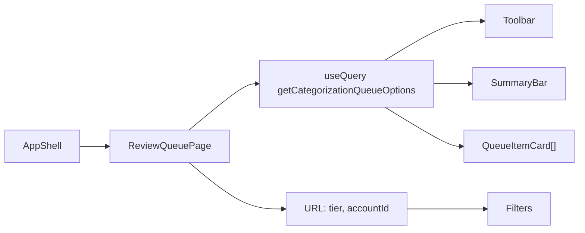

# Implementation plan: Review queue UI

Maps to [PRD §6.4](./PRD.md#64-ui--review-application) (layout, queue view, empty states) and [PRD §11 Phase 1](./PRD.md#phase-1--read-path) (read-only queue display).

## Goal

A reviewer can open the web app, see every pending transaction with its AI proposal, and filter the list — without recording a decision. When complete:

- Default route is the review queue (Review nav enabled)
- Queue loads from `getCategorizationQueueOptions` (generated SDK)
- Summary bar shows unfiltered tier counts; list shows date, amount, payee, account, memo, suggestion, confidence, tier, flags
- Expanding a row shows method signals, ranked `options`, gap/route reason, and feature text
- Filters (tier, account) are URL search params and do **not** re-spawn `predict-json`
- Empty, loading, and API-error states are explicit
- `pnpm check` still passes

## Out of scope

- Approve / deny / change, editable category/payee/memo, `markApprovedInYnab` (`ui-decisions.md`)
- Outbound sync badge, flush controls (`ui-decisions.md`, `api-write-path.md`)
- `GET /api/categories` picker and `GET /api/payees` (proposal already carries names; catalog is for the editor)
- Stats view, batch approve, auto-apply
- Visual redesign of the Mantine theme — reuse existing dark tokens and fonts

## Design decisions

**Read-only fields, not disabled forms.** Show current payee, memo, and category as text. Disabled inputs look interactive and will confuse a reviewer before the write path exists.

**Fetch the cached working set; expand it on demand.** The standing query has no LLM flag. `refresh` is sent only on the explicit refresh action. After the first batch lands, the client requests `expand=true` once to prefetch the next batch, then again when the reviewer nears the end of the scored list (table/list sentinel, classify position). Tier and account filters apply to `items` in the client. `hasMore` is about unscored pending rows, not about the current filter.

- Filter query params would refetch without re-spawning, but they also drop accounts from `items`, so the account dropdown cannot be derived from a filtered response.
- `summary` is already unfiltered. Client-side filter keeps summary chips honest and chip clicks instant.
- Scored set grows with `expand=true`. No virtualization at current batch sizes.

**`refresh` is an action, not a cache key.** The standing React Query key is the unfiltered queue. Refresh calls `queryClient.fetchQuery(getCategorizationQueueOptions({ query: { refresh: true } }))` and writes the result into the standing cache. Do not put `refresh: true` on the mounted `useQuery` options — it would re-spawn on every remount.

**Predictions are sticky until refresh.** `staleTime: Infinity` and `refetchOnWindowFocus: false` on the queue query. Window focus must not wait on a 5-minute CLI run. Show `generatedAt` and a "Refresh predictions" control.

**LLM is a classify-card overlay, not a queue scoring mode.** `GET /categorization/queue` always uses local scores. The classify **card** (`ClassifyWorkspace`) calls `POST /categorization/llm-suggest` for the focused uncertain item (and prefetches the next remaining uncertain card). The classify table and queue list do not. Certain (100% local) and already-decided cards skip the call. Missing `OPENROUTER_API_KEY` leaves the local suggestion in place.

**First paint scores a batch, not the full pending table.** Default batch size is 50. `CATEGORIZATION_PREDICT_TIMEOUT_MS` is 300000. The page must look intentional while waiting: title + "Scoring a batch of pending transactions…" + indeterminate loader. Do not render an empty-queue message during load. `pendingCount` on the response is the full pending table; `summary` is the scored working set.

**Proxy timeout.** If the Vite `/api` proxy 504s on first load, set `server.proxy['/api'].timeout` (and `proxyTimeout` if needed) to at least 300000. Fail loud; do not add a client-side shorter timeout.

**Proposal field is `options`, not `alternatives`.** Ranked category list from `proposal.options`.

**Amounts are YNAB milliunits.** `transaction.amount / 1000`, `en-US` currency, two decimals, tabular lining via `fontFamilyMonospace`. Negative = outflow. No currency code on the DTO — format as USD.

**Confidence is 0–1.** Display as a percentage (`72%`), not a raw float.

## Routing and shell

| Current | Change |
|---------|--------|
| `/` → `HomePage` (health) | `/` → `ReviewQueuePage` |
| Review `NavLink` disabled | Review enabled, `to="/"` |
| `href="/"` (full reload) | Mantine `NavLink` + React Router `NavLink` (`component={RouterNavLink}`) |

Move API health into the navbar footer (existing `getHealthOptions` + badge). Delete `HomePage.tsx`.



## Data fetching

```typescript
const [searchParams, setSearchParams] = useSearchParams();

const queueQuery = useQuery({
    ...getCategorizationQueueOptions(),
    staleTime: Number.POSITIVE_INFINITY,
    refetchOnWindowFocus: false,
});
```

Refresh:

1. Button calls `fetchQuery` with `{ refresh: true }`
2. On success, `setQueryData` for the standing key (without `refresh`)
3. Button disabled + loader while that fetch is in flight

Parse URL:

| Param | Format | Default |
|-------|--------|---------|
| `tier` | Comma-separated `ApprovalTier` (same as API) | all tiers |
| `accountId` | Single YNAB account id | all accounts |

Invalid `tier` tokens: ignore them (do not 422 the page). Account ids not in the loaded set: show the select empty-value and an empty filtered list with the "no matches" copy.

Derive account options from unique `{ accountId, accountName }` on `queueQuery.data.items` (full, unfiltered payload).

Visible list = filter `items` by selected tiers and `accountId`, preserving API sort (already AutoApply → Suggested → Review → Blocked, then date descending).

## Page layout

`ReviewQueuePage` is the orchestrator. Feature UI lives under `components/review/`.

### Toolbar

- Title: Review
- `generatedAt` as relative time ("Scored 3 minutes ago") plus exact tooltip
- Refresh predictions button
- Visible item count vs `summary.total` when filters are active ("12 of 40")

### Summary bar

Four clickable counts from `summary` (not from the filtered list): AutoApply, Suggested, Review, Blocked, plus total. Clicking a tier toggles it in the `tier` search param. Selected tiers are visually active. Counts always reflect the full cached queue.

### Filters

Account `Select`: "All accounts" + names from the payload. Writes `accountId`. Clearable.

### Item card (always visible)

| Region | Source |
|--------|--------|
| Date | `transaction.date` (ISO date, locale format) |
| Amount | milliunits → USD, monospace |
| Payee | `transaction.payeeName` or `importPayeeName` or em dash |
| Account | `transaction.accountName` |
| Memo | `transaction.memo` if present |
| Current category | `transaction.categoryName` if present (often empty/excluded) |
| Suggestion | `proposal.suggestedCategoryGroup`: `proposal.suggestedCategory`, or "No suggestion" |
| Confidence + method | percentage + humanized `proposal.method` |
| Tier | `TierBadge` |
| Flags | chips for true flags only |

Flag labels: Ambiguous, Novel import, Excluded, Manual review.

Tier colors (Mantine palette, not new hex in components):

| Tier | Color |
|------|-------|
| AutoApply | `teal` |
| Suggested | `accent` (theme primary) |
| Review | `yellow` |
| Blocked | `gray` |

Blocked and Review cards should still show the suggestion when present, plus `gapReason` / `routeReason` when not `None`.

### Expanded details

`Collapse` / accordion per card, collapsed by default.

- Agreeing signals, then all signals (`method`, `category`, confidence %)
- Ranked `options` (`Group: Category`, confidence, supporting methods)
- `featureText`, `resolvedPayee`, `notes` when non-empty
- `confidenceInterval` (top / second / spread) as compact text, not a chart

No decision buttons.

### States

| State | UI |
|-------|----|
| Loading (no data) | Page chrome + scoring message + `Loader` |
| Fetch error | `BackendErrorNotice` (503 from missing models / CLI is expected copy via API message) |
| `summary.total === 0` | "All caught up" — no pending transactions |
| Filters hide everything | "No transactions match these filters" + control to clear filters |
| Refresh in flight with existing data | Keep the list; toolbar button loading. Do not blank the page |

## File layout

```
apps/web/src/
  App.tsx
  pages/
    ReviewQueuePage.tsx
  components/
    BackendErrorNotice.tsx
    review/
      QueueToolbar.tsx
      QueueSummaryBar.tsx
      QueueFilters.tsx
      QueueItemCard.tsx
      ProposalDetails.tsx
      TierBadge.tsx
      FlagChips.tsx
      queueSearchParams.ts
      formatYnabAmount.ts
      formatConfidence.ts
      humanizeEnum.ts
      __tests__/
        queueSearchParams.test.ts
        formatYnabAmount.test.ts
        formatConfidence.test.ts
```

Keep `ReviewQueuePage` as the only page-level file. Split cards/toolbar because each has a single job (component-organization rule). Pure helpers get tests; they are shared across cards and the toolbar.

`queueSearchParams.ts`: parse/serialize `tier` / `accountId`. Round-trip tested.

`formatYnabAmount.ts`: milliunits → string (sign, grouping, two decimals). Cover `0`, `-12340` → `-$12.34`, `1500` → `$1.50`.

`humanizeEnum.ts`: insert spaces in PascalCase / known method names (`ImportAmountLookup` → readable label). One function is enough; do not build a localization framework.

## Tests and tooling

`apps/web` has no test runner. Add Vitest the same way as the API:

```bash
pnpm --filter @budget-tools/web add -D vitest
```

- `vitest.config.ts` with `passWithNoTests` not required once tests exist
- `"test": "vitest run"` on `@budget-tools/web` so root `pnpm test` picks it up

No component/RTL tests in this plan.

## Styling

Stay on existing `theme.ts` / `cssVariablesResolver.ts`. Prefer Mantine props (`Badge`, `Chip`, `Group`, `Stack`, `Paper`, `Text`, `Select`, `Switch`, `Collapse`). CSS Modules only if a card needs layout that props cannot express. Amounts use `theme.fontFamilyMonospace`. No Inter/font swap.

## Verification

| # | Action | Expected |
|---|--------|----------|
| 1 | `pnpm check` | Biome + typecheck clean |
| 2 | `pnpm test` | New formatter/search-param tests pass |
| 3 | `pnpm dev`, open `/` | Review queue, not Home; nav Review active |
| 4 | First queue load | Scoring message until CLI returns; then cards |
| 5 | Second load / filter chips | Instant; API does not spawn (watch API logs) |
| 6 | Refresh predictions | Toolbar loading; list remains; new `generatedAt` |
| 7 | `?tier=Blocked` | Only Blocked cards; summary still shows all counts |
| 8 | Account select | Filters list; other accounts remain in the dropdown |
| 9 | Empty Postgres pending set | "All caught up" |
| 10 | API down | `BackendErrorNotice`, not a blank shell |

## PRD cross-reference

| PRD | This plan |
|-----|-----------|
| §6.4 Layout, queue view, category/flag/signal display | In |
| §6.4 Transaction editor, decision actions, sync indicator | `ui-decisions.md` |
| §6.4 Stats view | Polish / later |
| §9.3 Hide or badge pending outbound rows | `ui-decisions.md` (no outbound table yet) |
