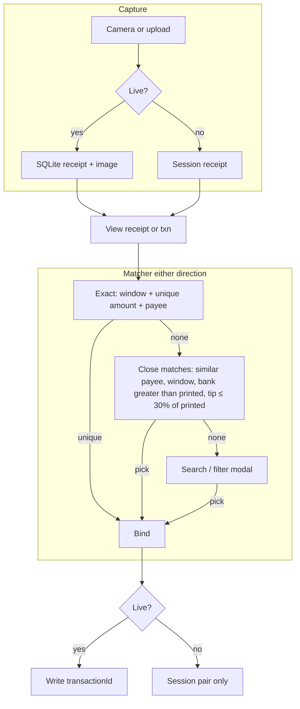
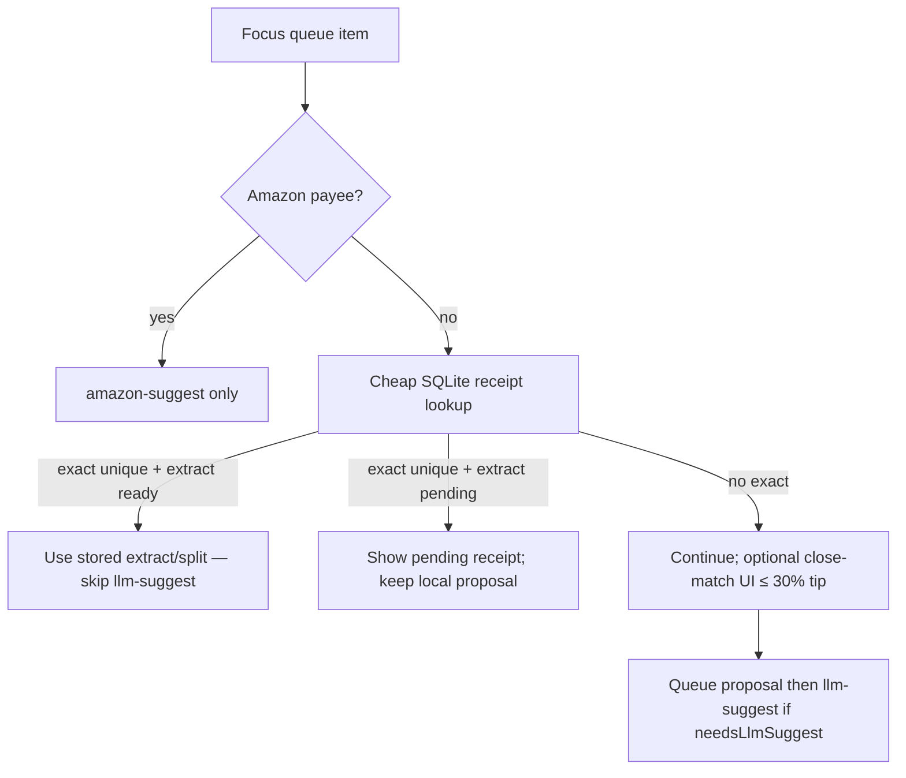
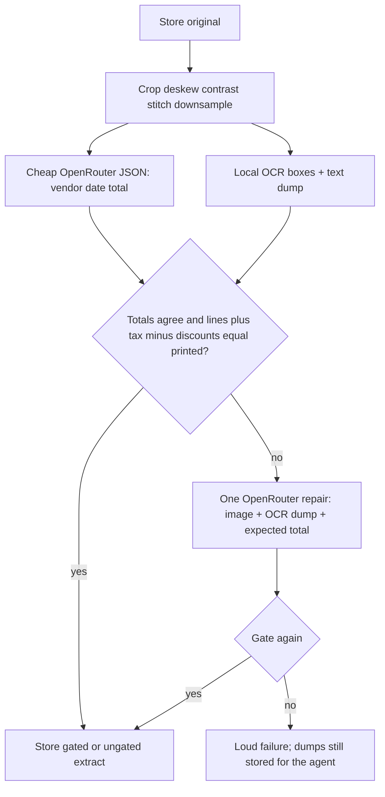

# PRD — Receipt taking

> **Status**: Draft
> **Owner**: Douglas
> **Last updated**: 2026-08-29
> **Scope**: Capture non-Amazon receipts in the web app, persist image and extract in API SQLite when Live, match receipts and YNAB transactions in both directions with a shared matcher (exact Amazon window/amount, then fuzzy close matches with a 30% tip cap, then search). Classify: Amazon payees stay on `amazon-suggest`; other cards run a fast receipt lookup before the ordinary categorize/LLM path.
> **Does not cover**: A native iOS/Android app; scraping store-account digital receipts as the primary path; storing receipt blobs in Postgres; auto-writing categories or splits to YNAB without a Classify decision.

This repo has no `docs/project-vision/product-constitution.md`. Constraints come from existing product behavior: Live vs Practice write-back ([api-write-path](../plans/ynab-categorization-api-ui/api-write-path.md)), Amazon classify matching and item gates ([amazon-classify-sync](../amazon-classify-sync.md)), and the categorization UI PRD ([ynab-categorization-api-ui/PRD.md](../plans/ynab-categorization-api-ui/PRD.md)).

## 1) Summary

Bank charges arrive in Classify as a single amount and a payee. Paper receipts have vendor, date, total, and (often) line items. The reviewer captures receipts in the app (Classify camera, inbox burst, or file upload), **except Amazon**: those payees stay on `amazon-suggest` and are not receipt-matched. YNAB transaction documents stay in Postgres. Receipt images, extract, and a nullable `transactionId` live in API SQLite — **Live** writes those rows and match relations. Practice matching is computed on the spot and discarded, same class as Practice classify decisions ([api-write-path](../plans/ynab-categorization-api-ui/api-write-path.md)).

Matching is a **dual-direction service** when the reviewer is looking at a transaction or a receipt — not a batch that Classify must wait on:

- **Transaction → receipt**: opening a **non-Amazon** queue item runs a **fast** receipt lookup first. A unique exact hit can reuse extract/split already stored on the receipt and skip generic `llm-suggest`. Amazon cards skip this. A miss must not delay ordinary categorize (queue proposal, then LLM if `needsLlmSuggest`).
- **Receipt → transaction**: managing a receipt hunts for a bank row with the same matcher, then continues.

Exact match reuses Amazon’s bank date −5 … +1 window and unique milliunits as a **shared helper**. If that finds nothing, the UI says so and offers **close matches**: similar payee, same window, bank abs > printed abs, tip ≤ **30% of printed**. Fuzzy hits are options, never silent auto-binds. If those fail too, **search / filter** (inline or modal) lets the reviewer pick a transaction by hand.

Line items and splits stay best-effort: gated arithmetic may own cents; otherwise equal shares of the **bank** amount across inferred categories. Unverified OCR prices never post to YNAB. Category/split accept in Live still goes through `classification_sync`.

### 1.1 Milestones

**Capture, persist, match, and gated split context** — a reviewer can photograph or upload receipts in the web app on a phone, see them stored, get vendor/date/total mapping when unique, and use extract context in Classify without silent bad data.

- In-app camera and upload on the Classify card and in a receipt inbox.
- Live: durable original + SQLite extract; exact unique bind persisted; fuzzy/search pick persisted when chosen.
- Practice: match and bind are session-only; no SQLite `transactionId` and no YNAB write.
- Dual-direction matcher: txn→receipt on Classify, receipt→txn in the inbox.
- Classify **step function**: Amazon payees → `amazon-suggest` only; other cards cheap receipt lookup before LLM; miss does not stall non-receipt cards.
- Exact Amazon window/amount, then fuzzy close matches (similar payee, bank > printed, tip ≤ 30% of printed), then transaction search.
- Gated line items or equal-share coarse split; reviewer confirms before Live YNAB.

**Later** (not this slice):

- Store-account or barcode digital receipts as a higher-quality substitute for OCR (Amazon-scrape analog).
- Merchant-specific spatial parsers beyond a first working extract.
- Moving receipt storage into Postgres.

**Back pocket** (not scheduled):

- Native camera apps.
- Fine-tuning a receipt model on household gold-set images.
- Auto-apply splits without Classify confirmation.

### 1.2 Sequencing

Product order: what must be true before the next outcome is possible. Not an implementation plan.

| Step | Outcome | Done when |
| ---- | ------- | --------- |
| **1** | Receipt document exists | Live: image + extract survive restart. Practice: session only |
| **2** | Match keys exist | Vendor, date, printed total (or loud extract failure) |
| **3** | Classify lookup is cheap | Indexed SQLite read; no OCR/LLM; miss continues the existing proposal path |
| **4** | Pair is chosen | Exact unique auto-bind (Live persist); else close-match list; else search |
| **5** | Overlay without extra LLM when possible | Stored extract/split on the receipt reused; otherwise ordinary LLM path |
| **6** | Split cents are honest | Gated lines or equal bank shares; Live accept still required |

## 2) Goals

- **G1 — Capture in-app**: On a phone browser, the reviewer can open the device camera from Classify or from a receipt inbox, and can alternatively pick an existing image. They do not have to leave the app for the Camera roll as the only path.
- **G2 — Durable receipts (Live)**: Live capture persists original image + extract whether or not a transaction is bound yet. Practice capture/match does not write SQLite or YNAB.
- **G3 — Dual-direction live matching**: Same matcher runs when categorizing a transaction (find receipt) and when managing a receipt (find transaction). Exact unique pairs bind; Live persists the relation; Practice does not. Amazon payees are outside this matcher.
- **G4 — Best-effort line items**: The system extracts line items when it can, without pretending a failed table is correct.
- **G5 — Better classify/split**: For queue items, the agent receives receipt context. Ungated names yield equal-share category drafts of the bank amount; gated lines may own cents.
- **G6 — No silent bad data**: Deterministic gates block auto-match and block YNAB milliunits when extract and bank disagree. Reviewer confirmation remains required in Live.
- **G7 — Classify must stay snappy**: Amazon cards never enter receipt lookup. For other cards, receipt lookup is a cheap SQLite read. Transactions with no receipt candidate follow today’s path with no OCR/LLM wait added for receipts.

## 3) Non-goals

- Native iOS/Android applications (the existing categorization PRD already excludes this; this feature uses the web app).
- Replacing Amazon classify or Playwright invoice scrape.
- Scraping Walmart/Safeway account history as the required v1 path.
- Auto-applying categories or splits to YNAB without Classify confirmation (same bright line as AutoApply in the categorization PRD).
- Amazon paper receipts or receipt overlays on Amazon payees. Those charges stay on `amazon-suggest` ([amazon-classify-sync](../amazon-classify-sync.md)). The receipt matcher does not pair `isAmazonTransaction` rows.
- Upserting receipt images or extract into Postgres `transactions`.
- Perfect supermarket line-item OCR as a launch bar; best-effort plus gates is the bar.
- Multi-user auth / RBAC.
- Using receipt photos as a substitute for `transactions-retrieval` (the bank row remains the financial source of truth).

## 4) Users & primary scenarios

- **Household reviewer (phone, Live inbox)**: Captures several tapes. Extract runs and is stored. Opening a receipt live-matches toward Postgres; exact unique bind persists. No unique hit → close matches (tips) → search/filter.
- **Household reviewer (Classify)**: Amazon payees use `amazon-suggest` only. Other queue items **look up receipts** (cheap). Hit with stored extract/split seeds the card and skips generic `llm-suggest`. Miss continues local proposal + LLM when `needsLlmSuggest`.
- **Constrained path — already categorized**: Exact unique match may still persist a Live bind on a non-Amazon charge. Classify does not re-queue that transaction.
- **Constrained path — tip / fuzzy**: Exact amount fails; UI shows unmatched-exact and ranked close matches (similar payee, date window, bank > printed, tip ≤ 30% of printed). No silent bind.
- **Constrained path — Practice**: Matcher still runs so the reviewer can try the flow. Nothing is written to SQLite or YNAB. Refresh loses Practice binds.

## 5) Requirements (with current status)

Legend: **Done** / **Not done**.

### 5.1 Capture

- [ ] **In-app camera on the card**: From a focused **non-Amazon** Classify transaction, capture one or more stills in the web app. Live: receipt row + bind to that id. Practice: session only. Amazon cards do not offer receipt capture. (**Not done**)
- [ ] **In-app camera in the inbox**: A receipt inbox surface supports repeated capture (burst / “again”) without requiring a focused transaction. New receipts start unbound. (**Not done**)
- [ ] **Upload existing image**: Either door accepts an existing photo (file picker), not only a live camera shot. (**Not done**)
- [ ] **One receipt, many frames**: Overlapping shots of one long tape are one receipt document, not multiple matches. (**Not done**)
- [ ] **Dedupe**: Byte-identical (and, if implemented, perceptually identical) recaptures of the same image do not create a second receipt row. (**Not done**)

### 5.2 Persistence

- [ ] **Original image saved (Live)**: Live capture stores original bytes durably on the API host across restart. Practice does not persist originals. (**Not done**)
- [ ] **SQLite receipt row (Live)**: Live receipts have a stable id and extract payload in API SQLite (`SQLITE_DB_PATH`). Practice does not insert rows. (**Not done**)
- [ ] **Transaction relation (Live only)**: Live may store YNAB `transactionId` on the receipt. Practice never writes this column. Postgres `transactions` is not updated with receipt blobs. (**Not done**)
- [ ] **Replay**: A later extract upgrade can re-run against the saved original without requiring another photo. (**Not done**)

### 5.3 Extraction

Extract is a **pipeline with gates**, not a single “send the JPEG to a frontier model” call. Prep and local OCR exist because thermal-phone photos and grocery line grouping fail in ways a VLM will paper over (ReceiptBench: Gemini 3 Pro will alter a line or invent tax so items sum). Paid vision is for **match keys** and **repair**, not as the owner of YNAB cents.

- [ ] **Match keys**: The pipeline attempts vendor (merchant), purchase date, and printed total (milliunits). Failure is a stored extract status, not a silent empty success. (**Not done**)
- [ ] **Amazon extract dropped**: If the vendor is Amazon, the capture is not a receipt in this product (no row, no matcher candidate, no overlay). Classify Amazon cards already skip capture. (**Not done**)
- [ ] **Prep before read**: The original is stored. A processed image is what OCR and paid vision see: crop / deskew / contrast, stitch overlapping frames of one tape into one document, and downsample before an OpenRouter image call. Prep is quality and cost control, not optional garnish. (**Not done**)
- [ ] **Two tools, two jobs**: Cheap OpenRouter vision JSON (same `OPENROUTER_API_KEY` as classify; no new vendor) for vendor / date / total. Default header model is today’s classify default `qwen/qwen3.7-flash` (already VL). Repair may use a stronger **vision** slug on the same account (`qwen/qwen3.7-plus`, `qwen/qwen3.8-max`, `google/gemini-3.7-flash`, …). Skip text-only ids such as `qwen/qwen3.7-max`. Local OCR with bounding boxes for line candidates and a raw text dump. Do not use a document-table model as the grocery parser — tapes are not invoices. (**Not done**)
- [ ] **Line items**: The pipeline attempts line items (name, amount, quantity when present). Missing or partial line items are allowed. (**Not done**)
- [ ] **Raw text**: Recognized text (OCR and/or vision dump) is stored on the receipt for agent context and for reviewer inspection. (**Not done**)
- [ ] **Arithmetic gate**: Structured lines + tax − discounts must equal the printed total (and, once bound, the bank milliunits) before those prices may own split cents. A model that “makes the math work” by changing a line is a failed extract, not a pass. (**Not done**)
- [ ] **VLM repair is fallback only**: If the gate fails, one schema-constrained OpenRouter vision call may see the processed image + OCR dump + expected total, then the gate runs again. Repair never auto-binds and never writes ungated milliunits. (**Not done**)
- [ ] **Cross-check on total**: When both a vision/header total and an OCR-derived total exist, disagreement is recorded and blocks **auto-match** (G6). It does not delete the dumps. (**Not done**)
- [ ] **Extract is off the Classify hot path**: Capture enqueues extract. Classify focus only reads stored keys. A miss does not start OCR or OpenRouter. (**Not done**)

### 5.4 Matching

- [ ] **Shared matcher**: One service, two entry points — given a transaction, find receipts; given a receipt, find transactions. Amazon payment matching and receipt pairing share the date-window + unique-amount helper (`amazonPaymentDateWindow`: bank date −5 … +1). (**Not done**)
- [ ] **Exact tier**: Unique milliunit amount in window + vendor/payee haystack → auto-bind. Live persists `transactionId`. Practice keeps the pair in session only. Zero hits → not exact. Two+ exact amounts → ambiguous (no auto-bind). (**Not done**)
- [ ] **Amazon excluded**: Receipt matching never considers transactions that `isAmazonTransaction` would treat as Amazon. Classify does not run receipt lookup on those cards. Amazon `amazon-suggest` always wins. (**Not done**)
- [ ] **Fuzzy tier**: If exact finds nothing, rank **close matches** that share similar payee/vendor, fall in the Amazon date window, have **bank abs(milliunits) greater than printed abs(milliunits)**, and a tip gap of **at most 30% of the printed total**: `(bankAbs - printedAbs) / printedAbs ≤ 0.30`. Printed total 0 is not a fuzzy candidate. The UI states that exact match failed and lists options. Fuzzy never auto-binds. (**Not done**)
- [ ] **Search tier**: If the reviewer rejects close matches or none exist, they can search and filter transactions (inline or modal) and pick one. (**Not done**)
- [ ] **Live vs Practice persist**: Matcher always runs on view. SQLite bind (and Live receipt rows) only when Live. Practice writes neither bind nor receipt files. (**Not done**)
- [ ] **Already categorized**: Exact unique Live bind is allowed on non-Amazon charges; that transaction is not put on the Classify queue. (**Not done**)
- [ ] **Card capture**: Shooting from a focused **non-Amazon** Classify card is an explicit pair (skip hunt). Live persists; Practice session only. Amazon cards have no receipt camera. (**Not done**)
- [ ] **Detach**: The reviewer can clear a wrong bind (Live deletes the stored relation). (**Not done**)

### 5.5 Classify step function

Classify already skips generic `llm-suggest` for Amazon payees (`needsLlmSuggest` / `needsAmazonSuggest` in `applyLlmOverlay.ts`). Those cards **do not** run receipt lookup. For every other card, receipts add a **cheap** step. It must not add an OCR or LLM wait to cards with no receipt candidate.

| Step | When | Must not |
| ---- | ---- | -------- |
| **A. Amazon payee** | `isAmazonTransaction` | Receipt lookup or receipt overlay |
| **B. Fast receipt lookup** | Non-Amazon focus (and prefetch neighbors) | Call OCR, vision, or OpenRouter |
| **C. Exact unique hit, extract ready** | Stored keys/split on the receipt | Fall through to generic `llm-suggest` |
| **D. Exact hit, extract still running** | Show receipt pending; keep local queue proposal | Block the filmstrip on extract |
| **E. Fuzzy / none** | Offer close matches (30% tip rule); do not auto-bind | Stall ordinary categorize |
| **F. Otherwise** | Existing proposal + `llm-suggest` when `needsLlmSuggest` | Wait on receipt I/O beyond a cheap SQLite read |

- [ ] **Indexed lookup**: Receipt match keys are queryable without scanning images (date, milliunits, vendor). (**Not done**)
- [ ] **Reuse stored split**: When C succeeds, Classify seeds from the receipt’s gated or equal-share draft — no extra LLM required for that card. (**Not done**)
- [ ] **Miss is free**: No receipt candidate → step F only; latency matches today’s non-Amazon path aside from the cheap read. Amazon cards stay on A (`amazon-suggest` only). (**Not done**)
- [ ] **Receipt overlay UI**: Bound/pending receipt visible on the card (image, extract status), same role as Amazon split overlay. (**Not done**)

### 5.6 Classify and split (agent)

- [ ] **Agent context**: When a receipt is attached and extract exists, prompts include vendor, date, printed total, raw text, and line items, marked gated vs unverified. (**Not done**)
- [ ] **Equal-share coarse split**: Ungated names → categories; **bank milliunits** split equally (remainder on last line). One category → no fake split. (**Not done**)
- [ ] **Gated split lines**: Lines + tax − discounts equal bank milliunits → those amounts may be suggested split lines. (**Not done**)
- [ ] **Human accept**: Live category/split still uses `classification_sync`. Receipt match never PATCHes YNAB by itself. (**Not done**)

### 5.7 Safety and error constraints

- [ ] **Loud extract failure**: Unreadable image, failed camera permission, or empty extract sets a failure status the UI can show; it does not invent vendor/date/total. (**Not done**)
- [ ] **No auto-match on disagreement**: Conflicting totals, missing date, or missing vendor block **exact** auto-bind (fuzzy/search still allowed). (**Not done**)
- [ ] **No silent fuzzy bind**: Close matches require an explicit pick. (**Not done**)
- [ ] **No auto-match on collision**: Non-unique amount in the date+vendor window blocks auto-match. (**Not done**)
- [ ] **Milliunits only from gates**: Ungated OCR/vision prices must not be written as YNAB split line amounts. (**Not done**)
- [ ] **Bank amount is source of truth**: Suggested splits always sum to the Postgres/YNAB transaction amount, not to a model-reconciled story that altered a line to force a sum. (**Not done**)
- [ ] **Reviewer can edit**: The reviewer can correct vendor/date/total, bind, line items, and split lines before accepting. (**Not done**)

## 6) Behavior & data flow

**Classify focus** (must stay a step function, not one blocking pipeline):

Amazon classify remains the only overlay for Amazon payees ([amazon-classify-sync](../amazon-classify-sync.md)). Receipt matching does not apply to those transactions.

**Extract** (background; not Classify focus):

## 7) Constraints & invariants

- **Single household, local API**: Same trust model as today (no new auth product). Receipt images are household financial documents; they stay on the API host, not in a third-party receipt SaaS, except via existing OpenRouter (or equivalent) calls the API already uses for classify.
- **Postgres vs SQLite**: Transaction facts live in Postgres. Receipts and the `transactionId` relation live in API SQLite. Stale or missing Postgres rows mean match waits; they must not create fake transactions.
- **Live vs Practice**: Matcher runs in both modes. Live persists receipt files, extract, and `transactionId`. Practice persists none of those. `requireLiveMode` still gates YNAB enqueue.
- **NFR — lookup**: Fast path is an indexed read. It must not introduce OCR, vision, or OpenRouter into the miss path. Extract remaining in-flight must not freeze Classify.
- **Confirmation**: No AutoApply. Same as categorization PRD v1 non-goal.
- **Web camera**: Feature detection and permission failure are first-class UX, not a silent fallback that pretends capture succeeded.
- **NFR — persistence**: After Live API restart, previously captured originals and SQLite rows are intact. Practice has no durable receipt rows.
- **NFR — match safety over recall**: Prefer unmatched over a wrong bind.
- **NFR — extract cost**: Typical extract is a cheap OpenRouter vision JSON call for headers plus local OCR. It must not use a frontier model as the primary parser. Household volume is small; the quality failure mode (invented lines) matters more than dollars. Order-of-magnitude target: well under **$0.01 per receipt** on the recommended path (see cost notes in open questions).
- **Delivery — review before commit**: Each implementation phase’s tracked source is code-reviewed (local-review on that phase slice) **before** that phase is git-committed. Fix Critical, High, and Medium findings, and Lows that simplify or improve consistency, quality, or duplication. Remaining phases for this milestone: matcher, extract, Classify capture, inbox/splits.
- Latency, retention days, and max image size are **open questions** (no invented numbers).

## 8) Open questions

- **Image bytes**: Filesystem next to SQLite vs blob column. Product only requires Live durability and association.
- **Retention**: Keep Live originals forever, or a delete/purge control?
- **HTTPS / phone hitting local API**: Camera on a phone is in scope; how the phone reaches the API is design/ops.
- **Extract cost, measured**: OpenRouter image-token formulas differ by vendor (OpenAI tiles vs Gemini 768px crops vs Qwen patches). The PRD target is “cheap header VLM + local OCR, repair rarely.” Actual cents per receipt should be logged from `usage.cost` the same way classify already logs inference cost (`openRouterClient.ts`).

Resolved:

- **Two capture doors**: Card attach and mass inbox both exist; they share one receipt type.
- **Headers are match keys**: Vendor, date, and total drive exact match.
- **Agent sees imperfect extract**: Unverified text is context; it does not own YNAB cents.
- **SQLite relation, Postgres transactions**: Receipts do not migrate the transaction store.
- **No YNAB write without Classify accept**: Live decision path unchanged.
- **Shared match utility**: Bank date −5 … +1 and unique amount; two directions, one helper.
- **Match universe**: Exact unique may bind categorized charges; they are not re-queued.
- **Any receipt except Amazon**: No grocery-only limit; Amazon payees and Amazon paper receipts are out of the receipt matcher.
- **Classify order**: Amazon cards → `amazon-suggest` only. Others: cheap receipt lookup first; reuse stored split when ready; miss does not stall LLM/local path.
- **Fuzzy tip rule**: Similar payee, date window, bank abs > printed abs, tip ≤ 30% of printed total; never auto-bind.
- **Ungated allocation**: Equal bank-milliunit shares across inferred categories.
- **Unmatched UX**: Indicate exact failure; close-match options; then search/filter.
- **Practice matching**: Live persist only; Practice is session-only including capture rows.
- **Extract method**: Prep the photo; cheap VLM for vendor/date/total; local boxed OCR for lines; arithmetic gate; one VLM repair only if the gate fails. Not a frontier model as the primary parser.
- **Extract vendor**: Same OpenRouter account as classify. Header/repair are vision model ids on that router; gold-set A/B picks among them.
- **Review before phase commit**: Each remaining RPI Pxx commit is preceded by local-review on that phase slice. Fix Critical, High, and Medium findings first, plus Lows that simplify or improve consistency, quality, or duplication.

## 9) Acceptance criteria

### Current milestone

1. On a phone-sized viewport, Classify offers in-app still capture and file upload. Live: a receipt row and original exist afterward. Practice: the shot is usable in-session only.
2. The inbox allows capturing or uploading multiple receipts in one sitting without selecting a transaction first.
3. Exact unique pair (Amazon window + amount + payee) auto-binds; Live persists; Practice does not. Duplicate exact amounts stay unbound until pick.
4. Exact miss shows that status and ranked close matches (similar payee, date window, bank abs > printed abs, tip ≤ 30% of printed). Picking one binds (Live persist). Fuzzy never auto-binds.
5. If close matches are unusable, search/filter (inline or modal) can select a transaction.
6. Amazon queue items never run receipt lookup; they use `amazon-suggest` only. Other items: cheap receipt lookup before `llm-suggest`. A ready extract/split is used and generic LLM suggest is skipped. A miss does not wait on OCR or OpenRouter.
7. Vendor, date, and total appear when extract succeeds; extract failure is visible and does not fabricate fields.
8. Header vs OCR total disagreement blocks exact auto-bind.
9. Ungated drafts split the bank amount equally across inferred categories; gated drafts use reconciled line amounts; Live accept uses `classification_sync`.
10. After Live API restart, receipt ids still serve originals and extract. Practice refresh has no leftover binds.
11. Extract preprocesses the original, fills vendor/date/total via a cheap vision JSON call, fills line candidates via local boxed OCR, and only then (on arithmetic failure) may run one repair vision call. Ungated prices never become split milliunits.

### Later (not this slice)

1. Digital/store-account line items can replace OCR for a bound receipt.
2. Receipt rows can be queried/exported independently of the Classify filmstrip.

## 10) References

- [docs/plans/ynab-categorization-api-ui/PRD.md](../plans/ynab-categorization-api-ui/PRD.md) — Classify, Live confirmation, mobile-native non-goal
- [docs/plans/ynab-categorization-api-ui/api-write-path.md](../plans/ynab-categorization-api-ui/api-write-path.md) — `classification_sync`, Practice vs Live
- [docs/amazon-classify-sync.md](../amazon-classify-sync.md) — date window, unique amount match, item completeness
- `apps/api/src/data-persistence/database.ts` — API SQLite vs Postgres
- `apps/api/src/features/amazonClassify/matchAmazonPayment.ts` — uniqueness match analog
- `apps/api/src/features/amazonClassify/allocateAmazonItemsToBank.ts` — bank amount as split total
- `apps/web/src/components/review/classify/applyLlmOverlay.ts` — `needsLlmSuggest` / `needsAmazonSuggest` short-circuit; receipt lookup runs only on non-Amazon cards
